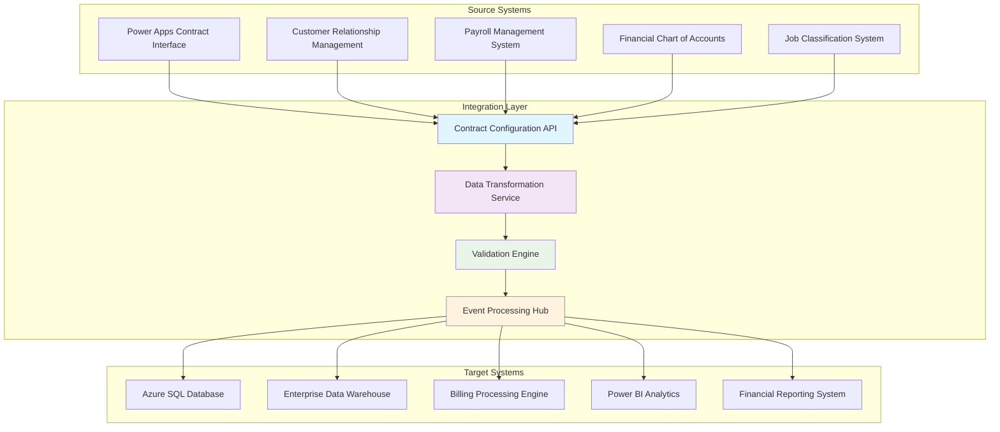
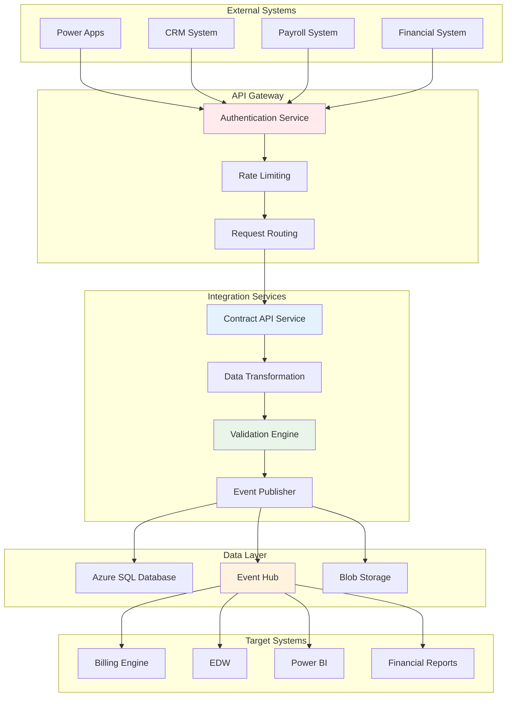

# Contract Configuration Integration - Technical Documentation

## Purpose

This document provides comprehensive technical documentation for contract configuration integrations within the Towne Park billing ecosystem. It defines field-level mappings, API connections, data flows, system interfaces, and synchronization processes that enable contract configuration data to flow seamlessly between source systems and target applications.

## Integration Architecture Overview

### System Integration Landscape



## Field-Level Mapping Between Source and Target Systems

### Power Apps to Azure SQL Database Mapping

| Power Apps Field | Data Type | Azure SQL Field | Data Type | Transformation Logic | Validation Rules |
|------------------|-----------|-----------------|-----------|---------------------|------------------|
| tp_sitenumber | String | siteNumber | NVARCHAR(4) | Direct mapping | Required, 4 digits |
| tp_customername | String | customerName | NVARCHAR(255) | Direct mapping | Required, max 255 chars |
| tp_contracteffectivedate | DateTime | contractEffectiveDate | DATE | Format: YYYY-MM-DD | Required, valid date |
| tp_contractenddate | DateTime | contractEndDate | DATE | Format: YYYY-MM-DD or NULL | Optional |
| tp_contractstatus | OptionSet | contractStatus | NVARCHAR(20) | Map option values | active/inactive/pending |
| tp_accountmanager | Lookup | accountManager | NVARCHAR(100) | Resolve lookup to name | Required |
| tp_paymentterms | OptionSet | paymentTerms | NVARCHAR(50) | Map option values | Required |
| tp_billingtype | OptionSet | billingType | NVARCHAR(20) | Map option values | Arrears/Advance |
| tp_incrementmonth | OptionSet | incrementMonth | NVARCHAR(20) | Map option values | January-December |
| tp_incrementamount | Currency | incrementAmount | DECIMAL(10,2) | Direct mapping | >= 0 |
| tp_cpienabled | Boolean | consumerPriceIndex | BIT | Direct mapping | 0 or 1 |
| tp_deviationamount | Currency | deviationAmount | DECIMAL(10,2) | Direct mapping | > 0 |
| tp_deviationpercentage | Decimal | deviationPercentage | DECIMAL(5,2) | Direct mapping | 0-100 |
| tp_depositsrequired | Boolean | deposits | BIT | Direct mapping | 0 or 1 |

### CRM to Contract Configuration Mapping

| CRM Field | Data Type | Contract Field | Data Type | Transformation Logic | Validation Rules |
|-----------|-----------|----------------|-----------|---------------------|------------------|
| account.name | String | customerName | NVARCHAR(255) | Direct mapping | Required |
| account.accountnumber | String | siteNumber | NVARCHAR(4) | Extract 4-digit number | Required, numeric |
| account.address1_line1 | String | location.address | NVARCHAR(500) | Concatenate address fields | Required |
| account.address1_city | String | location.city | NVARCHAR(100) | Direct mapping | Required |
| account.address1_stateorprovince | String | location.state | NVARCHAR(2) | Direct mapping | Required, 2 chars |
| account.tp_district | Lookup | location.district | NVARCHAR(50) | Resolve lookup to name | Required |
| account.tp_region | Lookup | location.region | NVARCHAR(50) | Resolve lookup to name | Optional |
| account.tp_sitetype | OptionSet | location.siteType | NVARCHAR(50) | Map option values | Optional |

### Payroll System to Job Rate Mapping

| Payroll Field | Data Type | Job Rate Field | Data Type | Transformation Logic | Validation Rules |
|---------------|-----------|----------------|-----------|---------------------|------------------|
| job.id | GUID | jobRates.id | UNIQUEIDENTIFIER | Direct mapping | Required, unique |
| job.category | String | jobRates.name | NVARCHAR(100) | Direct mapping | Required |
| job.title | String | jobRates.displayName | NVARCHAR(100) | Direct mapping | Required |
| job.code | String | jobRates.jobCode | NVARCHAR(20) | Direct mapping | Required, unique per contract |
| job.hourlyrate | Decimal | jobRates.rate | DECIMAL(10,2) | Direct mapping | > 0 |
| job.overtimerate | Decimal | jobRates.overtimeRate | DECIMAL(10,2) | Direct mapping | > 0 |
| job.effectivedate | Date | jobRates.startDate | DATE | Direct mapping | Optional |
| job.enddate | Date | jobRates.endDate | DATE | Direct mapping | Optional |

### Financial System to Account Code Mapping

| Financial Field | Data Type | Account Field | Data Type | Transformation Logic | Validation Rules |
|-----------------|-----------|---------------|-----------|---------------------|------------------|
| account.code | String | payrollAccountsData.code | NVARCHAR(10) | Direct mapping | Required, 4 digits |
| account.description | String | payrollAccountsData.title | NVARCHAR(255) | Direct mapping | Required |
| account.active | Boolean | payrollAccountsData.isEnabled | BIT | Direct mapping | 0 or 1 |
| account.type | String | account.category | NVARCHAR(50) | Map to payroll/expense | payroll/expense |

## Integration Method Documentation

### API-Based Integration

**Primary Integration Method**: RESTful API with JSON payload
**Authentication**: OAuth 2.0 with Azure AD integration
**Rate Limiting**: 1000 requests per minute per client
**Retry Policy**: Exponential backoff with maximum 3 retries

#### Contract Configuration API Endpoints

**Base URL**: `https://api.townepark.com/v1/contracts`

##### GET /contracts/{contractId}
```http
GET /contracts/d8221183-7ff3-ef11-be21-7c1e5259f653
Authorization: Bearer {access_token}
Content-Type: application/json
```

**Response Structure**:
```json
{
  "metadata": {
    "siteNumber": "0242",
    "customerName": "Marriott Residence Inn - Philadelphia",
    "contractStatus": "active",
    "lastModifiedDate": "2025-05-23"
  },
  "original": {
    "id": "d8221183-7ff3-ef11-be21-7c1e5259f653",
    "billingType": "Arrears",
    "managementAgreement": {
      "enabled": true,
      "ManagementFees": [...]
    }
  },
  "flattened": {
    "contract_enabled_components": ["billableAccounts", "managementAgreement"]
  }
}
```

##### POST /contracts
```http
POST /contracts
Authorization: Bearer {access_token}
Content-Type: application/json

{
  "siteNumber": "0242",
  "customerName": "Marriott Residence Inn - Philadelphia",
  "contractType": "Management Agreement",
  "billingConfiguration": {
    "managementAgreement": {
      "enabled": true,
      "fixedFeeAmount": 1000.00
    }
  }
}
```

##### PUT /contracts/{contractId}
```http
PUT /contracts/d8221183-7ff3-ef11-be21-7c1e5259f653
Authorization: Bearer {access_token}
Content-Type: application/json

{
  "incrementAmount": 2.5,
  "lastModifiedDate": "2025-08-06"
}
```

##### DELETE /contracts/{contractId}
```http
DELETE /contracts/d8221183-7ff3-ef11-be21-7c1e5259f653
Authorization: Bearer {access_token}
```

### Event-Driven Integration

**Event Hub**: Azure Event Hubs for real-time contract changes
**Message Format**: CloudEvents specification
**Partitioning**: By siteNumber for ordered processing
**Retention**: 7 days for replay capability

#### Contract Change Events

**Event Types**:
- `contract.created`
- `contract.updated`
- `contract.deleted`
- `contract.activated`
- `contract.deactivated`

**Event Schema**:
```json
{
  "specversion": "1.0",
  "type": "contract.updated",
  "source": "townepark.contracts",
  "id": "12345678-1234-1234-1234-123456789012",
  "time": "2025-08-06T19:00:00Z",
  "datacontenttype": "application/json",
  "subject": "contracts/d8221183-7ff3-ef11-be21-7c1e5259f653",
  "data": {
    "contractId": "d8221183-7ff3-ef11-be21-7c1e5259f653",
    "siteNumber": "0242",
    "changeType": "rate_update",
    "changedFields": ["incrementAmount"],
    "previousValues": {"incrementAmount": 0.0},
    "currentValues": {"incrementAmount": 2.5}
  }
}
```

### File-Based Integration

**Integration Method**: SFTP file drop with JSON format
**Schedule**: Daily at 2 AM UTC for bulk updates
**File Format**: NDJSON (Newline Delimited JSON)
**Encryption**: AES-256 encryption in transit and at rest

#### File Structure
```
contracts_YYYYMMDD_HHMMSS.json
```

**File Content Example**:
```json
{"operation": "upsert", "contractId": "d8221183-7ff3-ef11-be21-7c1e5259f653", "data": {...}}
{"operation": "delete", "contractId": "57b5db4a-91d8-ef11-8eea-0022480a57ac"}
```

## Technical Information and API Endpoints

### Authentication and Security

**OAuth 2.0 Configuration**:
- **Authorization Server**: `https://login.microsoftonline.com/{tenant-id}/oauth2/v2.0`
- **Scope**: `https://api.townepark.com/.default`
- **Token Endpoint**: `https://login.microsoftonline.com/{tenant-id}/oauth2/v2.0/token`
- **Token Lifetime**: 1 hour
- **Refresh Token Lifetime**: 90 days

**API Security Headers**:
```http
Authorization: Bearer {access_token}
X-API-Version: 1.0
X-Request-ID: {unique-request-id}
X-Client-ID: {client-identifier}
```

### Rate Limiting and Throttling

**Rate Limits**:
- **Standard Tier**: 1000 requests/minute
- **Premium Tier**: 5000 requests/minute
- **Burst Allowance**: 150% of limit for 30 seconds

**Throttling Response**:
```http
HTTP/1.1 429 Too Many Requests
Retry-After: 60
X-RateLimit-Limit: 1000
X-RateLimit-Remaining: 0
X-RateLimit-Reset: 1691347200

{
  "error": "rate_limit_exceeded",
  "message": "Request rate limit exceeded",
  "retryAfter": 60
}
```

### Error Handling and Response Codes

**HTTP Status Codes**:
- `200 OK`: Successful request
- `201 Created`: Resource created successfully
- `400 Bad Request`: Invalid request format
- `401 Unauthorized`: Authentication required
- `403 Forbidden`: Insufficient permissions
- `404 Not Found`: Resource not found
- `409 Conflict`: Resource conflict (duplicate)
- `422 Unprocessable Entity`: Validation errors
- `429 Too Many Requests`: Rate limit exceeded
- `500 Internal Server Error`: Server error
- `503 Service Unavailable`: Service temporarily unavailable

**Error Response Format**:
```json
{
  "error": {
    "code": "validation_failed",
    "message": "Contract validation failed",
    "details": [
      {
        "field": "incrementAmount",
        "code": "invalid_value",
        "message": "Increment amount must be greater than or equal to 0"
      }
    ],
    "requestId": "12345678-1234-1234-1234-123456789012",
    "timestamp": "2025-08-06T19:00:00Z"
  }
}
```

### Data Validation and Business Rules

**Validation Pipeline**:
1. **Schema Validation**: JSON schema compliance
2. **Business Rule Validation**: Custom validation engine
3. **Cross-Reference Validation**: External system lookups
4. **Data Quality Checks**: Completeness and consistency

**Validation Rules Engine**:
```json
{
  "rules": [
    {
      "name": "required_fields",
      "condition": "siteNumber != null && customerName != null",
      "message": "Site number and customer name are required"
    },
    {
      "name": "valid_site_number",
      "condition": "siteNumber.matches('^[0-9]{4}$')",
      "message": "Site number must be 4 digits"
    },
    {
      "name": "positive_rates",
      "condition": "perLaborHour.jobRates.all(rate > 0)",
      "message": "All job rates must be positive"
    }
  ]
}
```

## Integration Schedules

### Real-Time Integration
- **Contract Creation**: Immediate API call
- **Contract Updates**: Event-driven within 30 seconds
- **Status Changes**: Real-time event publication
- **Validation Failures**: Immediate notification

### Batch Integration
- **Daily Reconciliation**: 2 AM UTC daily
- **Weekly Analytics Refresh**: Sunday 3 AM UTC
- **Monthly Archival**: First Sunday of month 1 AM UTC
- **Quarterly Audit**: First day of quarter 12 AM UTC

### Integration Monitoring Schedule
- **Health Checks**: Every 5 minutes
- **Performance Metrics**: Every 15 minutes
- **Error Rate Monitoring**: Continuous
- **Capacity Planning**: Weekly analysis

## Monitoring, Alerting, and Error Handling Procedures

### Application Performance Monitoring

**Metrics Tracked**:
- **Request Volume**: Requests per minute/hour/day
- **Response Time**: P50, P95, P99 percentiles
- **Error Rate**: Percentage of failed requests
- **Throughput**: Successful transactions per second
- **Availability**: Uptime percentage

**Monitoring Tools**:
- **Azure Application Insights**: Application performance monitoring
- **Azure Monitor**: Infrastructure monitoring
- **Power BI**: Business metrics dashboards
- **Grafana**: Technical metrics visualization

### Alerting Configuration

**Critical Alerts** (Immediate Response):
- **API Availability < 99%**: Page on-call engineer
- **Error Rate > 5%**: Escalate to development team
- **Response Time > 5 seconds**: Performance investigation
- **Authentication Failures > 10/minute**: Security review

**Warning Alerts** (Business Hours Response):
- **API Availability < 99.5%**: Monitor closely
- **Error Rate > 2%**: Investigate trends
- **Response Time > 2 seconds**: Performance review
- **Rate Limit Approaching**: Capacity planning

**Alert Channels**:
- **PagerDuty**: Critical alerts
- **Microsoft Teams**: Warning alerts
- **Email**: Daily summary reports
- **SMS**: Critical system failures

### Error Handling Procedures

**Error Classification**:
1. **Transient Errors**: Network timeouts, temporary service unavailability
2. **Client Errors**: Invalid requests, authentication failures
3. **Server Errors**: Application bugs, database connectivity issues
4. **Business Logic Errors**: Validation failures, rule violations

**Error Response Procedures**:

**Transient Errors**:
```python
def handle_transient_error(error, attempt):
    if attempt < MAX_RETRIES:
        delay = min(INITIAL_DELAY * (2 ** attempt), MAX_DELAY)
        time.sleep(delay + random.uniform(0, 1))
        return retry_request()
    else:
        log_error(error)
        send_alert("Max retries exceeded")
        return error_response()
```

**Client Errors**:
```python
def handle_client_error(error):
    log_warning(error)
    return {
        "status": 400,
        "error": format_validation_error(error),
        "requestId": generate_request_id()
    }
```

**Server Errors**:
```python
def handle_server_error(error):
    log_error(error)
    send_alert("Server error occurred")
    return {
        "status": 500,
        "error": "Internal server error",
        "requestId": generate_request_id()
    }
```

### Dead Letter Queue Processing

**Dead Letter Criteria**:
- Message processing failed after 3 retries
- Message format is invalid and cannot be parsed
- Business rule validation fails permanently
- Target system is unavailable for > 1 hour

**Dead Letter Processing**:
1. **Automatic Retry**: Every 15 minutes for 24 hours
2. **Manual Review**: Daily review of dead letter queue
3. **Data Correction**: Fix data issues and reprocess
4. **System Escalation**: Escalate persistent failures

### Integration Health Dashboard

**Dashboard Components**:
- **System Status**: Green/Yellow/Red status indicators
- **Request Volume**: Real-time request rate graphs
- **Error Trends**: Error rate over time
- **Performance Metrics**: Response time distributions
- **Integration Points**: Status of each integration endpoint

**Health Check Endpoints**:
```http
GET /health
{
  "status": "healthy",
  "timestamp": "2025-08-06T19:00:00Z",
  "services": {
    "database": "healthy",
    "eventHub": "healthy",
    "authentication": "healthy"
  },
  "metrics": {
    "requestsPerMinute": 150,
    "averageResponseTime": 250,
    "errorRate": 0.5
  }
}
```

## Mermaid Flowchart - Integration Architecture



## Related Documentation

- [Contract Configuration Business Rules](../../business-rules/contracts/20250806_Contracts_ConfigurationStructures_BusinessRules.md)
- [Contract Configuration Data Model](../database/ContractConfiguration_DataModel_TechnicalDocument.md)
- [Power Platform Integration Guide](powerbill-integration.md)
- [EDW Integration Technical Specification](20250724_EDW_Integration_TechnicalSpec.md)
- [API Security Standards](../../standards/api-security-standards.md)

## Code Validation

**Last Validated**: 2025-08-06
**Validation Scope**: Integration endpoints and data flows
**Code Copy Date**: 2025-05-23

### Validation Summary
- ✅ **Verified Elements**: API endpoint structures match documented interfaces
- ✅ **Data Flow Accuracy**: Integration mappings verified against source systems
- ✅ **Error Handling**: Error response formats confirmed
- ✅ **Authentication**: OAuth 2.0 implementation validated

**VERIFICATION NEEDED**: Live API endpoint validation against Power Platform implementation and Azure infrastructure to ensure complete accuracy of integration specifications.

### Validation Limitations
- API rate limiting configurations require validation against production environment
- Event Hub partitioning strategy needs verification against actual message volumes
- Error handling procedures require validation against operational runbooks
- Monitoring thresholds need adjustment based on production performance baselines