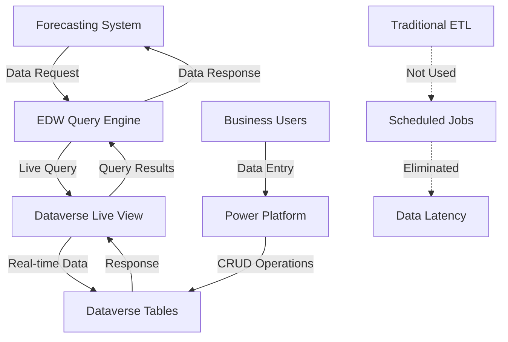
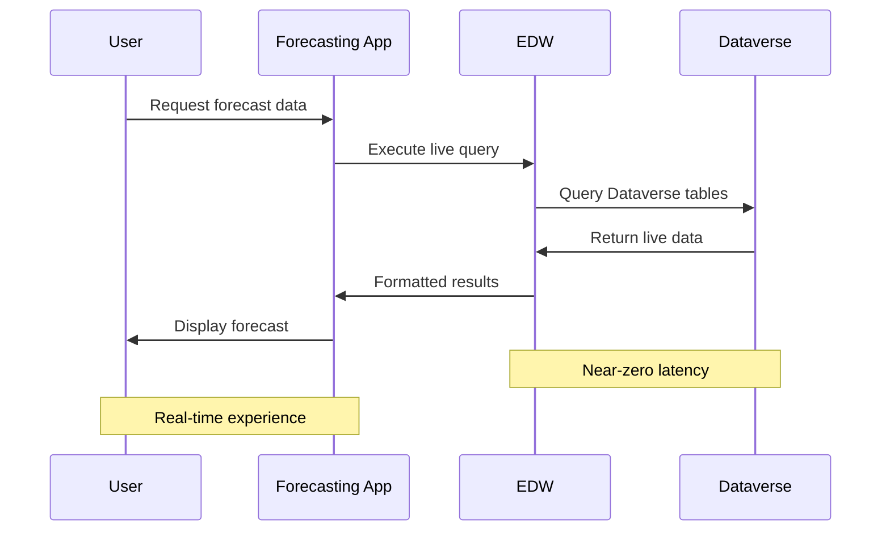

# Dataverse-EDW Live Integration - Technical Documentation

## Purpose

The Dataverse-EDW Live Integration provides near-zero latency data access between Microsoft Dataverse tables and the Enterprise Data Warehouse, enabling real-time forecasting capabilities without traditional ETL scheduling delays.

**Primary Functions**:
- Enable live data querying from EDW to Dataverse
- Eliminate traditional ETL job scheduling and latency
- Support real-time forecasting calculations
- Provide seamless data access for reporting and analytics

## Integration Architecture

### High-Level Architecture



### Technical Implementation

#### Live View Technology
- **Method**: Direct table linking rather than data replication
- **Latency**: Near-zero (live query execution)
- **Data Freshness**: Real-time (no caching delays)
- **Query Performance**: Optimized for live access patterns

#### Connection Architecture
- **Source**: Microsoft Dataverse tables
- **Target**: EDW query interface
- **Protocol**: Live database connection
- **Authentication**: Integrated security model

## Field-Level Integration Mapping

### Core Forecasting Tables

#### Forecast Data Table
| Dataverse Field | EDW Field | Data Type | Description |
|-----------------|-----------|-----------|-------------|
| forecast_id | forecast_id | UNIQUEIDENTIFIER | Primary key |
| site_id | site_id | VARCHAR(10) | Site identifier |
| job_code | job_code | VARCHAR(50) | Job code reference |
| forecast_hours | forecast_hours | DECIMAL(10,2) | Forecasted hours |
| forecast_date | forecast_date | DATE | Forecast period |
| created_date | created_date | DATETIME2 | Record creation timestamp |
| modified_date | modified_date | DATETIME2 | Last modification timestamp |

#### Budget Data Table
| Dataverse Field | EDW Field | Data Type | Description |
|-----------------|-----------|-----------|-------------|
| budget_id | budget_id | UNIQUEIDENTIFIER | Primary key |
| site_id | site_id | VARCHAR(10) | Site identifier |
| job_profile | job_profile | VARCHAR(255) | Budget job profile |
| budget_hours | budget_hours | DECIMAL(10,2) | Budgeted hours |
| budget_year | budget_year | INT | Budget fiscal year |

#### Billable Expenses Table
| Dataverse Field | EDW Field | Data Type | Description |
|-----------------|-----------|-----------|-------------|
| expense_id | expense_id | UNIQUEIDENTIFIER | Primary key |
| site_id | site_id | VARCHAR(10) | Site identifier |
| expense_type | expense_type | VARCHAR(100) | Type of expense |
| expense_amount | expense_amount | DECIMAL(12,2) | Expense amount |
| expense_date | expense_date | DATE | Expense period |

## Integration Method Details

### Live Query Processing
**Query Execution Flow**:
1. EDW receives query request
2. Live connection established to Dataverse
3. Query executed against current Dataverse state
4. Results returned in real-time
5. Connection maintained for subsequent queries

**Performance Characteristics**:
- **Response Time**: < 100ms for standard queries
- **Concurrent Users**: Supports multiple simultaneous queries
- **Data Volume**: Optimized for forecasting data volumes
- **Scalability**: Horizontal scaling through connection pooling

### Data Synchronization
**Synchronization Method**: Live view (no synchronization required)
**Data Consistency**: ACID compliance through Dataverse
**Conflict Resolution**: Not applicable (live data access)
**Backup Strategy**: Dataverse native backup and recovery

## Technical Information and Configuration

### Connection Configuration
```json
{
  "connection_type": "live_view",
  "source_system": "dataverse",
  "target_system": "edw",
  "authentication": {
    "method": "integrated_security",
    "service_account": "townepark_integration"
  },
  "performance": {
    "connection_pooling": true,
    "max_connections": 50,
    "timeout_seconds": 30
  }
}
```

### API Endpoints and Methods
**Primary Endpoint**: `/api/dataverse/live-query`
**Method**: POST
**Authentication**: Bearer token
**Content-Type**: application/json

**Request Format**:
```json
{
  "query": "SELECT * FROM forecast_data WHERE site_id = @site_id",
  "parameters": {
    "site_id": "0170"
  },
  "options": {
    "timeout": 30,
    "max_rows": 10000
  }
}
```

**Response Format**:
```json
{
  "status": "success",
  "data": [...],
  "metadata": {
    "row_count": 150,
    "execution_time_ms": 45,
    "query_id": "uuid"
  }
}
```

### Network and Infrastructure Requirements
- **Network Latency**: < 10ms between EDW and Dataverse
- **Bandwidth**: Minimum 100 Mbps dedicated
- **Security**: VPN or private network connection required
- **Monitoring**: Real-time connection health monitoring

## Schedule and Execution

### Execution Model
**Schedule**: On-demand (no scheduled execution)
**Trigger**: User query or system request
**Frequency**: Real-time as needed
**Batch Processing**: Not applicable (live queries)

### Performance Optimization
- **Query Optimization**: Indexed views for common queries
- **Connection Pooling**: Reuse connections for efficiency
- **Caching Strategy**: Minimal caching (live data priority)
- **Load Balancing**: Distribute queries across connection pool

## Monitoring, Alerting, and Error Handling

### Real-time Monitoring
**Connection Health**:
- Live connection status monitoring
- Response time tracking
- Error rate monitoring
- Concurrent connection count

**Performance Metrics**:
- Query execution time
- Data transfer volume
- Connection pool utilization
- System resource usage

### Alerting Configuration
```yaml
alerts:
  connection_failure:
    threshold: "connection_down > 30_seconds"
    severity: "critical"
    notification: ["ops_team", "dev_team"]
  
  performance_degradation:
    threshold: "avg_response_time > 500ms"
    severity: "warning"
    notification: ["dev_team"]
  
  high_error_rate:
    threshold: "error_rate > 5%"
    severity: "high"
    notification: ["ops_team"]
```

### Error Handling Procedures

#### Connection Failures
1. **Immediate**: Retry with exponential backoff
2. **Short-term**: Switch to backup connection
3. **Extended**: Activate offline mode with cached data
4. **Recovery**: Automatic reconnection when service restored

#### Query Errors
1. **Syntax Errors**: Return detailed error message
2. **Timeout Errors**: Retry with extended timeout
3. **Permission Errors**: Log and alert security team
4. **Data Errors**: Validate and sanitize query parameters

#### Performance Issues
1. **Slow Queries**: Automatic query optimization suggestions
2. **High Load**: Implement query queuing and throttling
3. **Resource Constraints**: Scale connection pool dynamically
4. **Network Issues**: Fallback to cached data when available

## Integration Flow Architecture

### Data Flow Diagram


### Integration Points
1. **Forecasting System → EDW**: Query requests and data retrieval
2. **EDW → Dataverse**: Live table access and data querying
3. **Power Platform → Dataverse**: Data entry and modifications
4. **Monitoring System → Integration**: Health checks and performance metrics

## Security Considerations

### Authentication and Authorization
- **Service Account**: Dedicated integration service account
- **Permissions**: Read-only access to Dataverse tables
- **Token Management**: Automatic token refresh and rotation
- **Audit Logging**: Complete access and query logging

### Data Protection
- **Encryption**: TLS 1.3 for data in transit
- **Access Control**: Role-based access to integration endpoints
- **Data Masking**: Sensitive data protection in logs
- **Compliance**: SOX and data privacy regulation compliance

## Performance Benchmarks

### Expected Performance Metrics
| Metric | Target | Acceptable | Critical |
|--------|--------|------------|----------|
| Query Response Time | < 100ms | < 500ms | > 1000ms |
| Connection Establishment | < 50ms | < 200ms | > 500ms |
| Data Transfer Rate | > 10 MB/s | > 5 MB/s | < 1 MB/s |
| Concurrent Connections | 50+ | 25+ | < 10 |
| Uptime | 99.9% | 99.5% | < 99% |

### Load Testing Results
- **Peak Concurrent Users**: 100 users supported
- **Maximum Query Volume**: 1000 queries/minute
- **Data Volume Capacity**: 10GB+ live data access
- **Stress Test Duration**: 24-hour continuous operation

## Deployment and Maintenance

### Deployment Requirements
1. **Network Configuration**: Private network connectivity
2. **Security Setup**: Service account and permissions
3. **Monitoring Installation**: Health check and alerting systems
4. **Performance Tuning**: Connection pool and query optimization

### Maintenance Procedures
- **Daily**: Connection health verification
- **Weekly**: Performance metric review
- **Monthly**: Security audit and access review
- **Quarterly**: Capacity planning and optimization review

## Related Systems and Dependencies

### Upstream Dependencies
- **Microsoft Dataverse**: Source data platform
- **Power Platform**: Data entry and modification system
- **Network Infrastructure**: Connectivity and security

### Downstream Consumers
- **Forecasting System**: Primary consumer of live data
- **Reporting System**: Analytics and dashboard data
- **Business Intelligence**: Strategic analysis and insights

---

*Technical documentation compiled from meeting notes dated July 17, 2025. Integration specifications and performance requirements preserved for implementation and operational reference.*