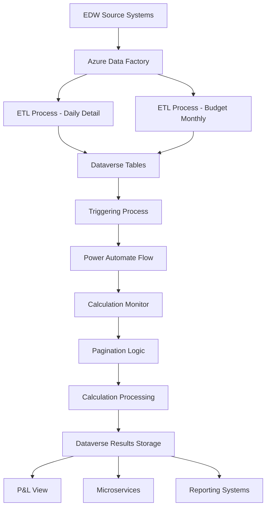
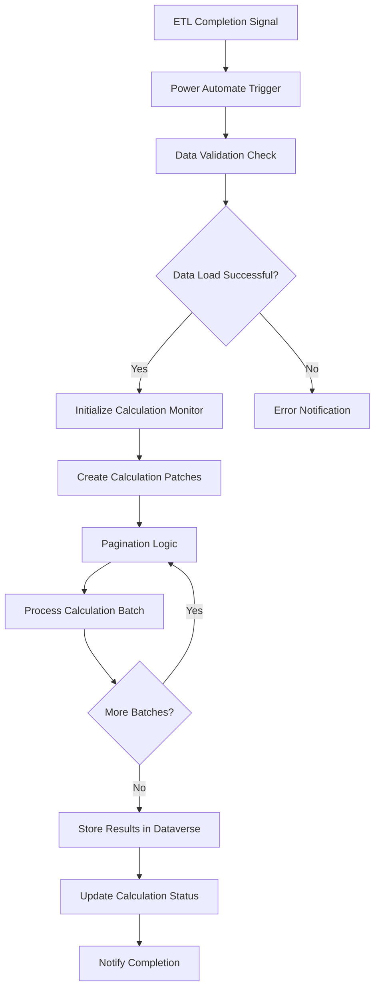
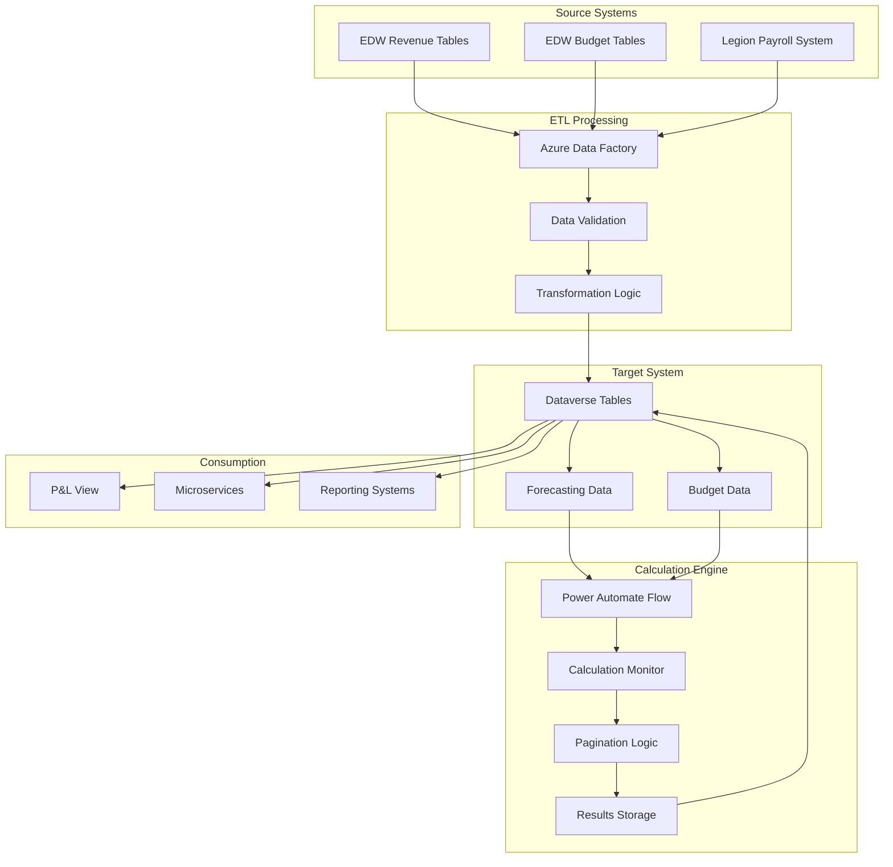

# EDW to Dataverse ETL Integration Technical Document

## Purpose

This integration provides the technical framework for transferring data between the Enterprise Data Warehouse (EDW) and Dataverse to support 12-month forecasting calculations and current month trending. The ETL process handles both daily detail forecasting data and monthly budget data while triggering Power Automate flows for calculation processing.

## Architecture Overview

### Integration Architecture



### System Components
- **Source**: EDW (Enterprise Data Warehouse)
- **ETL Engine**: Azure Data Factory
- **Target**: Dataverse tables
- **Orchestration**: Power Automate flows
- **Calculation Engine**: Custom calculation logic with pagination
- **Distribution**: P&L views and microservices

## Field-Level Mapping

### Daily Detail Data Mapping

#### Source: EDW Revenue Tables
| EDW Field | Data Type | Target Dataverse Field | Transformation Logic |
|-----------|-----------|------------------------|---------------------|
| `SITE` | VARCHAR(10) | `tp_site` | Direct mapping, validate against site master |
| `DATE` | DATE | `tp_date` | Direct mapping, daily granularity |
| `NETEXTERNALREVENUE` | DECIMAL(18,2) | `tp_external_revenue` | Direct mapping for revenue calculations |
| `REVENUE_CATEGORY` | VARCHAR(50) | `tp_revenue_category` | Direct mapping, validate against category master |
| `VALUE` | DECIMAL(18,2) | `tp_value` | From Revenue Datamart Daily table |
| `VALUE_TYPE` | VARCHAR(20) | `tp_value_type` | Revenue, Vehicles, Other classifications |

#### Source: Legion Payroll Data
| Legion Field | Data Type | Target Dataverse Field | Transformation Logic |
|--------------|-----------|------------------------|---------------------|
| `WORK_LOCATION` | VARCHAR(10) | `tp_site` | Map to site identifier |
| `DATE` | DATE | `tp_date` | Direct mapping |
| `TITLE` | VARCHAR(100) | `tp_job_title` | Job title classification |
| `TOTAL_DOLLARS` | DECIMAL(18,2) | `tp_payroll_cost` | Actual payroll cost |
| `HOURS_WORKED` | DECIMAL(10,2) | `tp_hours_worked` | Actual hours for calculations |

### Budget Data Mapping

#### Source: EDW Budget Tables
| EDW Field | Data Type | Target Dataverse Field | Transformation Logic |
|-----------|-----------|------------------------|---------------------|
| `COST_CENTER` | VARCHAR(10) | `tp_site` | Map cost center to site |
| `PERIOD` | VARCHAR(6) | `tp_period` | YYYYMM format, monthly granularity |
| `MAIN_ACCOUNT` | VARCHAR(10) | `tp_account_code` | General ledger account mapping |
| `BUDGET_AMOUNT` | DECIMAL(18,2) | `tp_budget_amount` | Monthly budget values |
| `ACCOUNT_DESCRIPTION` | VARCHAR(200) | `tp_account_description` | Account name and description |

## Integration Methods

### ETL Processing Method
- **Technology**: Azure Data Factory data flows
- **Frequency**: Daily for detail data, monthly for budget data
- **Processing Window**: Early morning hours (2:00 AM - 4:00 AM EST)
- **Error Handling**: Retry logic with exponential backoff

### Data Flow Architecture

#### Daily Detail ETL Process
```sql
-- Conceptual ETL logic for daily detail data
INSERT INTO [Dataverse].[Forecasting].[DailyDetail]
SELECT 
    SITE as tp_site,
    DATE as tp_date,
    NETEXTERNALREVENUE as tp_external_revenue,
    REVENUE_CATEGORY as tp_revenue_category,
    GETDATE() as tp_load_timestamp
FROM [TP_EDW].[dbo].[REVENUE_DAILY_DETAIL]
WHERE DATE >= @ProcessDate
  AND SITE IN (SELECT SITE FROM [Dataverse].[Master].[Sites] WHERE ACTIVE = 1)
```

#### Budget Data ETL Process
```sql
-- Conceptual ETL logic for budget data
INSERT INTO [Dataverse].[Forecasting].[BudgetData]
SELECT 
    COST_CENTER as tp_site,
    PERIOD as tp_period,
    MAIN_ACCOUNT as tp_account_code,
    BUDGET_AMOUNT as tp_budget_amount,
    GETDATE() as tp_load_timestamp
FROM [TP_EDW].[dbo].[BUDGET_SUMMARY]
WHERE PERIOD = @BudgetPeriod
  AND COST_CENTER IN (SELECT SITE FROM [Dataverse].[Master].[Sites] WHERE ACTIVE = 1)
```

### Power Automate Integration

#### Triggering Process
- **Trigger Type**: Scheduled trigger after ETL completion
- **Frequency**: Daily after successful data load
- **Validation**: Verify data load completion before triggering calculations

#### Flow Architecture


## Technical Information

### API Endpoints

#### Dataverse API Endpoints
- **Base URL**: `https://[environment].crm.dynamics.com/api/data/v9.2/`
- **Authentication**: OAuth 2.0 with service principal
- **Rate Limits**: 6,000 requests per 5-minute window per user

#### Key API Operations
```http
POST /api/data/v9.2/tp_forecastingdata
Content-Type: application/json
Authorization: Bearer {access_token}

{
    "tp_site": "0170",
    "tp_date": "2025-08-06",
    "tp_external_revenue": 15000.00,
    "tp_revenue_category": "Parking"
}
```

### Azure Data Factory Configuration

#### Pipeline Configuration
- **Pipeline Name**: `EDW-to-Dataverse-Daily-ETL`
- **Trigger**: Daily schedule at 2:00 AM EST
- **Timeout**: 2 hours maximum execution time
- **Retry Policy**: 3 attempts with 15-minute intervals

#### Data Flow Specifications
- **Source Connection**: EDW SQL Server connection
- **Sink Connection**: Dataverse connector
- **Transformation**: Data type conversions and validation rules
- **Error Handling**: Dead letter queue for failed records

### Performance Specifications

#### Processing Capacity
- **Daily Records**: 50,000-100,000 records per day
- **Processing Time**: 30-60 minutes for full daily load
- **Concurrent Connections**: Maximum 5 parallel data flows
- **Memory Allocation**: 8GB per data flow instance

#### Azure Data Factory Limitations
Based on architecture meeting discussions:
- **Evaluation Limits**: Minimum 1,000 evaluations per hour
- **Daily Processing**: Maximum 8 hours for all data flows
- **Concurrent Processing**: Maximum 1 evaluation concurrently
- **Alternative**: Data Factory data flows available if limits exceeded

## Schedule and Timing

### Daily ETL Schedule
- **Start Time**: 2:00 AM EST
- **Data Extraction**: 2:00 AM - 2:30 AM
- **Data Transformation**: 2:30 AM - 3:00 AM
- **Data Loading**: 3:00 AM - 3:30 AM
- **Validation**: 3:30 AM - 3:45 AM
- **Power Automate Trigger**: 3:45 AM

### Monthly Budget Schedule
- **Frequency**: First business day of each month
- **Start Time**: 1:00 AM EST (before daily ETL)
- **Duration**: 30-45 minutes
- **Validation**: Budget totals reconciliation

## Monitoring and Alerting

### Data Quality Monitoring
- **Record Count Validation**: Compare source vs. target record counts
- **Data Completeness**: Verify all required fields populated
- **Business Rule Validation**: Check data ranges and relationships
- **Duplicate Detection**: Identify and handle duplicate records

### Error Handling Procedures

#### ETL Failure Response
1. **Immediate**: Automatic retry with exponential backoff
2. **Escalation**: Email notification to data engineering team
3. **Manual Intervention**: Investigate and resolve data issues
4. **Recovery**: Reprocess failed batches after issue resolution

#### Data Quality Issues
1. **Validation Failures**: Log errors and continue processing valid records
2. **Business Rule Violations**: Flag records for manual review
3. **Missing Data**: Use default values where appropriate
4. **Data Inconsistencies**: Generate data quality reports

### Alerting Configuration
- **Success Notifications**: Daily summary to operations team
- **Failure Alerts**: Immediate notification to on-call engineer
- **Performance Alerts**: Trigger when processing exceeds SLA thresholds
- **Data Quality Alerts**: Weekly summary of validation issues

## Integration Monitoring

### Key Performance Indicators
- **ETL Success Rate**: Target 99.5% successful daily loads
- **Processing Time**: Target 90% of loads complete within 60 minutes
- **Data Quality Score**: Target 99% of records pass validation
- **Power Automate Success**: Target 99% successful calculation triggers

### Monitoring Dashboards
- **Real-time ETL Status**: Current processing status and progress
- **Historical Performance**: Trends in processing time and success rates
- **Data Quality Metrics**: Validation failure rates and error types
- **System Health**: Resource utilization and performance metrics

## Mermaid Flowchart - System Integration



## Business Stakeholders

### Technical Approval Authority
- **Primary**: Data Engineering Team Lead
- **Secondary**: Solution Architect
- **Final Approval**: IT Director

### Operational Stakeholders
- **Data Stewards**: Finance team members responsible for data quality
- **End Users**: Account managers and district managers using reports
- **Support Team**: IT operations team for monitoring and maintenance

## Data Validation Status

**Validation Required**: This integration should be validated against actual Azure Data Factory pipelines and Power Automate flows.

**Code Validation Scope**:
- Azure Data Factory pipeline configuration validation
- Power Automate flow logic validation
- Dataverse table schema validation
- ETL transformation logic validation
- Error handling and monitoring implementation

**Next Steps**: Perform comprehensive validation against:
- Azure Data Factory configurations in `Towne-Park-Azure-Components/`
- Power Automate flows in `Towne-Park-Billing-PA-Solution/`
- Dataverse schema definitions
- ETL implementation code in `Towne-Park-Billing-Source-Code/`