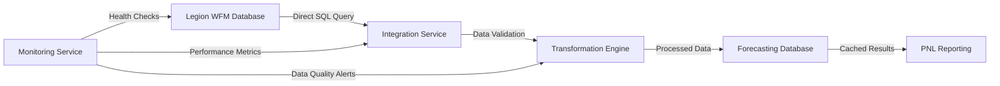
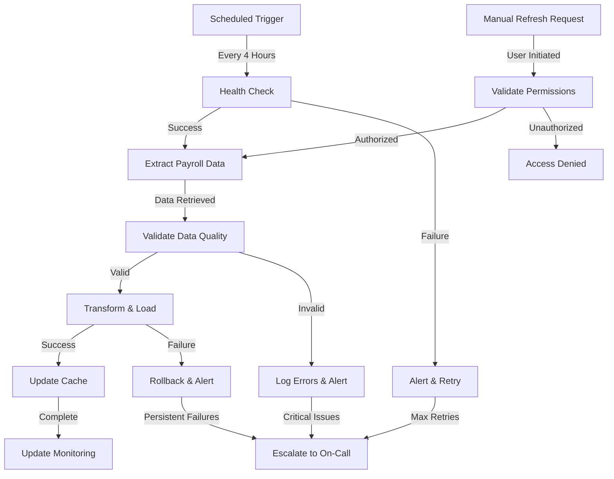

# Legion Database Integration - Technical Documentation

## Integration Overview

### Purpose
The Legion Database Integration provides real-time access to workforce management and payroll data from Legion's workforce management system. This integration enables the forecasting system to calculate current month payroll costs by blending actual payroll data (month-to-date) with forecasted payroll (remaining days) for accurate financial reporting.

### Business Context
Legion serves as Towne Park's primary workforce management system, tracking employee schedules, time and attendance, and payroll calculations. The integration is critical for PNL reporting accuracy and enables account managers to monitor labor costs against budget targets in real-time.

## Field-Level Mapping Between Source and Target Systems

### Source System: Legion Workforce Management Database

**Primary Source Table: payroll_summary (View)**
- **System**: Legion Database
- **Type**: Database View (aggregated from multiple Legion tables)
- **Update Frequency**: Daily
- **Access Method**: Direct database connection

### Target System: Towne Park Forecasting System

**Target Usage**: Current month payroll calculations, PNL reporting, variance analysis

### Field Mappings

| Legion Field | Data Type | Target Field | Target Type | Transformation Logic |
|--------------|-----------|--------------|-------------|---------------------|
| site | VARCHAR(10) | site_id | VARCHAR(10) | Direct mapping, validate against site master |
| date | VARCHAR(10) | payroll_date | DATE | CAST(date AS DATE) - handle string to date conversion |
| job_code | VARCHAR(50) | job_code | VARCHAR(50) | Direct mapping, validate against job code master |
| hours | DECIMAL(8,2) | hours_worked | DECIMAL(8,2) | Direct mapping, validate non-negative values |
| cost | DECIMAL(15,2) | payroll_cost | DECIMAL(15,2) | Direct mapping, includes wages + benefits + taxes |

### Data Quality Validations

**Site Validation**
```sql
-- Ensure site exists in master site table
WHERE EXISTS (
    SELECT 1 FROM sites s 
    WHERE s.site_id = legion.site
)
```

**Date Validation**
```sql
-- Handle string date conversion and validate format
WHERE TRY_CAST(legion.date AS DATE) IS NOT NULL
  AND CAST(legion.date AS DATE) <= GETDATE()
```

**Cost Validation**
```sql
-- Validate reasonable payroll cost ranges
WHERE legion.cost >= 0 
  AND legion.cost <= 10000  -- Daily site maximum threshold
```

## Integration Code and Logic Documentation

### Database Connection Configuration

**Connection String Components**
```json
{
  "server": "legion-db-server.townepark.com",
  "database": "LegionWFM",
  "authentication": "SQL Server Authentication",
  "connection_timeout": 30,
  "command_timeout": 300,
  "encryption": true,
  "trust_server_certificate": false
}
```

**Connection Pool Settings**
```json
{
  "min_pool_size": 5,
  "max_pool_size": 50,
  "connection_lifetime": 300,
  "connection_reset": true
}
```

### Data Extraction Logic

**Current Month Payroll Query**
```sql
-- Extract current month payroll data for PNL calculations
SELECT 
    site,
    CAST(date AS DATE) as payroll_date,
    job_code,
    SUM(hours) as total_hours,
    SUM(cost) as total_cost
FROM legion_database.dbo.payroll_summary
WHERE site = @site_parameter
  AND TRY_CAST(date AS DATE) >= @first_day_current_month
  AND TRY_CAST(date AS DATE) <= @current_date
  AND cost IS NOT NULL
  AND hours IS NOT NULL
GROUP BY site, CAST(date AS DATE), job_code
ORDER BY CAST(date AS DATE) DESC
```

**Data Availability Check**
```sql
-- Determine most recent payroll data availability
SELECT 
    site,
    MAX(CAST(date AS DATE)) as latest_payroll_date,
    COUNT(*) as record_count,
    SUM(cost) as total_cost
FROM legion_database.dbo.payroll_summary
WHERE site = @site_parameter
  AND TRY_CAST(date AS DATE) >= @first_day_current_month
  AND TRY_CAST(date AS DATE) <= @current_date
GROUP BY site
```

### Error Handling and Retry Logic

**Connection Error Handling**
```csharp
public async Task<PayrollData> GetPayrollDataAsync(string siteId, DateTime startDate, DateTime endDate)
{
    int retryCount = 0;
    const int maxRetries = 3;
    
    while (retryCount < maxRetries)
    {
        try
        {
            using var connection = new SqlConnection(connectionString);
            await connection.OpenAsync();
            
            // Execute payroll query
            var result = await ExecutePayrollQuery(connection, siteId, startDate, endDate);
            return result;
        }
        catch (SqlException ex) when (IsTransientError(ex))
        {
            retryCount++;
            await Task.Delay(TimeSpan.FromSeconds(Math.Pow(2, retryCount))); // Exponential backoff
            
            if (retryCount >= maxRetries)
                throw new IntegrationException($"Failed to retrieve payroll data after {maxRetries} attempts", ex);
        }
        catch (Exception ex)
        {
            throw new IntegrationException("Unexpected error retrieving payroll data", ex);
        }
    }
}
```

**Data Validation Logic**
```csharp
public PayrollValidationResult ValidatePayrollData(PayrollRecord record)
{
    var result = new PayrollValidationResult();
    
    // Validate site exists
    if (!siteRepository.SiteExists(record.SiteId))
    {
        result.AddError($"Invalid site ID: {record.SiteId}");
    }
    
    // Validate date format and range
    if (record.PayrollDate > DateTime.Today)
    {
        result.AddError($"Future payroll date not allowed: {record.PayrollDate}");
    }
    
    // Validate cost reasonableness
    if (record.Cost < 0 || record.Cost > 10000)
    {
        result.AddWarning($"Unusual payroll cost: {record.Cost:C}");
    }
    
    return result;
}
```

## Integration Schedule and Execution

### Scheduled Data Refresh

**Daily Refresh Schedule**
- **Frequency**: Every 4 hours during business hours (6 AM - 10 PM CT)
- **Off-Hours**: Single refresh at 2 AM CT for overnight processing
- **Weekend**: Reduced frequency (every 8 hours)

**Refresh Process Flow**
1. **Connection Validation**: Test Legion database connectivity
2. **Data Extraction**: Pull payroll data for current month
3. **Data Validation**: Validate extracted data quality
4. **Data Transformation**: Apply business rules and calculations
5. **Data Loading**: Update forecasting system tables
6. **Cache Refresh**: Update cached payroll calculations
7. **Notification**: Send alerts for any issues or anomalies

### Manual Refresh Capabilities

**User-Initiated Refresh**
- **Access**: System administrators and authorized users
- **Frequency Limit**: Maximum once per hour to prevent system overload
- **Validation**: Verify user permissions before execution

**Emergency Refresh**
- **Trigger**: Critical data discrepancies or system issues
- **Authorization**: Requires administrator approval
- **Monitoring**: Enhanced logging and monitoring during emergency refresh

## Integration Method and Technical Details

### Integration Architecture

**Direct Database Connection**
- **Method**: SQL Server to SQL Server direct connection
- **Protocol**: TDS (Tabular Data Stream) over TCP/IP
- **Security**: Encrypted connection with certificate validation
- **Authentication**: Service account with read-only permissions

**Data Flow Architecture**


### API Endpoints and Methods

**Internal API Endpoints**

**GET /api/payroll/current-month/{siteId}**
- **Purpose**: Retrieve current month payroll data for specific site
- **Parameters**: siteId (required), includeForecasted (optional)
- **Response**: PayrollSummary object with actual and forecasted amounts
- **Caching**: 1-hour cache with refresh capability

**GET /api/payroll/data-availability/{siteId}**
- **Purpose**: Check latest payroll data availability for current month calculations
- **Parameters**: siteId (required)
- **Response**: DataAvailability object with latest date and record count
- **Caching**: 15-minute cache for performance

**POST /api/payroll/refresh/{siteId}**
- **Purpose**: Trigger manual payroll data refresh
- **Parameters**: siteId (required), forceRefresh (optional)
- **Authorization**: Requires administrator role
- **Response**: RefreshStatus object with operation results

### Technical Information and Configuration

**Database Connection Details**
- **Server**: legion-db-server.townepark.com
- **Port**: 1433 (SQL Server default)
- **Database**: LegionWFM
- **Schema**: dbo
- **Primary Table**: payroll_summary (view)

**Service Account Configuration**
- **Username**: svc_forecasting_legion
- **Permissions**: db_datareader on LegionWFM database
- **Password Policy**: 90-day rotation, complex password requirements
- **Connection Limits**: Maximum 10 concurrent connections

**Network Configuration**
- **Firewall Rules**: Allow TCP 1433 from forecasting servers to Legion database
- **VPN Requirements**: Connection through secure corporate VPN
- **Load Balancing**: Connection string supports multiple Legion database replicas

## Monitoring, Alerting, and Error Handling

### Health Check Procedures

**Connection Health Monitoring**
```sql
-- Health check query executed every 5 minutes
SELECT 
    GETDATE() as current_time,
    @@SERVERNAME as server_name,
    DB_NAME() as database_name,
    'Legion Integration Health Check' as status
```

**Data Freshness Monitoring**
```sql
-- Monitor data freshness for current month
SELECT 
    site,
    MAX(CAST(date AS DATE)) as latest_data_date,
    DATEDIFF(day, MAX(CAST(date AS DATE)), GETDATE()) as days_behind
FROM payroll_summary
WHERE CAST(date AS DATE) >= DATEADD(month, DATEDIFF(month, 0, GETDATE()), 0)
GROUP BY site
HAVING DATEDIFF(day, MAX(CAST(date AS DATE)), GETDATE()) > 2
```

### Alert Configuration

**Critical Alerts**
- **Connection Failure**: Alert if Legion database unreachable for > 15 minutes
- **Data Staleness**: Alert if payroll data > 48 hours behind current date
- **Integration Errors**: Alert on repeated integration failures (3+ consecutive)

**Warning Alerts**
- **Performance Degradation**: Alert if query response time > 30 seconds
- **Data Quality Issues**: Alert on validation failures or unusual data patterns
- **High Error Rate**: Alert if error rate > 5% over 1-hour period

### Error Handling Procedures

**Transient Error Handling**
- **Network Timeouts**: Automatic retry with exponential backoff
- **Connection Pool Exhaustion**: Queue requests and retry when connections available
- **Temporary Database Unavailability**: Retry with increasing intervals up to 1 hour

**Permanent Error Handling**
- **Authentication Failures**: Immediate alert to system administrators
- **Permission Errors**: Log error and alert security team
- **Data Corruption**: Quarantine affected data and alert data management team

**Fallback Procedures**
- **Cached Data**: Use last known good payroll data with staleness warnings
- **Manual Override**: Allow manual payroll entry for critical reporting needs
- **Escalation**: Automatic escalation to on-call engineer after 1 hour of failures

## Integration Flowchart



## Performance Considerations

### Query Optimization

**Index Requirements on Legion Database**
```sql
-- Recommended indexes for optimal performance
CREATE INDEX IX_PayrollSummary_Site_Date 
ON payroll_summary (site, date) 
INCLUDE (job_code, hours, cost)

CREATE INDEX IX_PayrollSummary_Date_Site 
ON payroll_summary (date, site) 
INCLUDE (hours, cost)
```

**Query Performance Targets**
- **Single Site Query**: < 5 seconds response time
- **Multi-Site Query**: < 30 seconds response time
- **Data Availability Check**: < 2 seconds response time

### Caching Strategy

**Application-Level Caching**
- **Payroll Data**: 1-hour cache for current month data
- **Data Availability**: 15-minute cache for availability checks
- **Site Metadata**: 24-hour cache for site validation data

**Database-Level Caching**
- **Query Plan Caching**: Optimize frequently executed queries
- **Result Set Caching**: Cache common aggregation results
- **Connection Pooling**: Maintain persistent connections for performance

## Security and Access Control

### Authentication and Authorization

**Service Account Security**
- **Principle of Least Privilege**: Read-only access to required tables only
- **Regular Rotation**: 90-day password rotation policy
- **Audit Logging**: All access attempts logged and monitored

**Network Security**
- **Encrypted Connections**: TLS 1.2+ required for all database connections
- **Certificate Validation**: Verify Legion database server certificates
- **Firewall Rules**: Restrict access to authorized servers only

### Data Privacy and Compliance

**PII Handling**
- **No PII Storage**: Integration does not store personally identifiable information
- **Data Minimization**: Only extract required fields for business operations
- **Audit Trail**: Maintain logs of all data access and processing

**Compliance Requirements**
- **SOX Compliance**: Financial data handling meets SOX requirements
- **Data Retention**: Follow corporate data retention policies
- **Access Logging**: Comprehensive logging for compliance audits

## Related Documentation

- [Payroll Data Model Documentation](../database/)
- [PNL Report Technical Documentation](../reports/PNL_Report_TechnicalDocument.md)
- [Forecasting System Overview](../../systems/forecasting/forecasting-system-overview.md)
- [Integration Security Standards](../../standards/)

## Troubleshooting Guide

### Common Issues and Resolutions

**Connection Timeouts**
- **Symptoms**: Queries fail with timeout errors
- **Causes**: Network latency, database load, query complexity
- **Resolution**: Increase timeout values, optimize queries, check network connectivity

**Data Inconsistencies**
- **Symptoms**: Payroll amounts don't match Legion reports
- **Causes**: Timing differences, data transformation errors, caching issues
- **Resolution**: Refresh cache, validate transformation logic, compare timestamps

**Performance Degradation**
- **Symptoms**: Slow query response times
- **Causes**: Database load, missing indexes, network issues
- **Resolution**: Monitor database performance, optimize queries, check network status

### Support Contacts

**Primary Support**
- **Development Team**: development-team@townepark.com
- **Database Administration**: dba-team@townepark.com
- **Network Operations**: network-ops@townepark.com

**Escalation Contacts**
- **On-Call Engineer**: +1-555-0123 (24/7 support)
- **Legion Support**: legion-support@legion.com
- **Infrastructure Team**: infrastructure@townepark.com