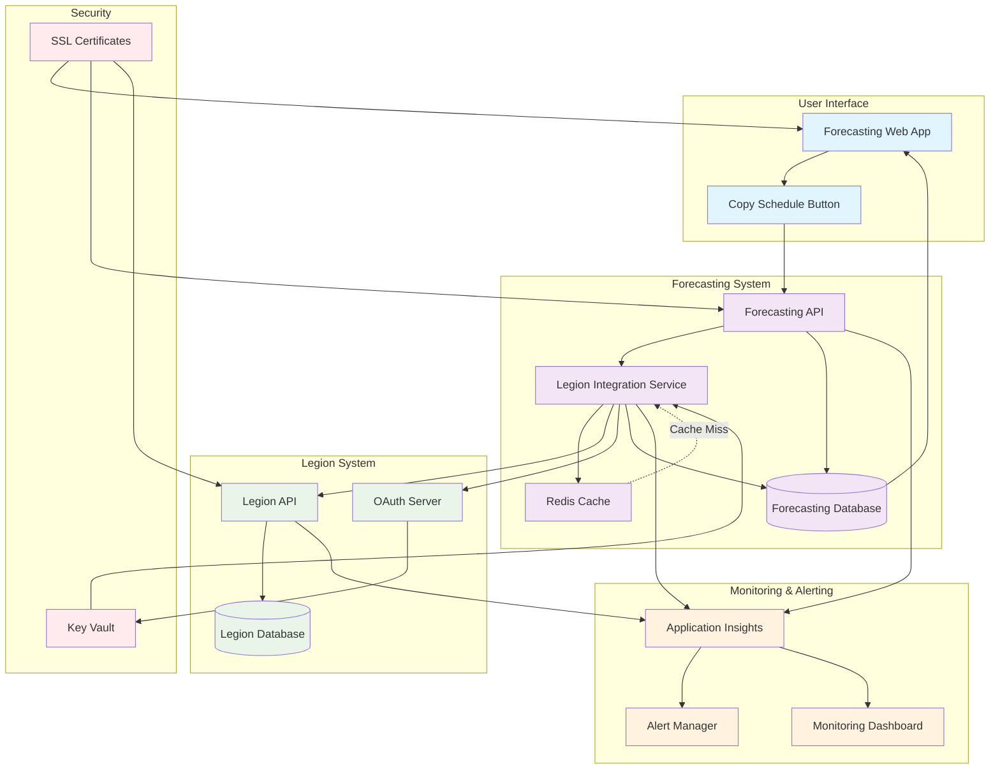

# Towne Park Forecasting - Legion Schedule Integration

## Field-level Mapping Between Source and Target Systems

### Legion Schedule Data to Forecasting System

| Legion Field | Data Type | Forecasting Field | Data Type | Transformation Rules | Business Logic |
|--------------|-----------|-------------------|-----------|---------------------|----------------|
| site_id | VARCHAR(10) | site_number | VARCHAR(10) | Direct mapping | Must match Power Bill site numbers |
| employee_id | VARCHAR(20) | employee_id | VARCHAR(20) | Direct mapping | Unique employee identifier |
| job_code | VARCHAR(20) | job_code | VARCHAR(20) | Direct mapping | Must exist in Power Bill job codes |
| schedule_date | DATE | forecast_date | DATE | Direct mapping | Date of scheduled work |
| start_time | TIME | start_time | TIME | Direct mapping | Shift start time |
| end_time | TIME | end_time | TIME | Direct mapping | Shift end time |
| scheduled_hours | DECIMAL(5,2) | scheduled_hours | DECIMAL(5,2) | Direct mapping | Total scheduled hours for shift |
| break_hours | DECIMAL(4,2) | break_hours | DECIMAL(4,2) | Direct mapping | Unpaid break time |
| net_hours | DECIMAL(5,2) | net_hours | DECIMAL(5,2) | Calculated: scheduled_hours - break_hours | Billable hours |
| hourly_rate | DECIMAL(8,2) | hourly_rate | DECIMAL(8,2) | Direct mapping | Employee hourly rate |
| shift_differential | DECIMAL(6,2) | shift_differential | DECIMAL(6,2) | Direct mapping | Additional pay for shift timing |
| overtime_flag | BIT | overtime_flag | BIT | Direct mapping | 1=Overtime, 0=Regular time |
| schedule_status | VARCHAR(20) | schedule_status | VARCHAR(20) | Direct mapping | SCHEDULED, CONFIRMED, CANCELLED |
| created_date | DATETIME | created_date | DATETIME | Direct mapping | Record creation timestamp |
| last_modified | DATETIME | last_updated | DATETIME | Direct mapping | Last modification timestamp |

### Legion Payroll Summary to Forecasting System

| Legion Field | Data Type | Forecasting Field | Data Type | Transformation Rules | Business Logic |
|--------------|-----------|-------------------|-----------|---------------------|----------------|
| site_id | VARCHAR(10) | site_number | VARCHAR(10) | Direct mapping | Must match Power Bill site numbers |
| pay_period_start | DATE | pay_period_start | DATE | Direct mapping | Start date of pay period |
| pay_period_end | DATE | pay_period_end | DATE | Direct mapping | End date of pay period |
| job_code | VARCHAR(20) | job_code | VARCHAR(20) | Direct mapping | Must exist in Power Bill job codes |
| regular_hours | DECIMAL(8,2) | regular_hours | DECIMAL(8,2) | Direct mapping | Regular time hours worked |
| overtime_hours | DECIMAL(8,2) | overtime_hours | DECIMAL(8,2) | Direct mapping | Overtime hours worked |
| total_hours | DECIMAL(8,2) | total_hours | DECIMAL(8,2) | Calculated: regular_hours + overtime_hours | Total hours worked |
| regular_pay | DECIMAL(10,2) | regular_pay | DECIMAL(10,2) | Direct mapping | Regular time compensation |
| overtime_pay | DECIMAL(10,2) | overtime_pay | DECIMAL(10,2) | Direct mapping | Overtime compensation |
| shift_differential_pay | DECIMAL(8,2) | shift_differential_pay | DECIMAL(8,2) | Direct mapping | Shift differential compensation |
| total_gross_pay | DECIMAL(12,2) | total_gross_pay | DECIMAL(12,2) | Direct mapping | Total gross compensation |
| employee_count | INT | employee_count | INT | Direct mapping | Number of employees in summary |

## Documentation of Code/Logic Including Code Snippets and Clear Explanation

### Copy Schedule to Forecast Functionality

#### Frontend Implementation
```javascript
// Copy Schedule to Forecast Button Handler
async function copyScheduleToForecast(siteNumber, startDate, endDate) {
    try {
        // Show confirmation dialog
        const confirmed = await showConfirmationDialog({
            title: "Copy Schedule to Forecast",
            message: `This will overwrite existing forecast data for all scheduled dates between ${startDate} and ${endDate}. Continue?`,
            confirmText: "Yes, Copy Schedule",
            cancelText: "Cancel"
        });
        
        if (!confirmed) return;
        
        // Show loading indicator
        showLoadingSpinner("Copying schedule data...");
        
        // Call backend API
        const response = await fetch('/api/forecasting/copy-schedule', {
            method: 'POST',
            headers: {
                'Content-Type': 'application/json',
                'Authorization': `Bearer ${getAuthToken()}`
            },
            body: JSON.stringify({
                siteNumber: siteNumber,
                startDate: startDate,
                endDate: endDate,
                overwriteExisting: true
            })
        });
        
        if (!response.ok) {
            throw new Error(`HTTP ${response.status}: ${response.statusText}`);
        }
        
        const result = await response.json();
        
        // Update UI with copied data
        await refreshForecastGrid();
        
        // Show success message
        showSuccessMessage(`Successfully copied ${result.recordsProcessed} scheduled shifts to forecast.`);
        
    } catch (error) {
        console.error('Error copying schedule to forecast:', error);
        showErrorMessage('Failed to copy schedule data. Please try again.');
    } finally {
        hideLoadingSpinner();
    }
}

// Confirmation Dialog Component
function showConfirmationDialog(options) {
    return new Promise((resolve) => {
        const dialog = document.createElement('div');
        dialog.className = 'confirmation-dialog-overlay';
        dialog.innerHTML = `
            <div class="confirmation-dialog">
                <h3>${options.title}</h3>
                <p>${options.message}</p>
                <div class="dialog-buttons">
                    <button class="btn-cancel" onclick="resolveDialog(false)">${options.cancelText}</button>
                    <button class="btn-confirm" onclick="resolveDialog(true)">${options.confirmText}</button>
                </div>
            </div>
        `;
        
        window.resolveDialog = (result) => {
            document.body.removeChild(dialog);
            delete window.resolveDialog;
            resolve(result);
        };
        
        document.body.appendChild(dialog);
    });
}
```

#### Backend API Implementation
```csharp
[HttpPost("copy-schedule")]
public async Task<IActionResult> CopyScheduleToForecast([FromBody] CopyScheduleRequest request)
{
    try
    {
        // Validate request parameters
        if (string.IsNullOrEmpty(request.SiteNumber) || 
            request.StartDate >= request.EndDate)
        {
            return BadRequest("Invalid request parameters");
        }
        
        // Check user permissions
        if (!await _authService.HasSiteAccess(User.Identity.Name, request.SiteNumber))
        {
            return Forbid("Insufficient permissions for this site");
        }
        
        // Retrieve scheduled data from Legion
        var scheduleData = await _legionService.GetScheduleData(
            request.SiteNumber, 
            request.StartDate, 
            request.EndDate
        );
        
        if (!scheduleData.Any())
        {
            return Ok(new { recordsProcessed = 0, message = "No scheduled data found for the specified period" });
        }
        
        // Transform schedule data to forecast format
        var forecastRecords = scheduleData.Select(schedule => new ForecastRecord
        {
            SiteNumber = schedule.SiteId,
            JobCode = schedule.JobCode,
            ForecastDate = schedule.ScheduleDate,
            ForecastedHours = schedule.NetHours,
            HourlyRate = schedule.HourlyRate,
            ShiftDifferential = schedule.ShiftDifferential,
            IsOvertime = schedule.OvertimeFlag,
            DataSource = "LEGION_SCHEDULE",
            CreatedBy = User.Identity.Name,
            CreatedDate = DateTime.UtcNow,
            LastUpdated = DateTime.UtcNow
        }).ToList();
        
        // Begin database transaction
        using var transaction = await _dbContext.Database.BeginTransactionAsync();
        
        try
        {
            // Delete existing forecast data for the date range if overwrite is enabled
            if (request.OverwriteExisting)
            {
                var existingRecords = _dbContext.ForecastData
                    .Where(f => f.SiteNumber == request.SiteNumber &&
                               f.ForecastDate >= request.StartDate &&
                               f.ForecastDate <= request.EndDate &&
                               f.DataSource == "LEGION_SCHEDULE");
                
                _dbContext.ForecastData.RemoveRange(existingRecords);
            }
            
            // Insert new forecast records
            await _dbContext.ForecastData.AddRangeAsync(forecastRecords);
            
            // Save changes
            var recordsProcessed = await _dbContext.SaveChangesAsync();
            
            // Commit transaction
            await transaction.CommitAsync();
            
            // Log the operation
            _logger.LogInformation($"Successfully copied {recordsProcessed} schedule records to forecast for site {request.SiteNumber}");
            
            return Ok(new { recordsProcessed = recordsProcessed });
        }
        catch (Exception ex)
        {
            await transaction.RollbackAsync();
            throw;
        }
    }
    catch (Exception ex)
    {
        _logger.LogError(ex, $"Error copying schedule to forecast for site {request.SiteNumber}");
        return StatusCode(500, "Internal server error occurred while copying schedule data");
    }
}

// Request model
public class CopyScheduleRequest
{
    public string SiteNumber { get; set; }
    public DateTime StartDate { get; set; }
    public DateTime EndDate { get; set; }
    public bool OverwriteExisting { get; set; } = true;
}
```

### Legion Data Synchronization Service
```csharp
public class LegionIntegrationService
{
    private readonly HttpClient _httpClient;
    private readonly IConfiguration _configuration;
    private readonly ILogger<LegionIntegrationService> _logger;
    
    public async Task<List<LegionScheduleRecord>> GetScheduleData(string siteNumber, DateTime startDate, DateTime endDate)
    {
        try
        {
            // Construct API endpoint
            var endpoint = $"{_configuration["Legion:BaseUrl"]}/api/schedule";
            var queryParams = $"?site={siteNumber}&start={startDate:yyyy-MM-dd}&end={endDate:yyyy-MM-dd}";
            
            // Add authentication headers
            _httpClient.DefaultRequestHeaders.Authorization = 
                new AuthenticationHeaderValue("Bearer", await GetLegionAccessToken());
            
            // Make API call
            var response = await _httpClient.GetAsync(endpoint + queryParams);
            response.EnsureSuccessStatusCode();
            
            // Parse response
            var jsonContent = await response.Content.ReadAsStringAsync();
            var scheduleData = JsonSerializer.Deserialize<List<LegionScheduleRecord>>(jsonContent);
            
            // Validate and filter data
            return scheduleData
                .Where(s => s.ScheduleStatus == "SCHEDULED" || s.ScheduleStatus == "CONFIRMED")
                .Where(s => s.NetHours > 0)
                .ToList();
        }
        catch (Exception ex)
        {
            _logger.LogError(ex, $"Error retrieving schedule data from Legion for site {siteNumber}");
            throw new IntegrationException("Failed to retrieve schedule data from Legion", ex);
        }
    }
    
    public async Task<List<LegionPayrollRecord>> GetPayrollSummary(string siteNumber, DateTime payPeriodStart, DateTime payPeriodEnd)
    {
        try
        {
            var endpoint = $"{_configuration["Legion:BaseUrl"]}/api/payroll/summary";
            var queryParams = $"?site={siteNumber}&periodStart={payPeriodStart:yyyy-MM-dd}&periodEnd={payPeriodEnd:yyyy-MM-dd}";
            
            _httpClient.DefaultRequestHeaders.Authorization = 
                new AuthenticationHeaderValue("Bearer", await GetLegionAccessToken());
            
            var response = await _httpClient.GetAsync(endpoint + queryParams);
            response.EnsureSuccessStatusCode();
            
            var jsonContent = await response.Content.ReadAsStringAsync();
            var payrollData = JsonSerializer.Deserialize<List<LegionPayrollRecord>>(jsonContent);
            
            return payrollData.Where(p => p.TotalHours > 0).ToList();
        }
        catch (Exception ex)
        {
            _logger.LogError(ex, $"Error retrieving payroll data from Legion for site {siteNumber}");
            throw new IntegrationException("Failed to retrieve payroll data from Legion", ex);
        }
    }
    
    private async Task<string> GetLegionAccessToken()
    {
        // Implementation for OAuth token retrieval
        // This would typically involve client credentials flow
        var tokenEndpoint = $"{_configuration["Legion:BaseUrl"]}/oauth/token";
        var clientId = _configuration["Legion:ClientId"];
        var clientSecret = _configuration["Legion:ClientSecret"];
        
        var tokenRequest = new FormUrlEncodedContent(new[]
        {
            new KeyValuePair<string, string>("grant_type", "client_credentials"),
            new KeyValuePair<string, string>("client_id", clientId),
            new KeyValuePair<string, string>("client_secret", clientSecret),
            new KeyValuePair<string, string>("scope", "schedule:read payroll:read")
        });
        
        var response = await _httpClient.PostAsync(tokenEndpoint, tokenRequest);
        response.EnsureSuccessStatusCode();
        
        var tokenResponse = await response.Content.ReadAsStringAsync();
        var tokenData = JsonSerializer.Deserialize<TokenResponse>(tokenResponse);
        
        return tokenData.AccessToken;
    }
}
```

## Schedule That It Is Run On

### Automated Synchronization Schedule

| Process | Frequency | Time | Purpose | Dependencies |
|---------|-----------|------|---------|--------------|
| Schedule Data Sync | Every 4 hours | 6:00 AM, 10:00 AM, 2:00 PM, 6:00 PM | Real-time schedule updates | Legion API availability |
| Payroll Summary Sync | Daily | 7:00 AM | Daily payroll actuals | Legion payroll processing |
| Historical Data Sync | Weekly | Sunday 2:00 AM | Backfill any missed data | Legion system maintenance window |
| Full Reconciliation | Monthly | 1st of month 3:00 AM | Complete data validation | Month-end processing complete |

### Manual Sync Triggers
- **On-demand refresh**: Users can trigger immediate sync for specific date ranges
- **Copy schedule action**: Triggered when user clicks "Copy Schedule to Forecast"
- **Error recovery**: Manual sync after integration failures
- **Data validation**: Sync triggered after data quality issues detected

## Integration Method

### Primary Integration: REST API
- **Protocol**: HTTPS REST API calls
- **Authentication**: OAuth 2.0 Client Credentials flow
- **Data Format**: JSON request/response
- **Timeout**: 30 seconds per API call
- **Retry Logic**: 3 attempts with exponential backoff

### Fallback Integration: File Drop
- **Location**: Secure SFTP server
- **Format**: CSV files with predefined schema
- **Frequency**: Daily at 11:00 PM
- **Retention**: 30 days on SFTP server
- **Processing**: Automated file pickup and processing

### Data Validation
- **Schema Validation**: JSON schema validation for API responses
- **Business Rule Validation**: Hours within reasonable ranges, valid job codes
- **Referential Integrity**: Site numbers and job codes exist in Power Bill
- **Duplicate Detection**: Prevent duplicate records for same employee/date/job

## Technical Information, API Endpoints, Methods, Functions

### Legion API Endpoints

#### Schedule Data Endpoint
```
GET /api/v2/schedule
Headers:
  Authorization: Bearer {access_token}
  Content-Type: application/json
  
Query Parameters:
  site: string (required) - Site identifier
  start: date (required) - Start date (YYYY-MM-DD)
  end: date (required) - End date (YYYY-MM-DD)
  status: string (optional) - Filter by schedule status
  jobCode: string (optional) - Filter by job code

Response Format:
{
  "schedules": [
    {
      "siteId": "0170",
      "employeeId": "EMP001",
      "jobCode": "GSA1",
      "scheduleDate": "2025-07-15",
      "startTime": "08:00:00",
      "endTime": "16:00:00",
      "scheduledHours": 8.0,
      "breakHours": 0.5,
      "netHours": 7.5,
      "hourlyRate": 15.50,
      "shiftDifferential": 0.00,
      "overtimeFlag": false,
      "scheduleStatus": "SCHEDULED"
    }
  ],
  "totalRecords": 1,
  "hasMore": false
}
```

#### Payroll Summary Endpoint
```
GET /api/v2/payroll/summary
Headers:
  Authorization: Bearer {access_token}
  Content-Type: application/json
  
Query Parameters:
  site: string (required) - Site identifier
  periodStart: date (required) - Pay period start (YYYY-MM-DD)
  periodEnd: date (required) - Pay period end (YYYY-MM-DD)
  groupBy: string (optional) - Grouping level (job, employee, day)

Response Format:
{
  "payrollSummary": [
    {
      "siteId": "0170",
      "payPeriodStart": "2025-07-01",
      "payPeriodEnd": "2025-07-15",
      "jobCode": "GSA1",
      "regularHours": 120.0,
      "overtimeHours": 8.0,
      "totalHours": 128.0,
      "regularPay": 1860.00,
      "overtimePay": 186.00,
      "shiftDifferentialPay": 0.00,
      "totalGrossPay": 2046.00,
      "employeeCount": 4
    }
  ],
  "totalRecords": 1
}
```

#### Authentication Endpoint
```
POST /oauth/token
Headers:
  Content-Type: application/x-www-form-urlencoded
  
Body:
  grant_type=client_credentials
  client_id={client_id}
  client_secret={client_secret}
  scope=schedule:read payroll:read

Response Format:
{
  "access_token": "eyJhbGciOiJSUzI1NiIs...",
  "token_type": "Bearer",
  "expires_in": 3600,
  "scope": "schedule:read payroll:read"
}
```

### Forecasting System API Functions

#### Copy Schedule Function
```csharp
public async Task<CopyScheduleResult> CopyScheduleToForecast(
    string siteNumber, 
    DateTime startDate, 
    DateTime endDate, 
    bool overwriteExisting = true)
{
    // Implementation details in code section above
}
```

#### Sync Payroll Function
```csharp
public async Task<SyncResult> SyncPayrollData(
    string siteNumber, 
    DateTime payPeriodStart, 
    DateTime payPeriodEnd)
{
    // Retrieve payroll data from Legion
    var payrollData = await _legionService.GetPayrollSummary(siteNumber, payPeriodStart, payPeriodEnd);
    
    // Transform and load into forecasting system
    var forecastRecords = TransformPayrollToForecast(payrollData);
    
    // Update database
    return await _dataService.UpdatePayrollActuals(forecastRecords);
}
```

## Information on Monitoring, Alerting, and Error Handling Procedures

### Monitoring Dashboard Metrics

#### Integration Health Metrics
- **API Response Time**: Average response time for Legion API calls
- **Success Rate**: Percentage of successful API calls in last 24 hours
- **Data Freshness**: Time since last successful data sync
- **Record Volume**: Number of records processed per sync cycle
- **Error Rate**: Percentage of failed integration attempts

#### Business Metrics
- **Schedule Coverage**: Percentage of sites with current schedule data
- **Payroll Accuracy**: Variance between Legion and forecasting payroll data
- **User Adoption**: Frequency of "Copy Schedule" feature usage
- **Data Quality**: Percentage of records passing validation rules

### Alerting Configuration

#### Critical Alerts (Immediate Response)
```yaml
- name: "Legion API Down"
  condition: "api_success_rate < 50% for 15 minutes"
  severity: "Critical"
  notification: "PagerDuty + Email"
  
- name: "Data Sync Failure"
  condition: "last_successful_sync > 6 hours ago"
  severity: "Critical"
  notification: "PagerDuty + Email"
  
- name: "Authentication Failure"
  condition: "oauth_token_failure for 3 consecutive attempts"
  severity: "Critical"
  notification: "PagerDuty + Email"
```

#### Warning Alerts (Business Hours Response)
```yaml
- name: "High Error Rate"
  condition: "error_rate > 10% for 1 hour"
  severity: "Warning"
  notification: "Email + Slack"
  
- name: "Slow Response Time"
  condition: "avg_response_time > 5 seconds for 30 minutes"
  severity: "Warning"
  notification: "Email + Slack"
  
- name: "Data Quality Issues"
  condition: "validation_failure_rate > 5% for 2 hours"
  severity: "Warning"
  notification: "Email + Slack"
```

### Error Handling Procedures

#### Automatic Error Recovery
```csharp
public async Task<T> ExecuteWithRetry<T>(Func<Task<T>> operation, int maxRetries = 3)
{
    var retryCount = 0;
    var baseDelay = TimeSpan.FromSeconds(2);
    
    while (retryCount < maxRetries)
    {
        try
        {
            return await operation();
        }
        catch (HttpRequestException ex) when (retryCount < maxRetries - 1)
        {
            retryCount++;
            var delay = TimeSpan.FromMilliseconds(baseDelay.TotalMilliseconds * Math.Pow(2, retryCount));
            
            _logger.LogWarning($"API call failed (attempt {retryCount}/{maxRetries}). Retrying in {delay.TotalSeconds} seconds. Error: {ex.Message}");
            
            await Task.Delay(delay);
        }
        catch (Exception ex)
        {
            _logger.LogError(ex, $"Operation failed after {retryCount} retries");
            throw;
        }
    }
    
    throw new IntegrationException($"Operation failed after {maxRetries} retry attempts");
}
```

#### Manual Error Recovery Procedures

1. **API Connection Issues**
   - Verify Legion system status
   - Check network connectivity
   - Validate authentication credentials
   - Review firewall and proxy settings

2. **Data Validation Failures**
   - Review error logs for specific validation failures
   - Check for changes in Legion data format
   - Validate job code mappings in Power Bill
   - Verify site number consistency

3. **Performance Issues**
   - Monitor Legion API response times
   - Check database performance metrics
   - Review integration batch sizes
   - Analyze concurrent user load

4. **Data Inconsistency Issues**
   - Run data reconciliation reports
   - Compare Legion source data with forecasting system
   - Identify and resolve mapping discrepancies
   - Execute manual data correction procedures

## Mermaid Flowchart Leveraging Architecture Library Syntax



## Related Documentation

- [Forecasting System Overview](../../systems/forecasting/forecasting-system-overview.md)
- [Payroll Management Business Rules](../../business-rules/forecasting/)
- [Account Manager User Processes](../../user-processes/account-manager/)
- [Data Synchronization Standards](../../standards/data-synchronization-standards/)
- [Error Handling Standards](../../standards/error-handling-standards.md)

## Code Validation Notes

**VERIFICATION NEEDED**: Legion API integration patterns require validation against current implementation:
- Confirm actual Legion API endpoints and authentication methods
- Validate data transformation logic and field mappings
- Verify error handling and retry mechanisms
- Check monitoring and alerting configuration

**VERIFICATION NEEDED**: Copy Schedule to Forecast functionality requires validation against Power Platform implementation:
- Confirm UI component structure and event handling
- Validate backend API methods and database operations
- Verify user permission and security implementations
- Check transaction handling and rollback procedures

**VERIFICATION NEEDED**: Data synchronization schedules and processes require validation against current operational procedures:
- Confirm actual sync frequencies and timing
- Validate monitoring metrics and alerting thresholds
- Verify manual recovery procedures and escalation paths
- Check performance benchmarks and capacity planning

---

*This integration document provides comprehensive specifications for Legion schedule integration within the Towne Park forecasting system. All technical implementations and operational procedures should be validated against current system implementation before relying on this documentation for development or operational decisions.*