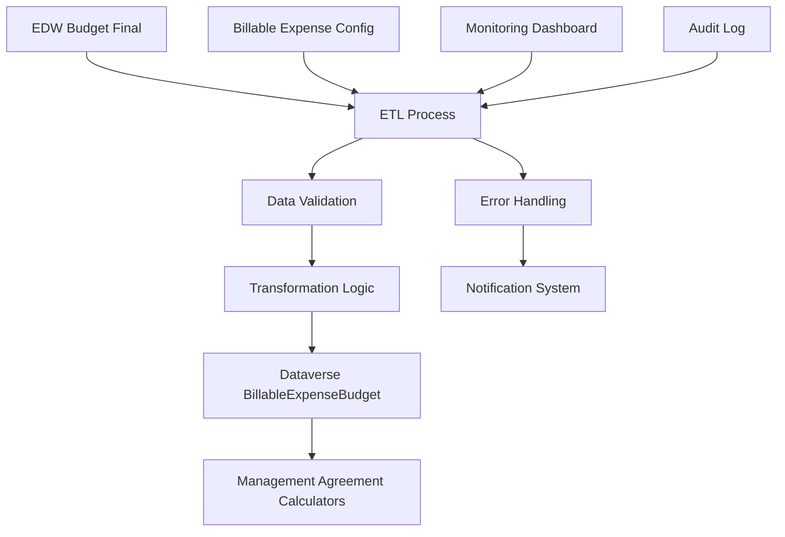
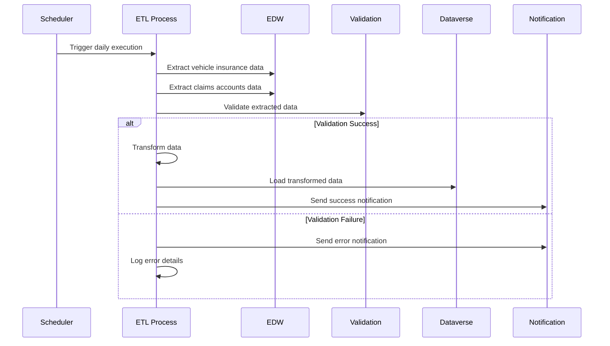

# Management Agreement ETL Integration Technical Documentation

## Purpose

This integration documentation defines the ETL (Extract, Transform, Load) processes required to support Management Agreement billing calculations. The integration enhances existing billable expense budget data with additional fields for vehicle insurance and claims account aggregations, ensuring accurate and timely data availability for complex billing calculations.

## Business Data Sources and Systems

### Source Systems
- **EDW (Enterprise Data Warehouse)**: Primary source for budget and financial data
- **Budget Final Table**: Contains detailed account-level budget information
- **Billable Expense Configuration**: Defines enabled/disabled account status

### Target Systems
- **Power Platform Dataverse**: Destination for processed ETL data
- **Billable Expense Budget Table**: Enhanced with new calculation fields
- **Management Agreement Calculators**: Consumers of ETL-processed data

## Field-Level Mapping

### Vehicle Insurance Budget Mapping

| Source Field | Source Table | Target Field | Target Table | Transformation Logic |
|--------------|--------------|--------------|--------------|---------------------|
| account_code | edw.budget_final | vehicle_insurance_budget | BillableExpenseBudget | SUM(budget_amount) WHERE account_code = '7082' |
| budget_amount | edw.budget_final | vehicle_insurance_budget | BillableExpenseBudget | Aggregate by contract_id, site_id, month_year |
| contract_id | edw.budget_final | contract_id | BillableExpenseBudget | Direct mapping (grouping key) |
| site_id | edw.budget_final | site_id | BillableExpenseBudget | Direct mapping (grouping key) |
| fiscal_period | edw.budget_final | month_year | BillableExpenseBudget | Convert to YYYY-MM-01 format |

### Claims Accounts Total Mapping

| Source Field | Source Table | Target Field | Target Table | Transformation Logic |
|--------------|--------------|--------------|--------------|---------------------|
| account_code | edw.budget_final | claims_accounts_total | BillableExpenseBudget | SUM(budget_amount) WHERE account_code IN claims_list |
| budget_amount | edw.budget_final | claims_accounts_total | BillableExpenseBudget | Aggregate enabled claims accounts only |
| enabled | billable_expense_config | claims_accounts_total | BillableExpenseBudget | Filter: enabled = 1 |
| contract_id | edw.budget_final | contract_id | BillableExpenseBudget | Direct mapping (grouping key) |
| site_id | edw.budget_final | site_id | BillableExpenseBudget | Direct mapping (grouping key) |

### Claims Account Codes Configuration

**Standard Claims Accounts**:
- 7099: Claims Account Type A
- 7100: Claims Account Type B
- 7101: Claims Account Type C (if configured)
- 7102: Claims Account Type D (if configured)

**Dynamic Configuration**: Additional claims account codes sourced from billable_expense_config table where account_type = 'claims' and enabled = 1

## Integration Architecture



## ETL Process Implementation

### Extract Phase

**Source Query - Vehicle Insurance Budget**:
```sql
SELECT 
    contract_id,
    site_id,
    fiscal_period,
    account_code,
    budget_amount,
    last_modified_date
FROM edw.budget_final
WHERE account_code = '7082'
  AND fiscal_period >= DATEADD(month, -3, GETDATE()) -- Rolling 3-month window
  AND budget_amount IS NOT NULL
```

**Source Query - Claims Accounts**:
```sql
SELECT 
    bf.contract_id,
    bf.site_id,
    bf.fiscal_period,
    bf.account_code,
    bf.budget_amount,
    bec.enabled,
    bf.last_modified_date
FROM edw.budget_final bf
INNER JOIN billable_expense_config bec ON bf.account_code = bec.account_code
WHERE bec.account_type = 'claims'
  AND bf.fiscal_period >= DATEADD(month, -3, GETDATE())
  AND bf.budget_amount IS NOT NULL
```

### Transform Phase

**Vehicle Insurance Aggregation**:
```sql
SELECT 
    contract_id,
    site_id,
    DATEFROMPARTS(YEAR(fiscal_period), MONTH(fiscal_period), 1) as month_year,
    SUM(budget_amount) as vehicle_insurance_budget,
    MAX(last_modified_date) as source_last_modified
FROM extracted_vehicle_insurance
GROUP BY contract_id, site_id, YEAR(fiscal_period), MONTH(fiscal_period)
HAVING SUM(budget_amount) > 0
```

**Claims Accounts Aggregation**:
```sql
SELECT 
    contract_id,
    site_id,
    DATEFROMPARTS(YEAR(fiscal_period), MONTH(fiscal_period), 1) as month_year,
    SUM(CASE WHEN enabled = 1 THEN budget_amount ELSE 0 END) as claims_accounts_total,
    COUNT(DISTINCT account_code) as claims_account_count,
    MAX(last_modified_date) as source_last_modified
FROM extracted_claims_accounts
GROUP BY contract_id, site_id, YEAR(fiscal_period), MONTH(fiscal_period)
```

### Load Phase

**Upsert Logic for BillableExpenseBudget**:
```sql
MERGE BillableExpenseBudget AS target
USING (
    SELECT 
        contract_id,
        site_id,
        month_year,
        vehicle_insurance_budget,
        claims_accounts_total,
        source_last_modified
    FROM transformed_data
) AS source ON (
    target.contract_id = source.contract_id 
    AND target.site_id = source.site_id 
    AND target.month_year = source.month_year
)
WHEN MATCHED AND source.source_last_modified > target.etl_last_updated THEN
    UPDATE SET 
        vehicle_insurance_budget = source.vehicle_insurance_budget,
        claims_accounts_total = source.claims_accounts_total,
        etl_last_updated = GETDATE()
WHEN NOT MATCHED THEN
    INSERT (contract_id, site_id, month_year, vehicle_insurance_budget, claims_accounts_total, etl_last_updated)
    VALUES (source.contract_id, source.site_id, source.month_year, 
            source.vehicle_insurance_budget, source.claims_accounts_total, GETDATE());
```

## Data Validation Rules

### Vehicle Insurance Budget Validation

**Business Rules**:
- Vehicle insurance budget must be >= 0
- Only one vehicle insurance account (7082) per contract/site/month
- Budget amount must be numeric with 2 decimal precision

**Validation Logic**:
```sql
-- Validate vehicle insurance budget
SELECT 
    contract_id,
    site_id,
    month_year,
    vehicle_insurance_budget,
    CASE 
        WHEN vehicle_insurance_budget < 0 THEN 'Negative budget amount'
        WHEN vehicle_insurance_budget IS NULL THEN 'Missing budget value'
        WHEN vehicle_insurance_budget > 999999.99 THEN 'Budget amount exceeds maximum'
        ELSE 'Valid'
    END as validation_status
FROM transformed_vehicle_insurance
WHERE validation_status != 'Valid'
```

### Claims Accounts Validation

**Business Rules**:
- Claims accounts total must be >= 0
- At least one enabled claims account must exist for non-zero totals
- Claims account codes must exist in billable_expense_config

**Validation Logic**:
```sql
-- Validate claims accounts
SELECT 
    contract_id,
    site_id,
    month_year,
    claims_accounts_total,
    claims_account_count,
    CASE 
        WHEN claims_accounts_total < 0 THEN 'Negative claims total'
        WHEN claims_accounts_total > 0 AND claims_account_count = 0 THEN 'No enabled claims accounts'
        WHEN claims_accounts_total IS NULL THEN 'Missing claims value'
        ELSE 'Valid'
    END as validation_status
FROM transformed_claims_accounts
WHERE validation_status != 'Valid'
```

## Schedule and Execution

### ETL Schedule

**Primary Schedule**: Daily execution at 2:00 AM EST
- **Duration**: Estimated 15-30 minutes for full processing
- **Window**: Off-peak hours to minimize system impact
- **Dependencies**: EDW data refresh completion (1:00 AM EST)

**Incremental Updates**: Every 4 hours during business hours
- **Scope**: Only records modified since last execution
- **Duration**: 2-5 minutes for incremental processing
- **Trigger**: Data change detection in source systems

### Execution Workflow



## Error Handling and Monitoring

### Error Categories

**Data Quality Errors**:
- Missing required fields
- Invalid data types or formats
- Business rule violations
- Referential integrity issues

**System Errors**:
- Source system connectivity issues
- Target system write failures
- Timeout errors
- Resource constraints

**Configuration Errors**:
- Missing billable expense configurations
- Invalid account code mappings
- Incorrect schedule parameters

### Error Handling Procedures

**Immediate Response**:
1. Log error details with full context
2. Send notification to on-call support team
3. Attempt automatic retry (up to 3 attempts)
4. Escalate to manual intervention if retries fail

**Error Recovery**:
```sql
-- Error recovery query for failed records
INSERT INTO etl_error_log (
    execution_id,
    error_type,
    error_message,
    failed_record_id,
    retry_count,
    created_date
)
SELECT 
    @execution_id,
    'Data Validation',
    validation_status,
    CONCAT(contract_id, '|', site_id, '|', month_year),
    0,
    GETDATE()
FROM validation_results
WHERE validation_status != 'Valid'
```

### Monitoring and Alerting

**Key Performance Indicators**:
- ETL execution duration
- Record processing volume
- Error rate percentage
- Data freshness metrics

**Alert Thresholds**:
- Execution time > 45 minutes: Warning
- Error rate > 5%: Critical
- Zero records processed: Critical
- Source data age > 25 hours: Warning

**Monitoring Dashboard Metrics**:
```sql
-- ETL performance monitoring query
SELECT 
    execution_date,
    total_records_processed,
    successful_records,
    failed_records,
    execution_duration_minutes,
    (failed_records * 100.0 / total_records_processed) as error_rate_percent
FROM etl_execution_log
WHERE execution_date >= DATEADD(day, -7, GETDATE())
ORDER BY execution_date DESC
```

## Performance Optimization

### Query Optimization

**Indexing Strategy**:
```sql
-- Source system indexes for optimal extraction
CREATE INDEX IX_BudgetFinal_AccountCode_Period 
ON edw.budget_final (account_code, fiscal_period) 
INCLUDE (contract_id, site_id, budget_amount);

-- Target system indexes for efficient upserts
CREATE INDEX IX_BillableExpenseBudget_Contract_Site_Month 
ON BillableExpenseBudget (contract_id, site_id, month_year) 
INCLUDE (vehicle_insurance_budget, claims_accounts_total);
```

**Batch Processing**:
- Process records in batches of 1,000 to optimize memory usage
- Use parallel processing for independent contract/site combinations
- Implement checkpoint restart capability for large data volumes

### Data Volume Management

**Current Volume Estimates**:
- Vehicle insurance records: ~500 contracts × 12 months = 6,000 records/year
- Claims account records: ~300 contracts × 4 accounts × 12 months = 14,400 records/year
- Processing time: ~2 minutes for current volume

**Scalability Considerations**:
- Partition large tables by fiscal year
- Implement data archival for records older than 3 years
- Use compression for historical data storage

## Technical Information

### API Endpoints

**ETL Control API**:
- `POST /api/etl/management-agreement/trigger`: Manual ETL execution
- `GET /api/etl/management-agreement/status`: Current execution status
- `GET /api/etl/management-agreement/logs`: Execution history and logs

**Data Validation API**:
- `POST /api/validation/vehicle-insurance`: Validate vehicle insurance data
- `POST /api/validation/claims-accounts`: Validate claims accounts data
- `GET /api/validation/rules`: Retrieve current validation rules

### Integration Methods

**Primary Method**: Scheduled ETL using SQL Server Integration Services (SSIS)
**Backup Method**: PowerShell scripts with SQL queries for manual execution
**Real-time Option**: Change Data Capture (CDC) for immediate updates when required

### Technical Configuration

**Connection Strings**:
```json
{
  "EDW_Connection": "Server=edw-prod;Database=FinancialData;Integrated Security=true;",
  "Dataverse_Connection": "AuthType=OAuth;Url=https://townepark.crm.dynamics.com;",
  "Notification_SMTP": "smtp.townepark.com:587"
}
```

**ETL Package Parameters**:
```xml
<Parameters>
  <Parameter Name="LookbackMonths" Value="3" />
  <Parameter Name="BatchSize" Value="1000" />
  <Parameter Name="RetryAttempts" Value="3" />
  <Parameter Name="TimeoutMinutes" Value="30" />
</Parameters>
```

## Monitoring and Alerting Procedures

### Automated Monitoring

**Health Checks**:
- Source system connectivity test every 15 minutes
- Target system write test every hour
- Data freshness validation every 4 hours

**Performance Monitoring**:
- Query execution time tracking
- Memory and CPU usage monitoring
- Disk space utilization alerts

### Manual Monitoring Procedures

**Daily Checks**:
1. Review ETL execution summary report
2. Validate record counts against expected volumes
3. Check error log for any failed records
4. Verify data freshness in target system

**Weekly Reviews**:
1. Analyze performance trends and optimization opportunities
2. Review error patterns and implement preventive measures
3. Validate business rule compliance across all processed data
4. Update monitoring thresholds based on volume changes

### Escalation Procedures

**Level 1 - Automated Response**:
- Retry failed operations up to 3 times
- Send notification to ETL support team
- Log detailed error information

**Level 2 - Support Team Response**:
- Investigate root cause within 30 minutes
- Implement immediate workaround if possible
- Escalate to Level 3 if resolution time exceeds 2 hours

**Level 3 - Engineering Team Response**:
- Deep technical investigation and resolution
- Code fixes or configuration changes as needed
- Post-incident review and prevention planning

---

*This integration documentation ensures reliable and accurate ETL processing for Management Agreement billing calculations, supporting the complex business requirements while maintaining system performance and data integrity.*