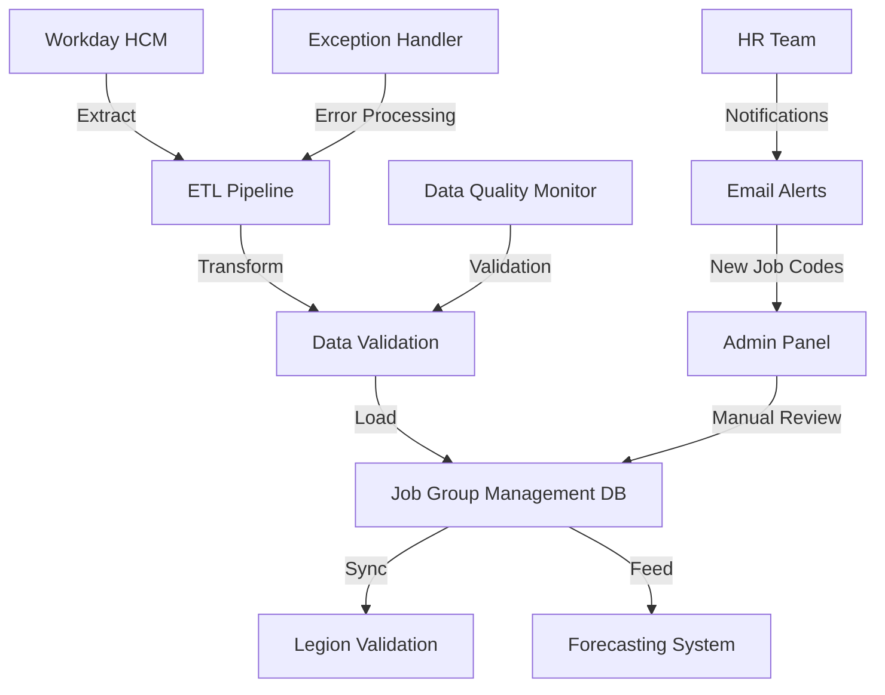

# Workday Job Code Integration - Technical Documentation

## Integration Overview

### Purpose
The Workday Job Code Integration provides automated extraction and synchronization of job code and employee data from Workday HCM system to support job group management, payroll forecasting, and budget mapping within the Towne Park forecasting system.

### Business Context
This integration serves as the authoritative source for job code definitions and site associations, enabling consistent workforce data across Legion scheduling, budget management, and forecasting systems while supporting organizational changes and new site onboarding.

### Integration Architecture


## Data Sources and Extraction

### Workday Data Sources

**Primary Table**: Employee Job Data
- **Source**: Workday HCM Employee Records
- **Refresh Frequency**: Daily (overnight batch)
- **Data Volume**: ~50,000 employee records across 600+ sites
- **Key Fields**: Employee ID, Job Code, Job Title, Site ID, Effective Date, Status

**Secondary Table**: Job Code Master
- **Source**: Workday HCM Job Code Definitions
- **Refresh Frequency**: Weekly
- **Data Volume**: ~2,000 unique job codes
- **Key Fields**: Job Code, Job Title, Job Family, Status, Created Date

### Extraction Process

**Daily Extract Query**:
```sql
-- Workday job code and site association extraction
SELECT DISTINCT
    jc.job_code,
    jc.job_title,
    emp.site_id,
    COUNT(emp.employee_id) as active_employee_count,
    MAX(emp.last_updated_date) as last_activity_date,
    jc.job_family,
    jc.is_salary_position,
    jc.created_date as job_code_created_date
FROM workday_job_codes jc
INNER JOIN workday_employee_assignments emp 
    ON jc.job_code = emp.job_code
WHERE emp.status = 'Active'
    AND emp.effective_date <= GETDATE()
    AND (emp.end_date IS NULL OR emp.end_date > GETDATE())
    AND jc.status = 'Active'
GROUP BY 
    jc.job_code, 
    jc.job_title, 
    emp.site_id,
    jc.job_family,
    jc.is_salary_position,
    jc.created_date
```

**New Job Code Detection**:
```sql
-- Identify new job codes not yet in system
SELECT 
    w.job_code,
    w.job_title,
    w.job_family,
    w.created_date,
    COUNT(DISTINCT w.site_id) as site_count,
    SUM(w.active_employee_count) as total_employees
FROM workday_extract w
LEFT JOIN job_codes jc ON w.job_code = jc.job_code
WHERE jc.job_code_id IS NULL
GROUP BY w.job_code, w.job_title, w.job_family, w.created_date
ORDER BY w.created_date DESC
```

## Data Transformation Rules

### Job Code Standardization

**Naming Convention Validation**:
- Remove leading/trailing whitespace
- Convert to uppercase for consistency
- Validate alphanumeric + hyphen format
- Maximum length: 50 characters
- Reject codes with special characters (except hyphens)

**Job Title Processing**:
- Standardize capitalization (Title Case)
- Remove redundant words ("Position", "Role")
- Truncate to 200 characters maximum
- Handle null/empty titles (mark as new codes requiring review)

### Site Association Logic

**Valid Site Determination**:
```sql
-- Validate site associations
SELECT 
    w.job_code,
    w.site_id,
    s.site_name,
    w.active_employee_count
FROM workday_extract w
INNER JOIN sites s ON w.site_id = s.site_id
WHERE s.is_active = 1
    AND s.site_type IN ('Operational', 'Pilot')
    AND w.active_employee_count > 0
```

**Employee Count Validation**:
- Minimum threshold: 1 active employee
- Maximum threshold: 500 employees (data quality check)
- Zero employee count: Flag for review (possible data issue)
- Negative count: Reject and log error

### Data Quality Transformations

**Duplicate Resolution**:
- Same job code at multiple sites: Create separate associations
- Same job code with different titles: Flag for manual review
- Multiple job codes with same title: Allow (different operational roles)

**Historical Data Handling**:
- Preserve existing job code IDs for continuity
- Update employee counts and metadata
- Mark inactive associations where employees no longer exist
- Maintain audit trail of all changes

## Loading Process and Data Synchronization

### ETL Pipeline Stages

**Stage 1: Data Validation**
```sql
-- Validation checks before loading
DECLARE @ValidationErrors TABLE (
    job_code NVARCHAR(50),
    site_id INT,
    error_type NVARCHAR(100),
    error_message NVARCHAR(500)
)

-- Check for invalid job codes
INSERT INTO @ValidationErrors
SELECT job_code, site_id, 'Invalid Format', 'Job code contains invalid characters'
FROM workday_extract
WHERE job_code NOT LIKE '[A-Z0-9-]%'

-- Check for invalid site associations
INSERT INTO @ValidationErrors
SELECT job_code, site_id, 'Invalid Site', 'Site not found or inactive'
FROM workday_extract w
LEFT JOIN sites s ON w.site_id = s.site_id
WHERE s.site_id IS NULL OR s.is_active = 0
```

**Stage 2: Job Code Upsert**
```sql
-- Insert new job codes or update existing
MERGE job_codes AS target
USING (
    SELECT DISTINCT 
        job_code,
        job_title,
        CASE WHEN job_title IS NULL OR job_title = job_code 
             THEN 1 ELSE 0 END as is_new,
        is_salary_position,
        'Workday' as source_system
    FROM workday_extract
) AS source ON target.job_code = source.job_code
WHEN MATCHED THEN
    UPDATE SET 
        job_title = COALESCE(source.job_title, target.job_title),
        is_salary = source.is_salary_position,
        last_updated_date = GETUTCDATE(),
        updated_by = 'Workday_ETL'
WHEN NOT MATCHED THEN
    INSERT (job_code, job_title, is_new, is_salary, source_system, created_by)
    VALUES (source.job_code, source.job_title, source.is_new, 
            source.is_salary_position, source.source_system, 'Workday_ETL');
```

**Stage 3: Site Association Management**
```sql
-- Update job code site associations
MERGE job_code_site_associations AS target
USING (
    SELECT 
        jc.job_code_id,
        w.site_id,
        w.active_employee_count,
        GETDATE() as effective_date
    FROM workday_extract w
    INNER JOIN job_codes jc ON w.job_code = jc.job_code
) AS source ON target.job_code_id = source.job_code_id 
                AND target.site_id = source.site_id
WHEN MATCHED THEN
    UPDATE SET 
        active_employee_count = source.active_employee_count,
        is_active = 1,
        end_date = NULL,
        last_updated_date = GETUTCDATE()
WHEN NOT MATCHED THEN
    INSERT (job_code_id, site_id, active_employee_count, effective_date, is_active)
    VALUES (source.job_code_id, source.site_id, source.active_employee_count, 
            source.effective_date, 1);
```

### Change Detection and Notification

**New Job Code Alerts**:
```sql
-- Identify new job codes requiring admin attention
SELECT 
    jc.job_code,
    jc.job_title,
    COUNT(DISTINCT jcsa.site_id) as site_count,
    SUM(jcsa.active_employee_count) as total_employees,
    jc.created_date
FROM job_codes jc
INNER JOIN job_code_site_associations jcsa ON jc.job_code_id = jcsa.job_code_id
WHERE jc.is_new = 1
    AND jcsa.is_active = 1
GROUP BY jc.job_code, jc.job_title, jc.created_date
ORDER BY jc.created_date DESC
```

**Email Notification Process**:
- **Trigger**: New job codes detected in daily ETL
- **Recipients**: HR Team + System Administrators
- **Content**: Job code, affected sites, employee count
- **Frequency**: Daily digest (if new codes found)
- **Integration**: Leverage existing Wagefield notification process

## Error Handling and Data Quality

### Exception Management

**Data Quality Checks**:
```sql
-- Comprehensive data quality validation
WITH DataQualityChecks AS (
    SELECT 
        'Duplicate Job Codes' as check_type,
        COUNT(*) as issue_count
    FROM (
        SELECT job_code, COUNT(*) as cnt
        FROM job_codes 
        GROUP BY job_code 
        HAVING COUNT(*) > 1
    ) duplicates
    
    UNION ALL
    
    SELECT 
        'Orphaned Site Associations' as check_type,
        COUNT(*) as issue_count
    FROM job_code_site_associations jcsa
    LEFT JOIN job_codes jc ON jcsa.job_code_id = jc.job_code_id
    WHERE jc.job_code_id IS NULL
    
    UNION ALL
    
    SELECT 
        'Invalid Employee Counts' as check_type,
        COUNT(*) as issue_count
    FROM job_code_site_associations
    WHERE active_employee_count < 0 OR active_employee_count > 500
)
SELECT * FROM DataQualityChecks WHERE issue_count > 0
```

**Error Recovery Procedures**:
1. **Data Validation Failure**: Log error, skip record, continue processing
2. **Connection Timeout**: Retry with exponential backoff (3 attempts)
3. **Constraint Violation**: Log violation, attempt data correction, manual review
4. **Bulk Load Failure**: Rollback transaction, alert administrators, retry

### Data Reconciliation

**Daily Reconciliation Report**:
```sql
-- Compare Workday extract with current system state
SELECT 
    'Records Processed' as metric,
    COUNT(*) as workday_count,
    (SELECT COUNT(*) FROM job_codes WHERE source_system = 'Workday') as system_count
FROM workday_extract

UNION ALL

SELECT 
    'Active Associations' as metric,
    COUNT(DISTINCT CONCAT(job_code, '-', site_id)) as workday_count,
    (SELECT COUNT(*) FROM job_code_site_associations WHERE is_active = 1) as system_count
FROM workday_extract

UNION ALL

SELECT 
    'Total Employees' as metric,
    SUM(active_employee_count) as workday_count,
    (SELECT SUM(active_employee_count) FROM job_code_site_associations WHERE is_active = 1) as system_count
FROM workday_extract
```

## Performance Optimization

### ETL Performance Tuning

**Batch Processing Strategy**:
- **Batch Size**: 1,000 records per transaction
- **Parallel Processing**: 4 concurrent threads for site associations
- **Memory Management**: Stream processing for large datasets
- **Index Optimization**: Temporary indexes during bulk operations

**Query Optimization**:
```sql
-- Optimized extraction query with proper indexing
SELECT /*+ USE_INDEX(workday_employee_assignments, IX_emp_status_date) */
    jc.job_code,
    jc.job_title,
    emp.site_id,
    COUNT(emp.employee_id) as active_employee_count
FROM workday_job_codes jc WITH (NOLOCK)
INNER JOIN workday_employee_assignments emp WITH (NOLOCK)
    ON jc.job_code = emp.job_code
WHERE emp.status = 'Active'
    AND emp.effective_date <= GETDATE()
    AND ISNULL(emp.end_date, '9999-12-31') > GETDATE()
GROUP BY jc.job_code, jc.job_title, emp.site_id
```

### Monitoring and Alerting

**Performance Metrics**:
- **ETL Duration**: Target <30 minutes for full refresh
- **Record Throughput**: Target >1,000 records/minute
- **Error Rate**: Target <0.1% of processed records
- **Data Freshness**: Maximum 24-hour lag from Workday

**Automated Monitoring**:
```sql
-- ETL performance monitoring
INSERT INTO etl_performance_log (
    process_name,
    start_time,
    end_time,
    records_processed,
    records_failed,
    duration_minutes
)
SELECT 
    'Workday_Job_Code_ETL',
    @start_time,
    GETUTCDATE(),
    @records_processed,
    @records_failed,
    DATEDIFF(MINUTE, @start_time, GETUTCDATE())
```

## Security and Compliance

### Data Access Security

**Workday Connection Security**:
- **Authentication**: Service account with minimal required permissions
- **Encryption**: TLS 1.3 for data transmission
- **Network**: VPN tunnel for Workday connectivity
- **Credentials**: Azure Key Vault for credential management

**Data Handling Compliance**:
- **PII Protection**: No personally identifiable information extracted
- **Data Retention**: 7-year retention for audit compliance
- **Access Logging**: All data access logged and monitored
- **Encryption at Rest**: Database-level encryption for sensitive data

### Audit and Compliance

**Change Tracking**:
```sql
-- Audit trail for all job code changes
CREATE TABLE job_code_audit_log (
    audit_id INT IDENTITY(1,1) PRIMARY KEY,
    job_code_id INT NOT NULL,
    change_type NVARCHAR(50) NOT NULL, -- INSERT, UPDATE, DELETE
    old_values NVARCHAR(MAX),
    new_values NVARCHAR(MAX),
    changed_by NVARCHAR(100) NOT NULL,
    change_date DATETIME2 NOT NULL DEFAULT GETUTCDATE(),
    source_system NVARCHAR(50) NOT NULL
)
```

**Compliance Reporting**:
- **Monthly**: Data quality and reconciliation reports
- **Quarterly**: Security access review and audit
- **Annually**: Full compliance assessment and documentation update

## Integration Testing and Validation

### Test Data Management

**Test Environment Setup**:
- **Workday Sandbox**: Dedicated test environment with sample data
- **Data Volume**: 10% of production data for performance testing
- **Test Scenarios**: New job codes, site changes, employee transfers
- **Validation**: Automated comparison of expected vs actual results

**Test Cases**:
```sql
-- Test case: New job code processing
INSERT INTO test_workday_extract (job_code, job_title, site_id, active_employee_count)
VALUES ('TEST-NEW-001', 'Test New Position', 170, 5)

-- Verify: Job code created with is_new = 1
SELECT * FROM job_codes WHERE job_code = 'TEST-NEW-001' AND is_new = 1

-- Test case: Employee count update
UPDATE test_workday_extract 
SET active_employee_count = 8 
WHERE job_code = 'TEST-NEW-001'

-- Verify: Association updated with new count
SELECT * FROM job_code_site_associations jcsa
INNER JOIN job_codes jc ON jcsa.job_code_id = jc.job_code_id
WHERE jc.job_code = 'TEST-NEW-001' AND jcsa.active_employee_count = 8
```

### Validation Procedures

**Data Integrity Validation**:
1. **Referential Integrity**: All foreign key relationships maintained
2. **Business Rule Compliance**: Job codes follow naming conventions
3. **Data Completeness**: No missing required fields
4. **Logical Consistency**: Employee counts align with site capacity

**Performance Validation**:
1. **Load Testing**: Process 50,000+ records within time limits
2. **Concurrency Testing**: Multiple ETL processes without conflicts
3. **Recovery Testing**: System recovery from various failure scenarios
4. **Scalability Testing**: Performance with projected data growth

## Deployment and Operations

### Deployment Process

**Environment Promotion**:
1. **Development**: Initial development and unit testing
2. **Test**: Integration testing with Workday sandbox
3. **UAT**: User acceptance testing with business stakeholders
4. **Production**: Phased rollout with monitoring

**Rollback Procedures**:
- **Database Backup**: Full backup before deployment
- **Configuration Rollback**: Revert to previous ETL configuration
- **Data Rollback**: Restore from backup if data corruption detected
- **Monitoring**: Enhanced monitoring during rollback period

### Operational Procedures

**Daily Operations**:
- **ETL Execution**: Automated overnight processing
- **Error Monitoring**: Review error logs and exception reports
- **Data Quality**: Validate daily reconciliation reports
- **Performance**: Monitor ETL duration and throughput

**Weekly Operations**:
- **Data Cleanup**: Archive old audit logs and temporary data
- **Performance Review**: Analyze ETL performance trends
- **Capacity Planning**: Monitor data growth and system capacity
- **Security Review**: Review access logs and security events

## Related Documentation

- [Job Group Management Data Model](../database/JobGroupManagement_DataModel_TechnicalDocument.md)
- [Admin Panel User Guide](../../user-processes/admin/)
- [Forecasting System Integration](../../systems/forecasting/)
- [Data Quality Standards](../../standards/)

## Future Enhancements

### Planned Improvements

**Real-Time Integration**:
- **Event-Driven Processing**: Process Workday changes in real-time
- **Change Data Capture**: Implement CDC for incremental updates
- **API Integration**: Direct API integration replacing batch ETL

**Enhanced Data Quality**:
- **Machine Learning**: ML-based job code classification and mapping
- **Automated Correction**: Self-healing data quality issues
- **Predictive Analytics**: Forecast job code usage and site needs

**Operational Efficiency**:
- **Self-Service**: HR team self-service for job code management
- **Automated Approval**: Workflow-based approval for job code changes
- **Integration Expansion**: Additional HR system integrations

### Technical Debt and Maintenance

**Code Maintenance**:
- **Quarterly**: Review and optimize ETL performance
- **Semi-Annual**: Update integration patterns and best practices
- **Annual**: Major version updates and technology refresh

**Documentation Maintenance**:
- **Monthly**: Update operational procedures and troubleshooting guides
- **Quarterly**: Review and update technical specifications
- **Annual**: Comprehensive documentation review and restructuring