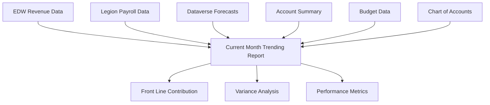

# Current Month Trending Report Technical Document

## Purpose of the Report

The Current Month Trending report provides real-time financial performance tracking by combining actual data (from current month to date) with forecasted data (for remaining days in the month). This hybrid approach enables accurate trending analysis for Front Line Contribution (FLC) and all major financial components throughout the month.

### Audience
- **Primary**: Account Managers and District Managers for operational decision-making
- **Secondary**: Finance Team for budget variance analysis
- **Tertiary**: Site Managers for local performance monitoring

## Business Data Sources and Systems

### Primary Data Sources

#### EDW (Enterprise Data Warehouse)
- **Revenue Daily Detail**: External revenue actuals
- **Revenue Datamart Daily**: Revenue, occupancy, and vehicle data
- **Account Summary**: Claims, parking rents, and other expenses
- **Chart of Accounts**: Account classification and mapping

#### Legion Workforce Management
- **Payroll Summary View**: Actual payroll costs and hours worked
- **Job Title Classifications**: Labor cost categorization
- **Work Location Mapping**: Site-specific payroll data

#### Dataverse Forecasting System
- **Forecasting Tables**: Projected values for remaining month days
- **Budget Data**: Annual budget allocations and monthly targets
- **Calculation Results**: Stored trending calculations

### Data Integration Flow



## Report Output Structure

### Main Report Sections

#### 1. Revenue Section
| Field Name | Data Type | Description | Source |
|------------|-----------|-------------|---------|
| External Revenue (Actual) | Currency | Actual external revenue to date | EDW Revenue Daily Detail |
| External Revenue (Forecast) | Currency | Forecasted external revenue remaining | Dataverse Forecasting |
| Internal Revenue (Trending) | Currency | Calculated internal revenue total | Hybrid Calculation |
| Internal Revenue (Budget) | Currency | Budgeted internal revenue | Dataverse Budget |
| Variance to Budget | Currency | Trending vs Budget difference | Calculated |

#### 2. Expense Section
| Field Name | Data Type | Description | Source |
|------------|-----------|-------------|---------|
| Payroll (Actual) | Currency | Actual payroll costs to date | Legion Payroll Summary |
| Payroll (Forecast) | Currency | Forecasted payroll remaining | Dataverse Forecasting |
| Payroll (Trending) | Currency | Combined actual + forecast | Hybrid Calculation |
| Claims (Current) | Currency | Current claims balance | EDW Account Summary |
| Parking Rents (Trending) | Currency | Greater of actual or forecast | Hybrid Logic |
| Other Expenses (Trending) | Currency | Trending other expense total | Hybrid Logic |
| PTEB (Budget) | Currency | Budgeted PTEB (no trending) | Dataverse Budget |
| Insurance (Budget) | Currency | Budgeted insurance (no trending) | Dataverse Budget |

#### 3. Performance Section
| Field Name | Data Type | Description | Calculation |
|------------|-----------|-------------|-------------|
| Front Line Contribution | Currency | FLC trending amount | Revenue - All Expenses |
| FLC Budget | Currency | Budgeted FLC amount | Budget Calculation |
| FLC Variance | Currency | Trending vs Budget | FLC Trending - FLC Budget |
| FLC Variance % | Percentage | Variance as percentage | (Variance / Budget) * 100 |

## Hard-coded and User-driven Filters

### Hard-coded Filters
- **Date Range**: Automatically set to current month (first day to last day)
- **Active Sites Only**: Excludes inactive or closed locations
- **Valid Account Codes**: Filters to approved chart of accounts
- **Data Quality**: Excludes records with null or invalid values

### User-driven Filters
- **Site Selection**: Single site or multiple site selection
- **Comparison Period**: Option to compare with prior month or prior year
- **Detail Level**: Summary view or detailed breakdown by category
- **Currency Display**: Actual amounts or rounded to thousands

### Filter Implementation
```sql
-- Example filter logic
WHERE [SITE] IN (@SelectedSites)
  AND [DATE] BETWEEN 
      DATEADD(MONTH, DATEDIFF(MONTH, 0, GETDATE()), 0) -- First day of current month
      AND EOMONTH(GETDATE()) -- Last day of current month
  AND [ACTIVE_FLAG] = 1
  AND [ACCOUNT_CODE] IN (SELECT ACCOUNT_CODE FROM VALID_ACCOUNTS)
```

## Logic and Definitions on Field-by-Field Basis

### External Revenue Calculation
```sql
-- Step 1: Retrieve actual external revenue to current date
SELECT [SITE],       
       SUM([NETEXTERNALREVENUE]) AS ACTUAL_EXTERNAL_REVENUE
FROM [TP_EDW].[dbo].[REVENUE_DAILY_DETAIL]
WHERE [SITE] = @SiteCode
  AND [DATE] BETWEEN @MonthStart AND @CurrentDate
GROUP BY [SITE]
```

### Internal Revenue Calculation Process

#### Step 1: Actual Data Collection (Month Start to Current Date)
- **External Revenue**: Sum from Revenue Daily Detail table
- **Occupancy Data**: Extract from Revenue Datamart Daily (VALUE_TYPE = 'Other')
- **Vehicle Data**: Extract from Revenue Datamart Daily (VALUE_TYPE = 'Vehicles')
- **Payroll Hours**: Extract from Legion Payroll Summary

#### Step 2: Forecasted Data Collection (Current Date + 1 to Month End)
- **External Revenue Forecast**: Query Dataverse forecasting tables
- **Occupancy Forecast**: Query Dataverse forecasting tables
- **Payroll Forecast**: Query Dataverse forecasting tables

#### Step 3: Hybrid Calculation
- **Replace Forecasted with Actual**: Use actual data up to DW_LOADED_DTTM
- **Calculate Internal Revenue**: Apply internal revenue formula using hybrid inputs
- **Sum Results**: Combine actual period + forecasted period

### Payroll Trending Calculation
```sql
-- Actual payroll (month start to current date)
WITH ActualPayroll AS (
    SELECT [WORK_LOCATION], SUM([TOTAL_DOLLARS]) AS ACTUAL_COST
    FROM [TP_LEGION].[dbo].[vwPAYROLL_SUMMARY]
    WHERE [DATE] BETWEEN @MonthStart AND @CurrentDate
    GROUP BY [WORK_LOCATION]
),
-- Forecasted payroll (current date + 1 to month end)
ForecastPayroll AS (
    SELECT [SITE], SUM([FORECASTED_PAYROLL]) AS FORECAST_COST
    FROM [Dataverse].[Forecasting].[PayrollForecast]
    WHERE [DATE] BETWEEN @NextDay AND @MonthEnd
    GROUP BY [SITE]
)
-- Combine actual and forecasted
SELECT 
    COALESCE(a.WORK_LOCATION, f.SITE) AS SITE,
    ISNULL(a.ACTUAL_COST, 0) + ISNULL(f.FORECAST_COST, 0) AS TRENDING_PAYROLL
FROM ActualPayroll a
FULL OUTER JOIN ForecastPayroll f ON a.WORK_LOCATION = f.SITE
```

### Claims Calculation
```sql
-- Current claims balance (no trending calculation)
SELECT SUM([BALANCE]) AS CURRENT_CLAIMS
FROM [TP_EDW].[dbo].[ACCOUNT_SUMMARY] AS actual
JOIN [TP_EDW].[dbo].[CHART_OF_ACCOUNT] AS coa 
    ON actual.MAIN_ACCOUNT = coa.MAIN_ACCOUNT
WHERE [COST_CENTER] = @SiteCode
  AND [PERIOD] = FORMAT(GETDATE(), 'yyyyMM')
  AND [IS_SUMMARY_CATEGORY] = 'CLAIMS'
```

### Parking Rents and Other Expenses Logic
- **Parking Rents**: Display greater of Account Summary actual or Other Expenses forecast
- **Other Expenses**: Same logic as Parking Rents, excluding specific account ranges
- **Exclusions**: Parking Rents accounts, Claims (4 accounts), Insurance (3 accounts)
- **Account Range**: Focus on 7000-7999 accounts with specified exclusions

### PTEB and Insurance Handling
- **PTEB**: No current month trending - display budgeted amount until month actualizes
- **Insurance**: No current month trending - display forecast until actual appears
- **Timing**: Both actualize only after month end processing

### Front Line Contribution Formula
```
FLC = [Trending Internal Revenue] 
    - [Trending Payroll] 
    - [Current Claims] 
    - [Trending Parking Rents] 
    - [Trending Other Expenses] 
    - [Budgeted PTEB] 
    - [Budgeted Insurance]
```

### FLC Budget Variance
```
FLC Variance = [Trending FLC] - [Budgeted FLC]
FLC Variance % = ([Trending FLC] - [Budgeted FLC]) / [Budgeted FLC] * 100
```

## User Security on the Report

### Role-Based Access Control

#### Account Manager Access
- **Sites**: Access to assigned sites only
- **Data**: Full trending and budget data
- **Actions**: View, export, drill-down capabilities
- **Restrictions**: Cannot modify data or access other managers' sites

#### District Manager Access
- **Sites**: Access to all sites within assigned district
- **Data**: Full trending, budget, and variance analysis
- **Actions**: View, export, drill-down, comparative analysis
- **Restrictions**: Cannot access sites outside assigned district

#### Finance Team Access
- **Sites**: Access to all sites across organization
- **Data**: Complete financial data including detailed breakdowns
- **Actions**: Full access including data validation and reconciliation
- **Restrictions**: Read-only access, cannot modify source data

#### Site Manager Access
- **Sites**: Access to assigned site only
- **Data**: Operational metrics and basic financial trending
- **Actions**: View current month performance
- **Restrictions**: Limited to operational data, no budget access

### Security Implementation
```sql
-- Row-level security example
CREATE SECURITY POLICY SiteAccessPolicy
ADD FILTER PREDICATE 
    [SITE] IN (
        SELECT [SITE] 
        FROM [Security].[UserSiteAccess] 
        WHERE [USER_ID] = USER_NAME()
    )
ON [Reports].[CurrentMonthTrending]
```

## Data Refresh Schedules

### Real-time Data Updates
- **EDW Data**: Refreshed every 4 hours during business hours
- **Legion Payroll**: Updated daily at 6:00 AM EST
- **Dataverse Forecasts**: Updated after each ETL completion
- **Account Summary**: Updated daily at 8:00 AM EST

### Calculation Refresh Schedule
- **Trending Calculations**: Triggered after each data refresh
- **Budget Comparisons**: Updated monthly or when budget changes
- **Variance Analysis**: Calculated in real-time during report generation

### Performance Optimization
- **Cached Results**: Trending calculations cached for 2 hours
- **Incremental Updates**: Only recalculate changed data
- **Background Processing**: Heavy calculations run during off-peak hours

## Report Dissemination

### Automated Distribution
- **Daily Email**: Summary report to Account Managers at 9:00 AM EST
- **Weekly Summary**: District-level rollup to District Managers every Monday
- **Monthly Package**: Complete analysis to Finance Team on 1st business day

### On-Demand Access
- **Web Portal**: Real-time access through business intelligence portal
- **Mobile App**: Key metrics available on mobile dashboard
- **API Access**: Programmatic access for integration with other systems

### Alert Notifications
- **Variance Alerts**: Automatic notification when FLC variance exceeds 5%
- **Data Quality Alerts**: Notification when data refresh fails or is delayed
- **Performance Alerts**: Notification when trending shows significant deviation

## Report Format Options

### Primary Format: Excel Workbook
- **Summary Tab**: High-level trending metrics
- **Detail Tab**: Line-by-line breakdown of all components
- **Variance Tab**: Budget comparison and variance analysis
- **Charts Tab**: Visual trending charts and graphs

### Secondary Format: Power BI Dashboard
- **Interactive Visuals**: Drill-down capabilities and filtering
- **Real-time Updates**: Live connection to data sources
- **Mobile Optimized**: Responsive design for mobile devices

### API Format: JSON
```json
{
  "site": "0170",
  "period": "2025-08",
  "as_of_date": "2025-08-06",
  "internal_revenue": {
    "trending": 125000.00,
    "budget": 120000.00,
    "variance": 5000.00
  },
  "expenses": {
    "payroll_trending": 45000.00,
    "claims_current": 2500.00,
    "other_expenses": 8000.00
  },
  "flc": {
    "trending": 69500.00,
    "budget": 65000.00,
    "variance": 4500.00,
    "variance_percent": 6.92
  }
}
```

## List of Business Stakeholders that Approve Changes or Access

### Primary Approval Authority
- **Finance Director**: Final approval for calculation methodology changes
- **Business Intelligence Manager**: Approval for report structure and data source changes
- **IT Director**: Approval for technical infrastructure and security changes

### Secondary Approval Authority
- **District Manager**: Approval for site-specific customizations
- **Payroll Manager**: Approval for payroll-related calculation changes
- **Revenue Manager**: Approval for revenue calculation methodology

### Access Approval Authority
- **HR Manager**: Approval for new user access requests
- **Site Operations Manager**: Approval for site manager access
- **Finance Manager**: Approval for finance team member access

### Change Control Process
1. **Request Submission**: Formal change request with business justification
2. **Impact Analysis**: Technical and business impact assessment
3. **Stakeholder Review**: Review by affected business stakeholders
4. **Approval Chain**: Sequential approval by appropriate authorities
5. **Implementation**: Controlled deployment with rollback capability
6. **Validation**: Post-implementation validation and sign-off

## Data Validation Status

**Validation Required**: This report specification should be validated against actual report implementation and data source configurations.

**Code Validation Scope**:
- Report query logic validation against actual implementation
- Data source connection validation
- Calculation formula validation
- Security implementation validation
- Performance optimization validation

**Next Steps**: Perform comprehensive validation against:
- Report implementation code in `Towne-Park-Billing-Source-Code/`
- Power BI report definitions
- Database view and stored procedure implementations
- Security configuration in Power Platform