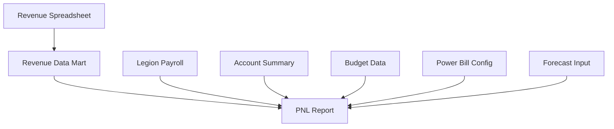

# Towne Park Forecasting - PNL Report Technical Document

## Purpose of the Report

The Profit & Loss (PNL) Report serves as the primary financial performance dashboard for Account Managers and District Managers, providing real-time visibility into site-level financial performance by combining actual financial data with forecasted projections. The report enables proactive financial management by showing current month trends and future period projections.

### Primary Audience
- **Account Managers**: Day-to-day site financial management and forecasting
- **District Managers**: Multi-site financial oversight and performance analysis
- **Financial Analysts**: Financial performance analysis and reporting
- **Operations Teams**: Understanding financial impact of operational decisions

## Business Data Sources and Systems

### Primary Data Sources

| Data Source | System | Purpose | Update Frequency |
|-------------|---------|---------|------------------|
| Revenue Daily Detail | Revenue Data Mart | External revenue actuals | Daily |
| Account Summary | Financial System | Expense actuals, claims | Daily |
| Payroll Summary | Legion | Payroll actuals and schedules | Daily |
| Budget Data | Budget System | Budgeted amounts for all categories | Monthly |
| Contract Configuration | Power Bill | Contract terms, rates, percentages | As needed |

### Data Integration Flow



## Report Output Structure

### Visual Representation

```
TOWNE PARK PROFIT & LOSS REPORT
Site: [Site Number] - [Site Name]
Period: [Month Year]
Contract Type: [Contract Type]

┌─────────────────────────────────────────────────────────────────┐
│                        REVENUE SECTION                         │
├─────────────────────────────────────────────────────────────────┤
│ External Revenue        │ $XXX,XXX │ $XXX,XXX │ $XXX,XXX │ X.X% │
│ Internal Revenue        │ $XXX,XXX │ $XXX,XXX │ $XXX,XXX │ X.X% │
│ Total Revenue          │ $XXX,XXX │ $XXX,XXX │ $XXX,XXX │ X.X% │
├─────────────────────────────────────────────────────────────────┤
│                        EXPENSE SECTION                         │
├─────────────────────────────────────────────────────────────────┤
│ Payroll                │ $XXX,XXX │ $XXX,XXX │ $XXX,XXX │ X.X% │
│ PTEB                   │ $XXX,XXX │ $XXX,XXX │ $XXX,XXX │ X.X% │
│ Insurance              │ $XXX,XXX │ $XXX,XXX │ $XXX,XXX │ X.X% │
│ Claims                 │ $XXX,XXX │ $XXX,XXX │ $XXX,XXX │ X.X% │
│ Parking Rents          │ $XXX,XXX │ $XXX,XXX │ $XXX,XXX │ X.X% │
│ Other Expenses         │ $XXX,XXX │ $XXX,XXX │ $XXX,XXX │ X.X% │
│ Total Expenses         │ $XXX,XXX │ $XXX,XXX │ $XXX,XXX │ X.X% │
├─────────────────────────────────────────────────────────────────┤
│                      CONTRIBUTION SECTION                      │
├─────────────────────────────────────────────────────────────────┤
│ Frontline Contribution │ $XXX,XXX │ $XXX,XXX │ $XXX,XXX │ X.X% │
└─────────────────────────────────────────────────────────────────┘

Columns: Budget | Actual | Forecast | Variance %
```

## Hard-coded and User-driven Filters

### Hard-coded Filters
- **Site-specific**: Report always filtered to single site context
- **Current fiscal year**: Automatic filtering to current fiscal year periods
- **Active contracts only**: Only displays data for active contract periods
- **Billable accounts only**: Excludes non-billable account classifications

### User-driven Filters
- **Time Period Selection**: Month, quarter, or custom date range
- **View Type**: Budget vs Actual vs Forecast vs Variance
- **Comparison Period**: Prior year, prior month, or budget comparison
- **Detail Level**: Summary view vs detailed account breakdown

## Logic and Definitions on Field-by-Field Basis

### External Revenue
- **Definition**: Revenue generated from customer payments and billable services
- **Calculation**: 
  - **Current Month**: Combination of actual revenue (from Revenue Daily Detail) + forecasted revenue for remaining days
  - **Future Months**: 100% forecasted amounts from user input
- **Data Source**: Revenue Data Mart Daily Detail table
- **Business Rule**: Includes adjustments applied at site level
- **Timing**: Updated daily as revenue data is entered

### Internal Revenue
- **Definition**: Calculated revenue based on contract type and external revenue
- **Calculation Logic by Contract Type**:
  - **Revenue Share**: `External Revenue × Revenue Share Percentage`
  - **Management Agreement**: Calculated from other PNL components based on contract terms
  - **Per Labor Hour**: Not applicable (Internal Revenue = $0)
  - **Fixed Fee**: Contract amount divided by contract period
- **Data Source**: Calculated field using Power Bill contract configuration
- **Business Rule**: Recalculated daily based on external revenue changes

### Payroll
- **Definition**: Total compensation costs including wages, overtime, and differentials
- **Calculation**:
  - **Current Month**: Actual payroll from Legion + forecasted payroll for unworked days
  - **Future Months**: Forecasted amounts based on scheduled hours and rates
- **Data Source**: Legion Payroll Summary table
- **Business Rule**: Day-by-day overlay of actuals where available
- **Components**: Base wages, overtime premiums, shift differentials, bonuses

### PTEB (Payroll Taxes, Employee Benefits)
- **Definition**: Employer-paid payroll taxes and employee benefits
- **Calculation**: `(Budgeted PTEB ÷ Budgeted Payroll) × Current Payroll`
- **Data Source**: Calculated field based on budget percentages
- **Business Rule**: Percentage remains constant throughout year unless budget revised
- **Timing**: No actual PTEB data available during current month
- **Components**: FICA, FUTA, SUTA, workers compensation, health insurance employer portion

### Insurance
- **Definition**: Site-level insurance costs including general liability and property
- **Calculation**: `(Budgeted Insurance ÷ Budgeted Payroll) × Current Payroll`
- **Data Source**: Calculated field based on budget percentages
- **Business Rule**: Posted in following month (July insurance posted August 1st)
- **Timing**: No actual insurance data available during current month

### Claims
- **Definition**: Insurance claims and related expenses
- **Calculation**: 
  - **Forecast**: Always $0 (claims cannot be forecasted)
  - **Actual**: Sum of actual claim amounts from Account Summary
- **Data Source**: Account Summary (4 specific claim accounts)
- **Business Rule**: Actual amounts only, no forecasting capability
- **Timing**: Posted as claims are processed and paid

### Parking Rents
- **Definition**: Rental income from parking operations
- **Calculation**: `MAX(Budget/Forecast Amount, Account Summary Actual)`
- **Data Source**: Account Summary + Forecast input
- **Business Rule**: Prevents early-month skewing when few transactions posted
- **Logic**: Uses greater of budgeted/forecasted amount vs actual to avoid understating
- **Override**: If Account Manager changes forecast, uses greater of AM forecast vs actual

### Other Expenses
- **Definition**: All operating expenses excluding specifically categorized items
- **Calculation**: `MAX(Budget/Forecast Amount, Account Summary Actual)` by main account
- **Data Source**: Account Summary (all 7000-range accounts except parking, claims, insurance)
- **Business Rule**: Same logic as parking rents applied to each main account individually
- **Excluded Accounts**: Parking rents, claims (4 accounts), insurance (3 accounts)
- **Components**: Utilities, supplies, maintenance, professional services, etc.

### Frontline Contribution
- **Definition**: Net profit/loss after all direct operating expenses
- **Calculation**: `Total Revenue - Total Expenses`
- **Data Source**: Calculated field from other PNL components
- **Business Rule**: Automatically calculated, not directly editable
- **Purpose**: Primary performance metric for site profitability

## User Security on the Report

### Role-based Access Control

| Role | Access Level | Permissions |
|------|-------------|-------------|
| Account Manager | Site-specific | View and edit forecasts for assigned sites |
| District Manager | Multi-site | View all sites in district, limited edit capabilities |
| Financial Analyst | Read-only | View all sites, export capabilities |
| System Administrator | Full access | All sites, all functions, user management |

### Data Security Measures
- **Site-level filtering**: Users only see data for authorized sites
- **Audit trail**: All forecast changes logged with user and timestamp
- **Data encryption**: All financial data encrypted in transit and at rest
- **Session management**: Automatic timeout for inactive sessions

## Data Refresh Schedules

### Automated Refresh Schedule

| Data Component | Refresh Frequency | Refresh Time | Source System |
|----------------|------------------|--------------|---------------|
| Revenue Data | Daily | 6:00 AM | Revenue Data Mart |
| Payroll Data | Daily | 7:00 AM | Legion |
| Account Summary | Daily | 8:00 AM | Financial System |
| Budget Data | Monthly | 1st of month | Budget System |
| Contract Config | As needed | Real-time | Power Bill |

### Manual Refresh Capabilities
- **On-demand refresh**: Users can trigger immediate data refresh
- **Forecast recalculation**: Automatic recalculation when forecast inputs change
- **Cache invalidation**: System clears cached data after updates

## Report Dissemination

### Distribution Methods
- **Embedded in Application**: Primary access through forecasting system interface
- **Email Distribution**: Automated monthly reports to stakeholders
- **Export Capabilities**: Excel, PDF, and CSV export options
- **Dashboard Integration**: Summary metrics displayed on executive dashboards

### Automated Distribution Schedule
- **Daily**: Current month PNL to Account Managers (if significant changes)
- **Weekly**: District-level summaries to District Managers
- **Monthly**: Complete PNL packages to all stakeholders
- **Quarterly**: Comprehensive performance analysis reports

## Report Format Options

### Available Formats
- **Interactive Web View**: Primary format with drill-down capabilities
- **Excel Export**: Formatted spreadsheet with formulas preserved
- **PDF Report**: Print-ready format for presentations and filing
- **CSV Data**: Raw data export for further analysis
- **Power BI Integration**: Live data connection for advanced analytics

### Format-specific Features
- **Web View**: Real-time updates, interactive filtering, drill-down to detail
- **Excel**: Pivot table ready, formula transparency, offline analysis
- **PDF**: Professional formatting, charts and graphs, executive summary
- **CSV**: Data integration, custom analysis, third-party tool import

## Business Stakeholders for Changes and Access

### Primary Stakeholders
- **Amy Sowells**: Business Analyst, forecast logic and business rules
- **Michael Foy**: Business Analyst, budget integration and data validation
- **Jonathan Aulson**: Development Lead, technical implementation and system integration

### Approval Authority
- **Forecast Logic Changes**: Amy Sowells and Michael Foy joint approval
- **Technical Architecture**: Jonathan Aulson approval
- **User Access Changes**: District Manager approval for their sites
- **System-wide Changes**: Executive team approval required

### Change Management Process
1. **Request Submission**: Stakeholder submits change request with business justification
2. **Impact Analysis**: Technical team assesses development effort and system impact
3. **Business Review**: Business analysts validate requirements and approve logic
4. **Development**: Implementation following standard development lifecycle
5. **Testing**: User acceptance testing with business stakeholders
6. **Deployment**: Coordinated release with user training and documentation updates

## Technical Implementation Notes

### Performance Considerations
- **Data Volume**: Optimized for sites with up to 100 job codes and 12-month forecasting
- **Calculation Speed**: Sub-second response time for PNL recalculation
- **Concurrent Users**: Supports up to 50 simultaneous users per site
- **Data Caching**: Intelligent caching of budget and configuration data

### Integration Dependencies
- **Revenue System**: Real-time integration for current-day revenue updates
- **Legion**: Scheduled integration for payroll and schedule data
- **Account Summary**: Near real-time integration for expense data
- **Power Bill**: Configuration changes reflected within 15 minutes

## Related Documentation

- [Forecasting Business Rules - PNL Calculations](../../business-rules/forecasting/)
- [Account Manager User Processes](../../user-processes/account-manager/)
- [Revenue Data Integration](../../technical/integrations/)
- [Legion Integration Technical Specification](../../technical/integrations/)
- [Financial Reporting Standards](../../standards/)

## Code Validation Notes

**VERIFICATION NEEDED**: PNL calculation formulas require validation against Power Platform implementation in forecasting system codebase, specifically:
- Internal revenue calculation logic for each contract type
- PTEB and insurance percentage calculation methods
- Greater-of logic implementation for parking rents and other expenses
- Daily granularity calculation patterns

**VERIFICATION NEEDED**: Data source integration patterns require validation against current system implementation:
- Revenue Daily Detail table structure and query patterns
- Legion Payroll Summary integration methods
- Account Summary data retrieval and filtering logic

---

*This technical document provides comprehensive specifications for the PNL Report within the Towne Park forecasting system. All calculation methods and business rules should be validated against current system implementation before relying on this documentation for development or business decisions.*