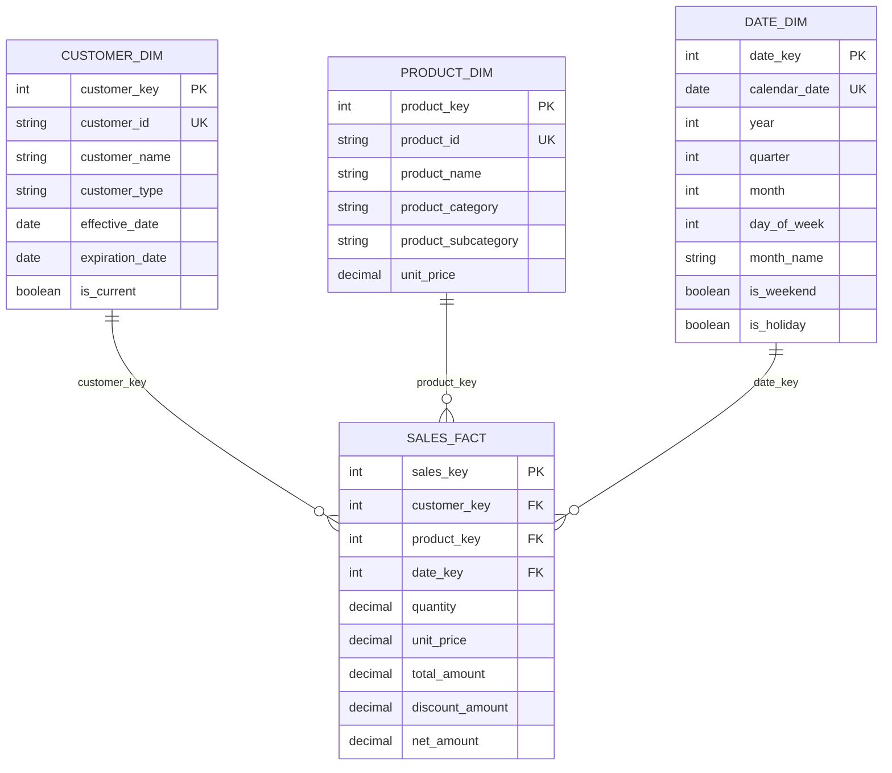

# [Data Model Name] Technical Document

**Document Version:** 1.0  
**Author:** [Your Name]  
**Date:** [YYYY-MM-DD]

---

**Table of Contents**

1. [Introduction](#introduction)
2. [Business Requirements](#business-requirements)
3. [Data Sources](#data-sources)
4. [Data Model Overview](#data-model-overview)
5. [Entity-Relationship Diagram (ERD)](#entity-relationship-diagram-erd)
6. [Data Flow & ETL Flowchart](#data-flow--etl-flowchart)
7. [Dimension Tables](#dimension-tables)
8. [Fact Tables](#fact-tables)
9. [Field Specifications](#field-specifications)
10. [Business Logic and Transformations](#business-logic-and-transformations)
11. [Calculated Fields and Key Figures](#calculated-fields-and-key-figures)
12. [List of Reports](#list-of-reports)
13. [Dataset Size Estimation](#dataset-size-estimation)
14. [Indexing and Archiving Strategy](#indexing-and-archiving-strategy)
15. [Data Management Approach](#data-management-approach)
16. [Data Quality and Validation](#data-quality-and-validation)
17. [Security and Compliance](#security-and-compliance)
18. [Performance Considerations](#performance-considerations)
19. [Maintenance and Operations](#maintenance-and-operations)
20. [Related Documentation](#related-documentation)
21. [Appendix](#appendix)

---

## 1. Introduction

This document describes the [Data Model Name] data model within the Enterprise Data Warehouse, including its structure, business logic, data sources, transformations, and operational characteristics.

### Model Purpose
[Describe the specific business purpose this data model serves]

### Model Type
- **Model Category**: [Dimensional/Relational/Star Schema/Snowflake/etc.]
- **Model Scope**: [Enterprise/Departmental/Subject Area]
- **Update Pattern**: [Real-time/Batch/Hybrid]

---

## 2. Business Requirements

### Business Objectives
- [Primary business objective 1]
- [Primary business objective 2]
- [Primary business objective 3]

### Key Business Questions Answered
1. [Business question 1 that this model helps answer]
2. [Business question 2 that this model helps answer]
3. [Business question 3 that this model helps answer]

### Business Rules
- [Key business rule 1 implemented in this model]
- [Key business rule 2 implemented in this model]
- [Key business rule 3 implemented in this model]

### Success Criteria
- [How success is measured for this data model]
- [Performance criteria and benchmarks]
- [Data quality expectations]

---

## 3. Data Sources

### Source Systems Overview
| Source System | Description | Frequency | Data Owner | Connection Method | Data Volume |
|---------------|-------------|-----------|------------|-------------------|-------------|
| [CRM System] | [Customer data] | [Daily] | [Sales Dept] | [API Integration] | [~100K records/day] |
| [ERP System] | [Financial data] | [Daily] | [Finance Dept] | [Database Connection] | [~50K records/day] |
| [E-commerce] | [Online transactions] | [Hourly] | [IT Dept] | [File Transfer] | [~10K records/hour] |

### Source System Details
#### [Source System 1]
- **System Name**: [Full system name and version]
- **Database/Platform**: [Database type and platform details]
- **Key Tables/Objects**: [List of primary source tables]
- **Data Extraction Method**: [How data is extracted]
- **Data Frequency**: [How often data is updated]
- **Data Quality**: [Known data quality characteristics]
- **Business Owner**: [Who owns this data source]
- **Technical Contact**: [Technical point of contact]

#### [Source System 2]
- **System Name**: [Full system name and version]
- **Database/Platform**: [Database type and platform details]
- **Key Tables/Objects**: [List of primary source tables]
- **Data Extraction Method**: [How data is extracted]
- **Data Frequency**: [How often data is updated]
- **Data Quality**: [Known data quality characteristics]
- **Business Owner**: [Who owns this data source]
- **Technical Contact**: [Technical point of contact]

---

## 4. Data Model Overview

### Model Architecture
The [Data Model Name] follows a **[star schema/snowflake schema/other]** design pattern, consisting of:
- **[X] Fact Tables**: [Brief description of fact tables]
- **[Y] Dimension Tables**: [Brief description of dimension tables]
- **[Z] Bridge Tables**: [Brief description of bridge tables if applicable]

### Model Characteristics
- **Grain**: [The lowest level of detail stored in fact tables]
- **Time Dimension**: [How time is handled in the model]
- **Slowly Changing Dimensions**: [Which dimensions use SCD and what type]
- **Data Retention**: [How long data is retained]

### Key Design Decisions
1. **[Design Decision 1]**: [Rationale and impact]
2. **[Design Decision 2]**: [Rationale and impact]
3. **[Design Decision 3]**: [Rationale and impact]

---

## 5. Entity-Relationship Diagram (ERD)

### Logical Data Model


### Physical Data Model Relationships
- **One-to-Many Relationships**: [List key 1:M relationships]
- **Many-to-Many Relationships**: [List M:M relationships and how they're resolved]
- **Hierarchical Relationships**: [List any hierarchical structures]

---

## 6. Data Flow & ETL Flowchart

### Data Flow Overview
```mermaid
flowchart TD
    subgraph "Source Systems"
        A[Source System 1<br/>[System Name]]
        B[Source System 2<br/>[System Name]]
        C[Source System 3<br/>[System Name]]
    end
    
    subgraph "Staging Area"
        D[Raw Data Landing]
        E[Data Cleansing]
        F[Data Validation]
    end
    
    subgraph "Data Warehouse"
        G[Dimension Tables]
        H[Fact Tables]
        I[Aggregate Tables]
    end
    
    subgraph "Data Marts"
        J[Subject Area 1]
        K[Subject Area 2]
    end
    
    subgraph "Consumption Layer"
        L[Reports]
        M[Dashboards]
        N[Analytics]
    end
    
    A -->|Extract| D
    B -->|Extract| D
    C -->|Extract| D
    
    D -->|Cleanse| E
    E -->|Validate| F
    
    F -->|Load Dimensions| G
    F -->|Load Facts| H
    G -->|Aggregate| I
    H -->|Aggregate| I
    
    G -->|Populate| J
    H -->|Populate| J
    G -->|Populate| K
    H -->|Populate| K
    
    J -->|Feed| L
    K -->|Feed| M
    I -->|Feed| N
```

### ETL Process Details
#### Extract Phase
- **Extraction Method**: [Full/Incremental/CDC/etc.]
- **Extraction Schedule**: [When extractions occur]
- **Data Validation**: [What validation occurs during extraction]
- **Error Handling**: [How extraction errors are handled]

#### Transform Phase
- **Data Cleansing**: [What cleansing operations are performed]
- **Data Standardization**: [How data is standardized]
- **Business Rule Application**: [What business rules are applied]
- **Data Quality Checks**: [What quality checks are performed]

#### Load Phase
- **Load Strategy**: [Truncate/Insert, Upsert, Merge, etc.]
- **Load Sequence**: [Order in which tables are loaded]
- **Dependency Management**: [How dependencies are managed]
- **Performance Optimization**: [Load optimization techniques]

---

## 7. Dimension Tables

### [Dimension Table 1 Name]
#### Table Structure
| Column Name | Data Type | Length | Nullable | Default | Description |
|-------------|-----------|--------|----------|---------|-------------|
| [dimension_key] | [INT] | [4] | [No] | [Identity] | [Surrogate key] |
| [business_key] | [VARCHAR] | [50] | [No] | [None] | [Natural business key] |
| [attribute_1] | [VARCHAR] | [100] | [Yes] | [NULL] | [Attribute description] |
| [attribute_2] | [DECIMAL] | [10,2] | [Yes] | [0.00] | [Attribute description] |
| [effective_date] | [DATE] | [8] | [No] | [1900-01-01] | [SCD effective date] |
| [expiration_date] | [DATE] | [8] | [No] | [9999-12-31] | [SCD expiration date] |
| [is_current] | [BIT] | [1] | [No] | [1] | [Current record flag] |

#### Source Mapping
| Target Column | Source System | Source Table | Source Column | Transformation Logic |
|---------------|---------------|--------------|---------------|---------------------|
| [business_key] | [CRM System] | [customers] | [customer_id] | [Direct mapping] |
| [attribute_1] | [CRM System] | [customers] | [customer_name] | [UPPER(TRIM(customer_name))] |
| [attribute_2] | [CRM System] | [customers] | [credit_limit] | [ISNULL(credit_limit, 0)] |

#### Slowly Changing Dimension (SCD) Implementation
- **SCD Type**: [Type 1/Type 2/Type 3/Hybrid]
- **Change Detection**: [How changes are detected]
- **History Retention**: [How historical data is maintained]
- **Current Record Identification**: [How current records are identified]

### [Dimension Table 2 Name]
[Repeat the same structure for each dimension table]

---

## 8. Fact Tables

### [Fact Table 1 Name]
#### Table Structure
| Column Name | Data Type | Length | Nullable | Default | Description |
|-------------|-----------|--------|----------|---------|-------------|
| [fact_key] | [BIGINT] | [8] | [No] | [Identity] | [Surrogate key] |
| [dimension_key_1] | [INT] | [4] | [No] | [None] | [Foreign key to dimension 1] |
| [dimension_key_2] | [INT] | [4] | [No] | [None] | [Foreign key to dimension 2] |
| [measure_1] | [DECIMAL] | [18,4] | [Yes] | [NULL] | [Additive measure] |
| [measure_2] | [DECIMAL] | [18,4] | [Yes] | [NULL] | [Semi-additive measure] |
| [measure_3] | [INT] | [4] | [Yes] | [NULL] | [Count measure] |

#### Source Mapping
| Target Column | Source System | Source Table | Source Column | Transformation Logic |
|---------------|---------------|--------------|---------------|---------------------|
| [measure_1] | [Sales System] | [transactions] | [amount] | [SUM(amount) GROUP BY dimensions] |
| [measure_2] | [Sales System] | [transactions] | [quantity] | [SUM(quantity) GROUP BY dimensions] |
| [measure_3] | [Sales System] | [transactions] | [transaction_id] | [COUNT(DISTINCT transaction_id)] |

#### Fact Table Characteristics
- **Grain**: [The level of detail in the fact table]
- **Fact Type**: [Transaction/Periodic Snapshot/Accumulating Snapshot]
- **Additivity**: [Which measures are additive, semi-additive, or non-additive]
- **Partitioning**: [How the table is partitioned]

### [Fact Table 2 Name]
[Repeat the same structure for each fact table]

---

## 9. Field Specifications

### Complete Field Inventory
| Table Name | Field Name | Source System | Source Field | Data Type | Business Definition | Transformation Rules |
|------------|------------|---------------|--------------|-----------|-------------------|---------------------|
| [Table1] | [Field1] | [System1] | [source_field1] | [VARCHAR(50)] | [Business meaning] | [Transformation logic] |
| [Table1] | [Field2] | [System1] | [source_field2] | [DECIMAL(10,2)] | [Business meaning] | [Transformation logic] |
| [Table2] | [Field3] | [System2] | [source_field3] | [DATE] | [Business meaning] | [Transformation logic] |

### Field-Level Documentation
#### [Table Name].[Field Name]
- **Business Definition**: [Clear business definition of the field]
- **Source System**: [Where this data originates]
- **Source Field**: [Original field name in source system]
- **Data Type**: [Target data type and precision]
- **Transformation Logic**: [Detailed transformation rules]
- **Business Rules**: [Any business rules applied to this field]
- **Data Quality Rules**: [Validation rules for this field]
- **Example Values**: [Sample values to illustrate the field]

---

## 10. Business Logic and Transformations

### Data Transformation Rules
#### Incoming Data Transformations
1. **[Transformation Rule 1]**
   - **Purpose**: [Why this transformation is needed]
   - **Logic**: [Detailed transformation logic]
   - **Example**: [Before and after example]
   - **Implementation**: 
   ```sql
   -- Example transformation SQL
   CASE 
       WHEN source_field IS NULL THEN 'Unknown'
       WHEN source_field = '' THEN 'Not Specified'
       ELSE UPPER(TRIM(source_field))
   END
   ```

2. **[Transformation Rule 2]**
   - **Purpose**: [Why this transformation is needed]
   - **Logic**: [Detailed transformation logic]
   - **Example**: [Before and after example]
   - **Implementation**: 
   ```sql
   -- Example transformation SQL
   [SQL code here]
   ```

### Data Cleansing Rules
- **Null Value Handling**: [How null values are handled]
- **Data Standardization**: [How data is standardized]
- **Duplicate Resolution**: [How duplicates are resolved]
- **Data Validation**: [What validation rules are applied]

### Business Rule Implementation
#### [Business Rule 1]
- **Rule Description**: [Clear description of the business rule]
- **Implementation Logic**: [How the rule is implemented]
- **Affected Tables/Fields**: [What data is affected by this rule]
- **Exception Handling**: [How exceptions to the rule are handled]

#### [Business Rule 2]
- **Rule Description**: [Clear description of the business rule]
- **Implementation Logic**: [How the rule is implemented]
- **Affected Tables/Fields**: [What data is affected by this rule]
- **Exception Handling**: [How exceptions to the rule are handled]

---

## 11. Calculated Fields and Key Figures

### Run-time Calculations
#### [Calculated Field 1]
- **Field Name**: [Name of the calculated field]
- **Business Definition**: [What this calculation represents]
- **Calculation Formula**: 
  ```sql
  -- Example calculation
  (current_year_sales - previous_year_sales) / previous_year_sales * 100
  ```
- **Components**: 
  - [Component 1]: [Description of component]
  - [Component 2]: [Description of component]
- **Calculation Level**: [Row level/Aggregate level/Report level]
- **Performance Considerations**: [Any performance implications]

#### [Calculated Field 2]
- **Field Name**: [Name of the calculated field]
- **Business Definition**: [What this calculation represents]
- **Calculation Formula**: 
  ```sql
  -- Example calculation
  [SQL formula here]
  ```
- **Components**: 
  - [Component 1]: [Description of component]
  - [Component 2]: [Description of component]
- **Calculation Level**: [Row level/Aggregate level/Report level]
- **Performance Considerations**: [Any performance implications]

### Key Performance Indicators (KPIs)
| KPI Name | Formula | Business Definition | Calculation Frequency | Target Value |
|----------|---------|-------------------|---------------------|--------------|
| [KPI 1] | [Formula] | [Business meaning] | [Daily/Weekly/Monthly] | [Target] |
| [KPI 2] | [Formula] | [Business meaning] | [Daily/Weekly/Monthly] | [Target] |

### Derived Measures
- **Ratios**: [List of ratio calculations]
- **Percentages**: [List of percentage calculations]
- **Variances**: [List of variance calculations]
- **Trends**: [List of trend calculations]

---

## 12. List of Reports

### Reports Built from This Data Model
| Report Name | Report Type | Frequency | Primary Users | Key Metrics | Status |
|-------------|-------------|-----------|---------------|-------------|--------|
| [Sales Performance Report] | [Operational] | [Daily] | [Sales Team] | [Revenue, Units Sold] | [Active] |
| [Customer Analysis Report] | [Analytical] | [Monthly] | [Marketing Team] | [Customer Retention, CLV] | [Active] |
| [Financial Summary Report] | [Executive] | [Weekly] | [Executive Team] | [P&L, Cash Flow] | [Active] |

### Report Dependencies
#### [Report Name 1]
- **Data Dependencies**: [Which tables/views this report depends on]
- **Calculation Dependencies**: [Which calculated fields are used]
- **Refresh Dependencies**: [What must be refreshed before this report]
- **Performance Impact**: [How this report affects system performance]

#### [Report Name 2]
- **Data Dependencies**: [Which tables/views this report depends on]
- **Calculation Dependencies**: [Which calculated fields are used]
- **Refresh Dependencies**: [What must be refreshed before this report]
- **Performance Impact**: [How this report affects system performance]

### Usage Analytics
- **Query Patterns**: [Common query patterns against this model]
- **Performance Metrics**: [Query performance statistics]
- **User Access Patterns**: [How users typically access this data]

---

## 13. Dataset Size Estimation

### Current Size Metrics
| Table Name | Row Count (Current) | Avg Row Size | Current Size | Growth Rate | Projected Size (1 Year) |
|------------|-------------------|--------------|--------------|-------------|------------------------|
| [Fact Table 1] | [50M] | [200 bytes] | [10 GB] | [20% annually] | [12 GB] |
| [Dimension 1] | [1M] | [150 bytes] | [150 MB] | [5% annually] | [158 MB] |
| [Dimension 2] | [10K] | [100 bytes] | [1 MB] | [2% annually] | [1.02 MB] |

### Size Projections
#### Growth Assumptions
- **Transaction Volume Growth**: [Expected growth in transaction volume]
- **New Data Sources**: [Any new data sources being added]
- **Data Retention Changes**: [Changes to data retention policies]
- **Historical Data Loading**: [Any historical data being loaded]

#### Capacity Planning
- **Storage Requirements**: [Current and projected storage needs]
- **Performance Impact**: [How size growth affects performance]
- **Archiving Strategy**: [When and how data will be archived]
- **Scaling Considerations**: [Infrastructure scaling requirements]

### Data Volume Monitoring
- **Monitoring Metrics**: [What metrics are tracked]
- **Alert Thresholds**: [When alerts are triggered]
- **Capacity Management**: [How capacity is managed]

---

## 14. Indexing and Archiving Strategy

### Indexing Strategy
#### Fact Tables
| Table Name | Index Type | Columns | Purpose | Maintenance |
|------------|------------|---------|---------|-------------|
| [Fact Table 1] | [Clustered] | [date_key, customer_key] | [Query performance] | [Rebuild weekly] |
| [Fact Table 1] | [Non-clustered] | [product_key] | [Filter performance] | [Reorganize daily] |

#### Dimension Tables
| Table Name | Index Type | Columns | Purpose | Maintenance |
|------------|------------|---------|---------|-------------|
| [Dimension 1] | [Primary Key] | [dimension_key] | [Uniqueness] | [Automatic] |
| [Dimension 1] | [Unique] | [business_key, effective_date] | [SCD support] | [Automatic] |

### Partitioning Strategy
#### Table Partitioning
- **Partitioning Column**: [Column used for partitioning]
- **Partition Scheme**: [How partitions are defined]
- **Partition Maintenance**: [How partitions are maintained]
- **Query Performance**: [How partitioning improves performance]

### Archiving Strategy
#### Data Retention Policies
- **Active Data**: [How long data remains in active tables]
- **Archive Data**: [How long data is kept in archives]
- **Purge Data**: [When data is permanently deleted]

#### Archiving Process
1. **Archive Criteria**: [What data gets archived and when]
2. **Archive Location**: [Where archived data is stored]
3. **Archive Format**: [Format of archived data]
4. **Retrieval Process**: [How to retrieve archived data if needed]

#### Archive Storage
- **Storage Type**: [Type of storage used for archives]
- **Compression**: [Compression methods used]
- **Access Method**: [How archived data can be accessed]
- **Cost Optimization**: [Cost optimization strategies]

---

## 15. Data Management Approach

### Data Loading Strategy
#### Delta Queue Processing
- **Change Detection**: [How changes are detected in source systems]
- **Delta Identification**: [How delta records are identified]
- **Processing Logic**: [How delta records are processed]
- **Error Handling**: [How errors in delta processing are handled]

#### Full Drop/Reload
- **Reload Triggers**: [When full reloads are performed]
- **Reload Process**: [Step-by-step reload process]
- **Downtime Management**: [How downtime is minimized]
- **Validation Process**: [How reload success is validated]

#### Pseudo Delta
- **Implementation**: [How pseudo delta is implemented]
- **Comparison Logic**: [How records are compared]
- **Performance Optimization**: [Optimization techniques used]
- **Limitations**: [Known limitations of this approach]

### Data Quality Management
#### Data Quality Framework
- **Quality Dimensions**: [Completeness, Accuracy, Consistency, etc.]
- **Quality Metrics**: [How quality is measured]
- **Quality Monitoring**: [How quality is monitored]
- **Quality Reporting**: [How quality issues are reported]

#### Data Validation Rules
1. **Referential Integrity**: [Foreign key validation rules]
2. **Business Rule Validation**: [Business logic validation]
3. **Data Range Validation**: [Acceptable value ranges]
4. **Format Validation**: [Data format requirements]

### Change Management
#### Schema Changes
- **Change Process**: [How schema changes are managed]
- **Impact Assessment**: [How impact is assessed]
- **Testing Requirements**: [Testing required for changes]
- **Deployment Process**: [How changes are deployed]

#### Data Migration
- **Migration Planning**: [How migrations are planned]
- **Migration Testing**: [How migrations are tested]
- **Rollback Procedures**: [How to rollback migrations]
- **Validation Process**: [How migration success is validated]

---

## 16. Data Quality and Validation

### Data Quality Framework
#### Quality Dimensions
| Dimension | Definition | Measurement Method | Target Threshold | Current Performance |
|-----------|------------|-------------------|------------------|-------------------|
| [Completeness] | [% of non-null values] | [Automated checks] | [>95%] | [97.2%] |
| [Accuracy] | [% of correct values] | [Business validation] | [>98%] | [98.5%] |
| [Consistency] | [% of consistent values] | [Cross-system validation] | [>99%] | [99.1%] |

### Validation Procedures
#### Source Data Validation
```sql
-- Example validation query
SELECT 
    table_name,
    column_name,
    COUNT(*) as total_records,
    COUNT(column_name) as non_null_records,
    (COUNT(column_name) * 100.0 / COUNT(*)) as completeness_pct
FROM information_schema.columns c
JOIN source_table st ON 1=1
GROUP BY table_name, column_name
HAVING completeness_pct < 95
```

#### Business Rule Validation
- **Rule 1**: [Description and validation logic]
- **Rule 2**: [Description and validation logic]
- **Rule 3**: [Description and validation logic]

### Data Quality Monitoring
#### Automated Monitoring
- **Monitoring Schedule**: [When quality checks run]
- **Alert Thresholds**: [When alerts are triggered]
- **Alert Recipients**: [Who receives quality alerts]
- **Escalation Procedures**: [How issues are escalated]

#### Quality Reporting
- **Quality Dashboard**: [Location and access to quality dashboard]
- **Quality Reports**: [Regular quality reports generated]
- **Trend Analysis**: [How quality trends are analyzed]

---

## 17. Security and Compliance

### Data Security
#### Access Control
- **Role-based Access**: [How access is controlled by role]
- **Data-level Security**: [Row-level or column-level security]
- **Encryption**: [Data encryption at rest and in transit]
- **Audit Trail**: [What access is logged and tracked]

#### Sensitive Data Handling
- **PII Identification**: [How PII is identified and protected]
- **Data Masking**: [What data is masked and how]
- **Data Classification**: [How data is classified by sensitivity]
- **Retention Policies**: [How long sensitive data is retained]

### Compliance Requirements
#### Regulatory Compliance
- **GDPR**: [GDPR compliance measures]
- **CCPA**: [CCPA compliance measures]
- **SOX**: [SOX compliance measures]
- **Industry Standards**: [Other relevant compliance requirements]

#### Data Governance
- **Data Stewardship**: [Who is responsible for data governance]
- **Data Lineage**: [How data lineage is tracked]
- **Metadata Management**: [How metadata is managed]
- **Change Control**: [How changes are controlled and approved]

---

## 18. Performance Considerations

### Query Performance
#### Performance Metrics
| Metric | Target | Current | Monitoring Method |
|--------|--------|---------|-------------------|
| [Average Query Time] | [< 30 seconds] | [25 seconds] | [Query monitoring] |
| [95th Percentile] | [< 2 minutes] | [1.8 minutes] | [Performance counters] |
| [Concurrent Users] | [50 users] | [35 users] | [Session monitoring] |

#### Optimization Strategies
- **Index Optimization**: [Index tuning strategies]
- **Query Optimization**: [Query tuning techniques]
- **Partitioning**: [Partitioning strategies for performance]
- **Caching**: [Caching strategies implemented]

### ETL Performance
#### Load Performance
- **Load Window**: [Available time window for loads]
- **Load Duration**: [Current load duration]
- **Optimization Techniques**: [Techniques used to optimize loads]
- **Parallel Processing**: [Parallel processing strategies]

#### Resource Utilization
- **CPU Usage**: [CPU utilization during loads]
- **Memory Usage**: [Memory utilization patterns]
- **I/O Patterns**: [Disk I/O characteristics]
- **Network Usage**: [Network utilization for data movement]

---

## 19. Maintenance and Operations

### Operational Procedures
#### Daily Operations
- **Health Checks**: [Daily health check procedures]
- **Load Monitoring**: [How loads are monitored]
- **Error Resolution**: [How errors are resolved]
- **Performance Monitoring**: [Daily performance checks]

#### Weekly Operations
- **Index Maintenance**: [Weekly index maintenance tasks]
- **Statistics Updates**: [Statistics update procedures]
- **Capacity Monitoring**: [Weekly capacity reviews]
- **Quality Reviews**: [Weekly data quality reviews]

#### Monthly Operations
- **Performance Reviews**: [Monthly performance analysis]
- **Capacity Planning**: [Monthly capacity planning]
- **Archive Processing**: [Monthly archiving tasks]
- **Documentation Updates**: [Monthly documentation reviews]

### Backup and Recovery
#### Backup Strategy
- **Backup Schedule**: [When backups are performed]
- **Backup Types**: [Full, differential, transaction log backups]
- **Backup Retention**: [How long backups are retained]
- **Backup Validation**: [How backup integrity is verified]

#### Recovery Procedures
- **Recovery Objectives**: [RTO and RPO targets]
- **Recovery Procedures**: [Step-by-step recovery process]
- **Testing Schedule**: [How often recovery is tested]
- **Documentation**: [Recovery documentation maintenance]

---

## 20. Related Documentation

### Internal Documentation
- [ETL Process Documentation](../integration/etl-processes.md) - Detailed ETL process specifications
- [Data Dictionary](../database/data-dictionary.md) - Complete data dictionary
- [Security Policies](../security/data-security-policies.md) - Data security and access policies
- [System Architecture](../architecture/data-warehouse-architecture.md) - Overall data warehouse architecture

### External Documentation
- [Business Requirements Document] - Original business requirements
- [Technical Architecture Document] - Technical architecture specifications
- [Data Governance Framework] - Enterprise data governance policies

### Version History
| Version | Date | Changes | Author |
|---------|------|---------|--------|
| 1.0 | [YYYY-MM-DD] | Initial creation | [Author Name] |

---

## 21. Appendix

### A. Sample Data
```sql
-- Sample data from key tables
SELECT TOP 10 * FROM [fact_table_name]
SELECT TOP 10 * FROM [dimension_table_name]
```

### B. DDL Scripts
```sql
-- Table creation scripts
CREATE TABLE [table_name] (
    [column_definitions]
);

-- Index creation scripts
CREATE INDEX [index_name] ON [table_name] ([columns]);
```

### C. ETL Code Samples
```sql
-- Sample ETL transformation logic
MERGE target_table AS target
USING source_table AS source
ON target.business_key = source.business_key
WHEN MATCHED THEN
    UPDATE SET [update_logic]
WHEN NOT MATCHED THEN
    INSERT ([insert_logic]);
```

### D. Performance Tuning Scripts
```sql
-- Performance monitoring queries
SELECT 
    [performance_metrics]
FROM [system_views]
WHERE [performance_conditions];
```

### E. Data Quality Validation Scripts
```sql
-- Data quality check queries
SELECT 
    [quality_metrics]
FROM [data_tables]
WHERE [quality_conditions];
```

### F. Glossary
| Term | Definition |
|------|------------|
| [Business Term 1] | [Clear