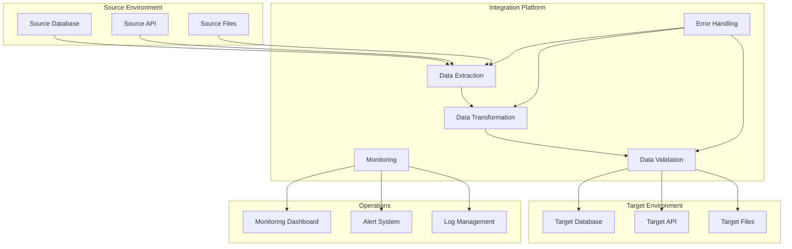

# [Integration Name] Technical Document

**Document Version:** 1.0  
**Author:** [Your Name]  
**Date:** [YYYY-MM-DD]

---

**Table of Contents**

1. [Introduction](#introduction)
2. [Integration Overview](#integration-overview)
3. [Source and Target Systems](#source-and-target-systems)
4. [Field-Level Mapping](#field-level-mapping)
5. [Technical Implementation](#technical-implementation)
6. [Code Logic and Documentation](#code-logic-and-documentation)
7. [Schedule and Execution](#schedule-and-execution)
8. [Integration Method and Technical Details](#integration-method-and-technical-details)
9. [Monitoring, Alerting, and Error Handling](#monitoring-alerting-and-error-handling)
10. [Architecture Diagram](#architecture-diagram)
11. [Security and Compliance](#security-and-compliance)
12. [Performance and Scalability](#performance-and-scalability)
13. [Testing and Validation](#testing-and-validation)
14. [Deployment and Configuration](#deployment-and-configuration)
15. [Troubleshooting Guide](#troubleshooting-guide)
16. [Appendix](#appendix)

---

## 1. Introduction

This document describes the integration between [Source System] and [Target System], including technical specifications, data mapping, implementation details, and operational procedures.

---

## 2. Integration Overview

### Purpose
[Describe the business purpose and objectives of this integration]

### Scope
[Define what is and isn't included in this integration]

### Business Requirements
- [List key business requirements this integration fulfills]
- [Include any compliance or regulatory requirements]

---

## 3. Source and Target Systems

### Source System Details
| Attribute | Value |
|-----------|-------|
| System Name | [Source System Name] |
| System Type | [Database/API/File System/etc.] |
| Version | [System Version] |
| Owner | [System Owner/Team] |
| Environment | [Production/Staging/Development] |
| Connection Details | [Host/URL/Path] |

### Target System Details
| Attribute | Value |
|-----------|-------|
| System Name | [Target System Name] |
| System Type | [Database/API/File System/etc.] |
| Version | [System Version] |
| Owner | [System Owner/Team] |
| Environment | [Production/Staging/Development] |
| Connection Details | [Host/URL/Path] |

---

## 4. Field-Level Mapping

### Data Mapping Table
| Source Field | Source Type | Target Field | Target Type | Transformation Logic | Required | Notes |
|--------------|-------------|--------------|-------------|---------------------|----------|-------|
| [source_field_1] | [varchar(50)] | [target_field_1] | [string] | [Direct mapping] | [Yes/No] | [Additional notes] |
| [source_field_2] | [decimal(10,2)] | [target_field_2] | [number] | [Multiply by 100] | [Yes/No] | [Currency conversion] |
| [source_field_3] | [datetime] | [target_field_3] | [timestamp] | [Format conversion] | [Yes/No] | [UTC conversion] |

### Data Transformation Rules
1. **[Rule Name]**: [Detailed description of transformation logic]
   - **Input**: [Description of input data]
   - **Process**: [Step-by-step transformation process]
   - **Output**: [Description of output data]
   - **Example**: [Concrete example of transformation]

2. **[Rule Name]**: [Detailed description of transformation logic]
   - **Input**: [Description of input data]
   - **Process**: [Step-by-step transformation process]
   - **Output**: [Description of output data]
   - **Example**: [Concrete example of transformation]

### Data Validation Rules
- **[Validation Rule 1]**: [Description and criteria]
- **[Validation Rule 2]**: [Description and criteria]
- **[Validation Rule 3]**: [Description and criteria]

---

## 5. Technical Implementation

### Integration Architecture
[Describe the overall technical architecture of the integration]

### Technology Stack
| Component | Technology | Version | Purpose |
|-----------|------------|---------|---------|
| [Component 1] | [Technology] | [Version] | [Purpose description] |
| [Component 2] | [Technology] | [Version] | [Purpose description] |
| [Component 3] | [Technology] | [Version] | [Purpose description] |

### Dependencies
- **Internal Dependencies**: [List internal system dependencies]
- **External Dependencies**: [List external system dependencies]
- **Library Dependencies**: [List required libraries and versions]

---

## 6. Code Logic and Documentation

### Core Integration Logic
```[language]
// [Description of what this code does and why]
[Code snippet with clear explanation]

// Example:
function processIntegrationData(sourceData) {
    // Validate input data structure
    if (!validateSourceData(sourceData)) {
        throw new Error('Invalid source data format');
    }
    
    // Transform data according to mapping rules
    const transformedData = transformData(sourceData);
    
    // Apply business rules
    const processedData = applyBusinessRules(transformedData);
    
    return processedData;
}
```

### Key Functions and Methods
#### [Function Name]
**Purpose**: [What this function does]
**Parameters**: 
- `[parameter1]` ([type]): [Description]
- `[parameter2]` ([type]): [Description]

**Returns**: [Return type and description]

**Example Usage**:
```[language]
[Example code showing how to use this function]
```

#### [Function Name]
**Purpose**: [What this function does]
**Parameters**: 
- `[parameter1]` ([type]): [Description]
- `[parameter2]` ([type]): [Description]

**Returns**: [Return type and description]

**Example Usage**:
```[language]
[Example code showing how to use this function]
```

### Error Handling Logic
```[language]
// [Description of error handling approach]
try {
    // Main integration logic
    [Main processing code]
} catch (ValidationError e) {
    // Handle validation errors
    [Error handling code]
} catch (ConnectionError e) {
    // Handle connection errors
    [Error handling code]
} catch (Exception e) {
    // Handle unexpected errors
    [Error handling code]
}
```

---

## 7. Schedule and Execution

### Execution Schedule
| Schedule Type | Frequency | Time | Days | Notes |
|---------------|-----------|------|------|-------|
| [Automated] | [Daily] | [02:00 AM UTC] | [Monday-Friday] | [Business days only] |
| [Manual] | [On-demand] | [As needed] | [Any] | [Emergency processing] |

### Execution Triggers
- **Scheduled Triggers**: [Description of automated triggers]
- **Event-based Triggers**: [Description of event-driven triggers]
- **Manual Triggers**: [Description of manual execution process]

### Execution Environment
- **Server/Platform**: [Execution environment details]
- **Resource Requirements**: [CPU, Memory, Storage requirements]
- **Runtime Configuration**: [Configuration parameters]

---

## 8. Integration Method and Technical Details

### Integration Method
**Primary Method**: [API/File Drop/ESB/Database/etc.]

### API Integration Details (if applicable)
#### Endpoints
| Endpoint | Method | Purpose | Authentication |
|----------|--------|---------|----------------|
| [/api/v1/data] | [POST] | [Submit data] | [Bearer Token] |
| [/api/v1/status] | [GET] | [Check status] | [API Key] |

#### Authentication
- **Method**: [OAuth 2.0/API Key/Basic Auth/etc.]
- **Credentials**: [How credentials are managed]
- **Token Refresh**: [Token refresh process if applicable]

#### Request/Response Format
**Request Format**:
```json
{
  "field1": "value1",
  "field2": "value2",
  "metadata": {
    "timestamp": "2025-08-05T00:00:00Z",
    "source": "system_name"
  }
}
```

**Response Format**:
```json
{
  "status": "success",
  "message": "Data processed successfully",
  "transaction_id": "12345",
  "processed_records": 100
}
```

### File-based Integration Details (if applicable)
#### File Specifications
| Attribute | Value |
|-----------|-------|
| File Format | [CSV/JSON/XML/etc.] |
| File Naming Convention | [Pattern description] |
| File Size Limits | [Maximum file size] |
| Character Encoding | [UTF-8/ASCII/etc.] |

#### File Transfer Details
- **Transfer Method**: [FTP/SFTP/HTTP/etc.]
- **Transfer Location**: [Server/directory path]
- **Transfer Schedule**: [When files are transferred]
- **File Retention**: [How long files are kept]

#### FTP/SFTP Configuration
- **Server**: [FTP server details]
- **Port**: [Port number]
- **Directory Structure**: [Directory layout]
- **Security**: [Encryption and security measures]

### ESB Integration Details (if applicable)
- **ESB Platform**: [Platform name and version]
- **Message Queue**: [Queue configuration]
- **Message Format**: [Message structure]
- **Routing Rules**: [How messages are routed]

---

## 9. Monitoring, Alerting, and Error Handling

### Monitoring Procedures
#### Key Performance Indicators
| Metric | Target | Warning Threshold | Critical Threshold | Monitoring Tool |
|--------|--------|-------------------|-------------------|-----------------|
| [Processing Time] | [< 5 minutes] | [> 10 minutes] | [> 30 minutes] | [Monitoring System] |
| [Success Rate] | [> 99%] | [< 95%] | [< 90%] | [Monitoring System] |
| [Data Volume] | [Expected range] | [Outside range] | [Zero records] | [Monitoring System] |

#### Monitoring Tools and Dashboards
- **Primary Monitoring Tool**: [Tool name and access details]
- **Dashboard URL**: [Link to monitoring dashboard]
- **Log Locations**: [Where logs are stored]
- **Metrics Collection**: [How metrics are collected]

### Alerting Configuration
#### Alert Types
| Alert Type | Condition | Recipients | Escalation |
|------------|-----------|------------|------------|
| [Integration Failure] | [Process fails] | [Team email] | [Manager after 30 min] |
| [Data Quality Issue] | [Validation fails] | [Data team] | [Lead after 1 hour] |
| [Performance Degradation] | [SLA breach] | [Operations team] | [Director after 2 hours] |

#### Alert Channels
- **Email**: [Distribution lists]
- **SMS**: [Phone numbers for critical alerts]
- **Slack/Teams**: [Channel names]
- **Ticketing System**: [Automatic ticket creation]

### Error Handling Procedures
#### Error Categories
1. **Data Validation Errors**
   - **Description**: [What constitutes a validation error]
   - **Response**: [How system responds]
   - **Resolution**: [Steps to resolve]
   - **Prevention**: [How to prevent in future]

2. **Connection Errors**
   - **Description**: [What constitutes a connection error]
   - **Response**: [How system responds]
   - **Resolution**: [Steps to resolve]
   - **Prevention**: [How to prevent in future]

3. **Business Logic Errors**
   - **Description**: [What constitutes a business logic error]
   - **Response**: [How system responds]
   - **Resolution**: [Steps to resolve]
   - **Prevention**: [How to prevent in future]

#### Error Recovery Procedures
- **Automatic Retry Logic**: [Retry configuration and limits]
- **Manual Recovery Steps**: [Step-by-step recovery process]
- **Data Reconciliation**: [How to reconcile data after errors]
- **Rollback Procedures**: [How to rollback failed transactions]

#### Error Logging and Tracking
- **Log Format**: [Structure of error logs]
- **Log Retention**: [How long logs are kept]
- **Error Tracking System**: [System used to track errors]
- **Reporting**: [Error reporting procedures]

---

## 10. Architecture Diagram

### Integration Flow Diagram
```mermaid
flowchart TD
    A[Source System<br/>[Source System Name]] -->|Extract Data| B[Integration Layer<br/>[Integration Platform]]
    B -->|Transform Data| C[Data Processing<br/>[Transformation Logic]]
    C -->|Validate Data| D[Data Validation<br/>[Validation Rules]]
    D -->|Load Data| E[Target System<br/>[Target System Name]]
    
    F[Monitoring System] -->|Monitor| B
    F -->|Monitor| C
    F -->|Monitor| D
    F -->|Monitor| E
    
    G[Error Handling] -->|Handle Errors| B
    G -->|Handle Errors| C
    G -->|Handle Errors| D
    
    H[Alerting System] -->|Send Alerts| I[Operations Team]
    F -->|Trigger Alerts| H
    G -->|Trigger Alerts| H
```

### System Architecture


---

## 11. Security and Compliance

### Security Measures
- **Data Encryption**: [Encryption methods for data in transit and at rest]
- **Authentication**: [Authentication mechanisms]
- **Authorization**: [Access control and permissions]
- **Network Security**: [Firewall rules, VPN requirements]
- **Audit Logging**: [Security audit trail requirements]

### Compliance Requirements
- **Regulatory Compliance**: [Relevant regulations (GDPR, HIPAA, etc.)]
- **Data Privacy**: [Data privacy protection measures]
- **Data Retention**: [Data retention policies]
- **Data Classification**: [Data sensitivity classification]

### Security Testing
- **Penetration Testing**: [Security testing procedures]
- **Vulnerability Scanning**: [Regular security scans]
- **Security Reviews**: [Periodic security assessments]

---

## 12. Performance and Scalability

### Performance Requirements
| Metric | Requirement | Current Performance | Notes |
|--------|-------------|-------------------|-------|
| [Throughput] | [X records/hour] | [Current rate] | [Performance notes] |
| [Latency] | [< X seconds] | [Current latency] | [Latency notes] |
| [Availability] | [99.9%] | [Current uptime] | [Availability notes] |

### Scalability Considerations
- **Horizontal Scaling**: [How to scale out]
- **Vertical Scaling**: [How to scale up]
- **Load Balancing**: [Load distribution strategy]
- **Resource Optimization**: [Resource usage optimization]

### Performance Monitoring
- **Performance Metrics**: [Key metrics to monitor]
- **Performance Testing**: [Regular performance testing procedures]
- **Capacity Planning**: [Future capacity requirements]

---

## 13. Testing and Validation

### Testing Strategy
#### Unit Testing
- **Test Coverage**: [Required test coverage percentage]
- **Test Framework**: [Testing framework used]
- **Test Data**: [Test data requirements]

#### Integration Testing
- **Test Scenarios**: [Key integration test scenarios]
- **Test Environment**: [Testing environment setup]
- **Test Automation**: [Automated testing procedures]

#### User Acceptance Testing
- **UAT Criteria**: [Acceptance criteria]
- **UAT Process**: [Testing process]
- **Sign-off Requirements**: [Who needs to approve]

### Data Validation Testing
- **Data Quality Tests**: [Data quality validation procedures]
- **Data Integrity Tests**: [Data integrity validation]
- **Business Rule Tests**: [Business rule validation]

### Performance Testing
- **Load Testing**: [Load testing procedures]
- **Stress Testing**: [Stress testing procedures]
- **Volume Testing**: [Volume testing procedures]

---

## 14. Deployment and Configuration

### Deployment Process
1. **Pre-deployment Checklist**
   - [ ] [Checklist item 1]
   - [ ] [Checklist item 2]
   - [ ] [Checklist item 3]

2. **Deployment Steps**
   - **Step 1**: [Detailed deployment step]
   - **Step 2**: [Detailed deployment step]
   - **Step 3**: [Detailed deployment step]

3. **Post-deployment Validation**
   - [ ] [Validation item 1]
   - [ ] [Validation item 2]
   - [ ] [Validation item 3]

### Configuration Management
- **Configuration Files**: [Location and management of config files]
- **Environment Variables**: [Required environment variables]
- **Database Configuration**: [Database setup requirements]
- **Network Configuration**: [Network setup requirements]

### Rollback Procedures
- **Rollback Triggers**: [When to rollback]
- **Rollback Steps**: [Step-by-step rollback process]
- **Data Recovery**: [Data recovery procedures]
- **Communication**: [Stakeholder communication during rollback]

---

## 15. Troubleshooting Guide

### Common Issues and Solutions
#### Issue: [Common Issue 1]
**Symptoms**: [How to identify this issue]
**Cause**: [Root cause of the issue]
**Solution**: [Step-by-step solution]
**Prevention**: [How to prevent this issue]

#### Issue: [Common Issue 2]
**Symptoms**: [How to identify this issue]
**Cause**: [Root cause of the issue]
**Solution**: [Step-by-step solution]
**Prevention**: [How to prevent this issue]

### Diagnostic Procedures
1. **Check System Status**
   - [Step-by-step diagnostic procedure]

2. **Verify Data Flow**
   - [Step-by-step diagnostic procedure]

3. **Validate Configuration**
   - [Step-by-step diagnostic procedure]

### Support Contacts
| Role | Contact | Availability | Escalation |
|------|---------|-------------|------------|
| [Primary Support] | [Contact info] | [Hours] | [Escalation contact] |
| [Secondary Support] | [Contact info] | [Hours] | [Escalation contact] |
| [Emergency Contact] | [Contact info] | [24/7] | [Final escalation] |

---

## 16. Appendix

### A. Configuration Examples
```[format]
[Example configuration files or settings]
```

### B. Sample Data
```[format]
[Sample input and output data examples]
```

### C. API Documentation
[Links to detailed API documentation]

### D. Change Log
| Version | Date | Changes | Author |
|---------|------|---------|--------|
| 1.0 | [YYYY-MM-DD] | Initial creation | [Author] |

### E. References
- [Reference 1]: [Description and link]
- [Reference 2]: [Description and link]
- [Reference 3]: [Description and link]

---

**End of Document**