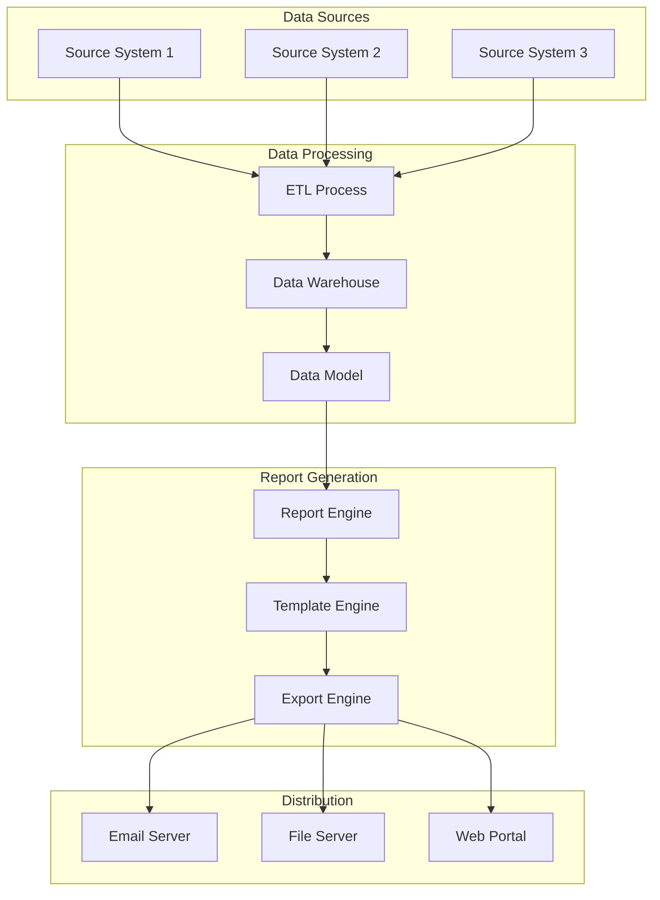

# [Report Name] Technical Document

**Document Version:** 1.0  
**Author:** [Your Name]  
**Date:** [YYYY-MM-DD]

---

**Table of Contents**

1. [Introduction](#introduction)
2. [Purpose and Audience](#purpose-and-audience)
3. [Business Data Sources](#business-data-sources)
4. [Report Output Visualization](#report-output-visualization)
5. [Filters and Parameters](#filters-and-parameters)
6. [Field Definitions and Logic](#field-definitions-and-logic)
7. [User Security and Access](#user-security-and-access)
8. [Data Refresh Schedules](#data-refresh-schedules)
9. [Report Dissemination](#report-dissemination)
10. [Report Format and Technical Details](#report-format-and-technical-details)
11. [Business Stakeholders and Approvals](#business-stakeholders-and-approvals)
12. [Performance and Optimization](#performance-and-optimization)
13. [Troubleshooting and Support](#troubleshooting-and-support)
14. [Related Documentation](#related-documentation)
15. [Appendix](#appendix)

---

## 1. Introduction

This document provides comprehensive technical and business documentation for the [Report Name] report, including its purpose, data sources, implementation details, and operational procedures.

---

## 2. Purpose and Audience

### Report Purpose
[Describe the specific business purpose this report serves]

### Primary Audience
| Audience Group | Role | Usage Pattern | Access Level |
|----------------|------|---------------|--------------|
| [Executive Leadership] | [Decision Making] | [Weekly Review] | [View Only] |
| [Operations Team] | [Daily Operations] | [Daily Monitoring] | [View/Export] |
| [Finance Team] | [Financial Analysis] | [Monthly Analysis] | [Full Access] |

### Business Objectives
- [Primary business objective 1]
- [Primary business objective 2]
- [Primary business objective 3]

### Success Metrics
- [How success is measured using this report]
- [Key performance indicators tracked]
- [Decision-making criteria supported]

---

## 3. Business Data Sources

### Source Systems Overview
| Source System | Data Type | Update Frequency | Owner | Connection Method |
|---------------|-----------|------------------|-------|-------------------|
| [CRM System] | [Customer Data] | [Real-time] | [Sales Team] | [API Integration] |
| [ERP System] | [Financial Data] | [Daily] | [Finance Team] | [Database Connection] |
| [Data Warehouse] | [Historical Data] | [Nightly] | [IT Team] | [Direct Query] |

### Data Lineage
```mermaid
flowchart TD
    A[Source System 1<br/>[System Name]] -->|Extract| D[Data Integration Layer]
    B[Source System 2<br/>[System Name]] -->|Extract| D
    C[Source System 3<br/>[System Name]] -->|Extract| D
    
    D -->|Transform| E[Data Warehouse<br/>[EDW/Data Lake]]
    E -->|Load| F[Report Data Model]
    F -->|Query| G[Report Output<br/>[Report Name]]
    
    H[Data Quality Checks] -->|Validate| D
    I[Business Rules Engine] -->|Apply Rules| E
```

### Detailed Source Specifications
#### [Source System 1]
- **System Name**: [Full system name]
- **Database/Schema**: [Database and schema details]
- **Key Tables/Views**: [List of primary data sources]
- **Data Volume**: [Approximate record counts]
- **Data Freshness**: [How current the data is]
- **Data Quality**: [Known data quality issues or constraints]

#### [Source System 2]
- **System Name**: [Full system name]
- **Database/Schema**: [Database and schema details]
- **Key Tables/Views**: [List of primary data sources]
- **Data Volume**: [Approximate record counts]
- **Data Freshness**: [How current the data is]
- **Data Quality**: [Known data quality issues or constraints]

---

## 4. Report Output Visualization

### Report Layout Description
[Provide a detailed description of the report layout and structure]

### Visual Representation
```
+------------------------------------------------------------------+
|                        [REPORT TITLE]                           |
|                     Generated: [Date/Time]                      |
+------------------------------------------------------------------+
| Filters: [Filter 1: Value] | [Filter 2: Value] | [Filter 3]    |
+------------------------------------------------------------------+
|                                                                  |
| SUMMARY SECTION                                                  |
| +--------------------------------------------------------------+ |
| | Total Revenue: $XXX,XXX | Total Customers: XXX | Growth: XX%| |
| | YTD Performance: XX%    | Target Achievement: XX%           | |
| +--------------------------------------------------------------+ |
|                                                                  |
| DETAILED DATA TABLE                                              |
| +----------+----------+----------+----------+----------+--------+ |
| | Column 1 | Column 2 | Column 3 | Column 4 | Column 5 | Action | |
| +----------+----------+----------+----------+----------+--------+ |
| | Data 1   | Data 2   | Data 3   | Data 4   | Data 5   | [Link] | |
| | Data 1   | Data 2   | Data 3   | Data 4   | Data 5   | [Link] | |
| | Data 1   | Data 2   | Data 3   | Data 4   | Data 5   | [Link] | |
| +----------+----------+----------+----------+----------+--------+ |
|                                                                  |
| CHARTS AND VISUALIZATIONS                                        |
| +----------------------------+  +-----------------------------+ |
| |     [Chart Title 1]        |  |     [Chart Title 2]         | |
| |                            |  |                             | |
| |    [Chart Description]     |  |    [Chart Description]      | |
| +----------------------------+  +-----------------------------+ |
|                                                                  |
| FOOTER: Page X of Y | Generated by [System] | [Timestamp]      |
+------------------------------------------------------------------+
```

### Alternative ASCII Representation (for complex reports)
```
REPORT: [Report Name]
=====================================

EXECUTIVE SUMMARY
-----------------
Key Metric 1: [Value] ([Change from previous period])
Key Metric 2: [Value] ([Change from previous period])
Key Metric 3: [Value] ([Change from previous period])

DETAILED BREAKDOWN
------------------
Category A:
  - Subcategory 1: [Value] | [Percentage] | [Trend]
  - Subcategory 2: [Value] | [Percentage] | [Trend]
  - Subcategory 3: [Value] | [Percentage] | [Trend]

Category B:
  - Subcategory 1: [Value] | [Percentage] | [Trend]
  - Subcategory 2: [Value] | [Percentage] | [Trend]

PERFORMANCE INDICATORS
----------------------
Target vs Actual:
  Target: [Value]
  Actual: [Value]
  Variance: [Value] ([Percentage])

RECOMMENDATIONS
---------------
1. [Recommendation based on data]
2. [Recommendation based on data]
3. [Recommendation based on data]
```

---

## 5. Filters and Parameters

### Hard-coded Filters
| Filter Name | Filter Value | Business Justification | Impact |
|-------------|--------------|------------------------|--------|
| [Date Range] | [Last 12 Months] | [Standard reporting period] | [Limits historical data] |
| [Status] | [Active Only] | [Focus on current operations] | [Excludes inactive records] |
| [Region] | [North America] | [Regional focus] | [Geographic limitation] |

### User-driven Filters
| Filter Name | Filter Type | Options/Range | Default Value | Required |
|-------------|-------------|---------------|---------------|----------|
| [Date Range] | [Date Picker] | [Last 5 years] | [Current Month] | [Yes] |
| [Department] | [Multi-select] | [All Departments] | [All Selected] | [No] |
| [Product Line] | [Dropdown] | [Product Categories] | [All Products] | [No] |

### Parameter Specifications
#### [Parameter Name 1]
- **Type**: [String/Number/Date/Boolean]
- **Description**: [What this parameter controls]
- **Valid Values**: [List or range of valid values]
- **Default Value**: [Default setting]
- **Business Rules**: [Any business logic applied to this parameter]

#### [Parameter Name 2]
- **Type**: [String/Number/Date/Boolean]
- **Description**: [What this parameter controls]
- **Valid Values**: [List or range of valid values]
- **Default Value**: [Default setting]
- **Business Rules**: [Any business logic applied to this parameter]

---

## 6. Field Definitions and Logic

### Field-by-Field Specifications
| Field Name | Data Type | Source | Calculation/Logic | Business Definition | Example |
|------------|-----------|--------|-------------------|-------------------|---------|
| [Revenue] | [Currency] | [Sales.Amount] | [SUM(Sales.Amount)] | [Total sales revenue] | [$125,000] |
| [Growth Rate] | [Percentage] | [Calculated] | [(Current - Previous)/Previous * 100] | [Period-over-period growth] | [15.5%] |
| [Customer Count] | [Integer] | [Customer.ID] | [COUNT(DISTINCT Customer.ID)] | [Unique customer count] | [1,250] |

### Detailed Field Logic
#### [Field Name 1]
**Business Definition**: [Clear business definition of what this field represents]
**Technical Implementation**: 
```sql
-- Example calculation logic
SELECT 
    SUM(amount) as total_revenue,
    COUNT(DISTINCT customer_id) as customer_count,
    AVG(amount) as average_order_value
FROM sales_transactions 
WHERE transaction_date >= @start_date 
    AND transaction_date <= @end_date
    AND status = 'completed'
```
**Data Validation Rules**: [Any validation applied to this field]
**Known Limitations**: [Any limitations or caveats about this field]

#### [Field Name 2]
**Business Definition**: [Clear business definition of what this field represents]
**Technical Implementation**: 
```sql
-- Example calculation logic
[SQL or formula logic]
```
**Data Validation Rules**: [Any validation applied to this field]
**Known Limitations**: [Any limitations or caveats about this field]

### Calculated Fields and Formulas
#### [Calculated Field 1]
**Formula**: `[Mathematical or logical formula]`
**Components**: 
- [Component 1]: [Description]
- [Component 2]: [Description]
**Business Logic**: [Why this calculation is performed]
**Example Calculation**: [Step-by-step example]

### Data Aggregation Rules
- **Grouping Logic**: [How data is grouped and aggregated]
- **Summarization Methods**: [SUM, AVG, COUNT, etc.]
- **Handling of Null Values**: [How null/missing values are treated]
- **Duplicate Handling**: [How duplicate records are managed]

---

## 7. User Security and Access

### Access Control Matrix
| User Role | View Report | Export Data | Modify Filters | Schedule Reports | Admin Functions |
|-----------|-------------|-------------|----------------|------------------|-----------------|
| [Executive] | ✅ | ✅ | ✅ | ❌ | ❌ |
| [Manager] | ✅ | ✅ | ✅ | ✅ | ❌ |
| [Analyst] | ✅ | ✅ | ✅ | ✅ | ❌ |
| [Admin] | ✅ | ✅ | ✅ | ✅ | ✅ |

### Security Implementation
#### Authentication Requirements
- **Authentication Method**: [SSO/LDAP/Database/etc.]
- **Multi-factor Authentication**: [Required/Optional/Not Required]
- **Session Management**: [Session timeout and management rules]

#### Authorization Rules
- **Role-based Access**: [How roles are assigned and managed]
- **Data-level Security**: [Row-level or column-level security rules]
- **Geographic Restrictions**: [Any location-based access controls]

#### Data Privacy and Compliance
- **PII Handling**: [How personally identifiable information is protected]
- **Data Masking**: [Any data masking or anonymization applied]
- **Compliance Requirements**: [GDPR, HIPAA, SOX, etc.]
- **Audit Trail**: [What user actions are logged and tracked]

### User Groups and Permissions
#### [User Group 1]
- **Group Name**: [Name of user group]
- **Members**: [Who belongs to this group]
- **Permissions**: [Specific permissions granted]
- **Data Access**: [What data this group can access]

#### [User Group 2]
- **Group Name**: [Name of user group]
- **Members**: [Who belongs to this group]
- **Permissions**: [Specific permissions granted]
- **Data Access**: [What data this group can access]

---

## 8. Data Refresh Schedules

### Refresh Schedule Overview
| Data Source | Refresh Frequency | Refresh Time | Duration | Dependencies |
|-------------|-------------------|--------------|----------|--------------|
| [Source 1] | [Daily] | [2:00 AM UTC] | [30 minutes] | [ETL Process A] |
| [Source 2] | [Hourly] | [Every hour] | [5 minutes] | [Real-time sync] |
| [Source 3] | [Weekly] | [Sunday 1:00 AM] | [2 hours] | [Data warehouse refresh] |

### Detailed Refresh Procedures
#### [Data Source 1] Refresh Process
**Schedule**: [Detailed schedule information]
**Process Steps**:
1. [Step 1]: [Detailed description]
2. [Step 2]: [Detailed description]
3. [Step 3]: [Detailed description]

**Dependencies**: [What must complete before this refresh can start]
**Error Handling**: [What happens if refresh fails]
**Monitoring**: [How refresh status is monitored]
**Rollback Procedures**: [How to rollback if issues occur]

### Data Latency Specifications
- **Real-time Data**: [What data is available in real-time]
- **Near Real-time Data**: [Data with minimal delay - specify delay]
- **Batch Data**: [Data updated in batches - specify frequency]
- **Historical Data**: [How far back historical data is available]

### Refresh Monitoring and Alerting
- **Success Notifications**: [Who gets notified of successful refreshes]
- **Failure Alerts**: [Who gets alerted when refreshes fail]
- **Performance Monitoring**: [How refresh performance is tracked]
- **SLA Requirements**: [Service level agreements for data freshness]

---

## 9. Report Dissemination

### Distribution Methods
| Method | Frequency | Recipients | Format | Automation Level |
|--------|-----------|------------|--------|------------------|
| [Email] | [Daily] | [Executive Team] | [PDF] | [Fully Automated] |
| [Dashboard] | [Real-time] | [Operations Team] | [Interactive] | [Self-service] |
| [File Share] | [Weekly] | [External Partners] | [Excel] | [Semi-automated] |

### Detailed Dissemination Procedures
#### Email Distribution
**Schedule**: [When emails are sent]
**Recipients**: [Who receives the emails]
**Email Template**: [Standard email format and content]
**Attachment Format**: [File format and naming conventions]
**Delivery Confirmation**: [How delivery is confirmed]

#### Dashboard Embedding
**Platform**: [Where dashboard is embedded]
**Access Method**: [How users access the embedded dashboard]
**Refresh Frequency**: [How often embedded data refreshes]
**Interactive Features**: [What interactions are available]

#### Manual Distribution
**Process**: [Step-by-step manual distribution process]
**Responsible Party**: [Who is responsible for manual distribution]
**Backup Procedures**: [What happens if primary person is unavailable]

### Subscription Management
- **Self-service Subscriptions**: [How users can subscribe/unsubscribe]
- **Subscription Approval**: [Who approves new subscriptions]
- **Distribution List Management**: [How distribution lists are maintained]

---

## 10. Report Format and Technical Details

### Primary Format Specifications
**Format Type**: [Excel/PDF/Power BI/Tableau/etc.]

#### Excel Format Details (if applicable)
- **File Extension**: [.xlsx/.xls]
- **Worksheet Structure**: [Number and names of worksheets]
- **Data Formatting**: [Number formats, date formats, etc.]
- **Charts and Visualizations**: [Types of charts included]
- **Macros**: [Any Excel macros included]
- **File Size**: [Typical file size range]

#### PDF Format Details (if applicable)
- **Page Layout**: [Portrait/Landscape, page size]
- **Font Specifications**: [Font types and sizes used]
- **Color Scheme**: [Color palette and usage]
- **Interactive Elements**: [Hyperlinks, bookmarks, etc.]
- **Security Settings**: [Password protection, printing restrictions]

#### Power BI Format Details (if applicable)
- **Workspace**: [Power BI workspace location]
- **Dataset**: [Associated Power BI dataset]
- **Refresh Schedule**: [Power BI refresh schedule]
- **Sharing Settings**: [How report is shared in Power BI]
- **Mobile Optimization**: [Mobile layout considerations]

### Technical Architecture


### Performance Specifications
- **Generation Time**: [How long report takes to generate]
- **File Size**: [Typical file size]
- **Concurrent Users**: [How many users can access simultaneously]
- **Response Time**: [Expected response time for interactive elements]

---

## 11. Business Stakeholders and Approvals

### Stakeholder Matrix
| Stakeholder | Role | Responsibility | Contact Information | Approval Authority |
|-------------|------|----------------|-------------------|-------------------|
| [John Smith] | [VP Finance] | [Report Sponsor] | [john.smith@company.com] | [Final Approval] |
| [Jane Doe] | [Data Manager] | [Data Quality] | [jane.doe@company.com] | [Technical Approval] |
| [Bob Johnson] | [Business Analyst] | [Requirements] | [bob.johnson@company.com] | [Content Approval] |

### Approval Processes
#### Content Changes
**Process**: [Step-by-step approval process for content changes]
**Required Approvers**: [Who must approve content changes]
**Timeline**: [How long approval process takes]
**Documentation**: [What documentation is required for changes]

#### Access Changes
**Process**: [Step-by-step approval process for access changes]
**Required Approvers**: [Who must approve access changes]
**Timeline**: [How long approval process takes]
**Documentation**: [What documentation is required for access changes]

#### Technical Changes
**Process**: [Step-by-step approval process for technical changes]
**Required Approvers**: [Who must approve technical changes]
**Timeline**: [How long approval process takes]
**Documentation**: [What documentation is required for technical changes]

### Change Management
- **Change Request Process**: [How changes are requested and tracked]
- **Impact Assessment**: [How impact of changes is assessed]
- **Testing Requirements**: [What testing is required for changes]
- **Rollback Procedures**: [How to rollback changes if needed]

### Communication Plan
- **Regular Reviews**: [Schedule for regular stakeholder reviews]
- **Status Updates**: [How stakeholders are kept informed]
- **Issue Escalation**: [How issues are escalated to stakeholders]

---

## 12. Performance and Optimization

### Performance Metrics
| Metric | Target | Current | Monitoring Method |
|--------|--------|---------|-------------------|
| [Generation Time] | [< 5 minutes] | [3.2 minutes] | [Automated monitoring] |
| [Data Freshness] | [< 1 hour] | [45 minutes] | [Data timestamp checks] |
| [User Response Time] | [< 10 seconds] | [7 seconds] | [User experience monitoring] |

### Optimization Strategies
#### Data Optimization
- **Indexing Strategy**: [Database indexes used to improve performance]
- **Data Partitioning**: [How data is partitioned for better performance]
- **Caching Strategy**: [What data is cached and for how long]
- **Query Optimization**: [How queries are optimized]

#### Report Optimization
- **Template Optimization**: [How report templates are optimized]
- **Rendering Optimization**: [How report rendering is optimized]
- **Export Optimization**: [How export processes are optimized]

### Capacity Planning
- **Current Usage**: [Current usage statistics]
- **Growth Projections**: [Expected growth in usage]
- **Capacity Limits**: [Known capacity limitations]
- **Scaling Plans**: [How to scale if needed]

---

## 13. Troubleshooting and Support

### Common Issues and Solutions
#### Issue: [Report Generation Fails]
**Symptoms**: [How to identify this issue]
**Possible Causes**: [Common root causes]
**Resolution Steps**:
1. [Step 1]: [Detailed resolution step]
2. [Step 2]: [Detailed resolution step]
3. [Step 3]: [Detailed resolution step]
**Prevention**: [How to prevent this issue]

#### Issue: [Data Discrepancies]
**Symptoms**: [How to identify this issue]
**Possible Causes**: [Common root causes]
**Resolution Steps**:
1. [Step 1]: [Detailed resolution step]
2. [Step 2]: [Detailed resolution step]
3. [Step 3]: [Detailed resolution step]
**Prevention**: [How to prevent this issue]

### Support Contacts
| Issue Type | Primary Contact | Secondary Contact | Escalation Contact |
|------------|-----------------|-------------------|-------------------|
| [Technical Issues] | [IT Help Desk] | [System Administrator] | [IT Manager] |
| [Data Issues] | [Data Team] | [Business Analyst] | [Data Manager] |
| [Access Issues] | [Security Team] | [System Administrator] | [Security Manager] |

### Diagnostic Procedures
#### Data Validation Checks
1. **Source Data Validation**: [How to validate source data]
2. **Transformation Validation**: [How to validate data transformations]
3. **Output Validation**: [How to validate report output]

#### Performance Diagnostics
1. **Query Performance**: [How to diagnose query performance issues]
2. **System Performance**: [How to diagnose system performance issues]
3. **Network Performance**: [How to diagnose network performance issues]

---

## 14. Related Documentation

### Internal Documentation
- [Data Dictionary](../database/data-dictionary.md) - Field definitions and data standards
- [ETL Process Documentation](../integration/etl-processes.md) - Data transformation processes
- [Security Policies](../security/access-control-policies.md) - Security and access control policies
- [System Architecture](../architecture/system-overview.md) - Overall system architecture

### External Documentation
- [Business Requirements Document] - Original business requirements
- [Technical Specifications] - Detailed technical specifications
- [User Training Materials] - End-user training and help materials

### Version History
| Version | Date | Changes | Author |
|---------|------|---------|--------|
| 1.0 | [YYYY-MM-DD] | Initial creation | [Author Name] |

---

## 15. Appendix

### A. Sample Report Output
[Include actual sample output or screenshots if available]

### B. SQL Queries and Code
```sql
-- Main report query
SELECT 
    [field1],
    [field2],
    [calculated_field]
FROM [source_tables]
WHERE [filter_conditions]
GROUP BY [grouping_fields]
ORDER BY [sorting_fields]
```

### C. Configuration Files
```json
{
  "report_config": {
    "name": "[Report Name]",
    "refresh_schedule": "[Schedule]",
    "data_sources": ["[Source 1]", "[Source 2]"],
    "output_formats": ["[Format 1]", "[Format 2]"]
  }
}
```

### D. Error Codes and Messages
| Error Code | Error Message | Resolution |
|------------|---------------|------------|
| [ERR001] | [Error message] | [Resolution steps] |
| [ERR002] | [Error message] | [Resolution steps] |

### E. Glossary
| Term | Definition |
|------|------------|
| [Business Term 1] | [Clear definition] |
| [Business Term 2] | [Clear definition] |

---

**End of Document**