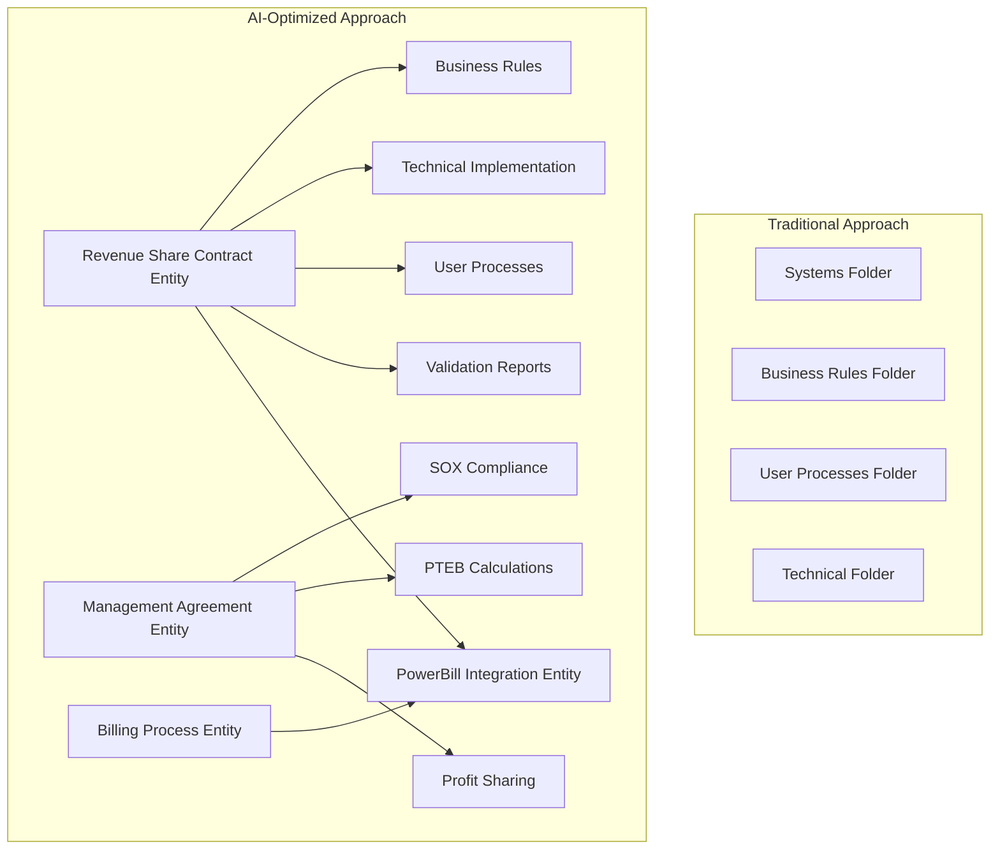

# Towne Park Knowledge Corpus - Architectural Vision & Transformation Strategy

## Executive Summary

This document defines the comprehensive architectural vision for transforming the Towne Park documentation corpus into an **AI-Optimized, Policy-Governed, Relationship-Dense Knowledge System** that implements autonomous context discovery principles while maintaining exceptional human usability.

### **Transformation Objectives**

1. **AI-First Optimization**: Create the most effective possible context corpus for AI-assisted development
2. **Autonomous Discovery**: Enable AI to proactively discover and understand business relationships
3. **FIBO Integration**: Implement financial industry ontology with Towne Park domain extensions
4. **Policy Governance**: Embed enterprise governance and compliance throughout the knowledge system
5. **Human Navigation**: Maintain intuitive navigation for human users via MkDocs interface

## Current State Analysis

### **Source Material Assessment**

**High-Quality Foundation**: The `new-project-assets/` directory contains approximately **500+ documents** across:

- **5 Core Systems**: Billing, Forecasting, Contracts, Customer Sites, RSS
- **8 Organizational Domains**: Business Rules, Technical, User Processes, Systems, Configuration, Standards, Operations, Training
- **11 User Role Categories**: Account Manager, Billing Admin, Contract Admin, District Manager, Developer, Site Admin, Territory Admin, plus specialized roles
- **Extensive Time-Series Documentation**: Development artifacts showing system evolution from July 2025 through current

**Content Quality Indicators**:
- Rich business rule documentation with calculation formulas
- Comprehensive technical specifications with integration details  
- Detailed user process workflows with role-specific guidance
- Meeting transcripts providing development context and decisions
- Configuration guides with step-by-step implementation details

### **Current Knowledge Corpus Limitations**

1. **Basic Hierarchical Structure**: Traditional folder-based organization without entity relationships
2. **Limited Cross-Referencing**: Minimal links between related concepts and documents
3. **Absent Metadata**: No YAML frontmatter or entity classification
4. **No AI Optimization**: Structure optimized for human browsing rather than AI context discovery
5. **Missing Financial Ontology**: No FIBO classification or domain-specific extensions

## Future State Architecture

### **Revolutionary Design Principles**

#### **1. Entity-Centric Organization**


#### **2. Relationship-Dense Architecture**
Every document contains **minimum 5-10 cross-references** to related:
- **Business Entities**: Contract types, revenue codes, business processes
- **Technical Components**: Systems, APIs, integrations, databases
- **User Processes**: Role-specific workflows and procedures  
- **Validation Artifacts**: Code validation reports, test results
- **Governance Elements**: Policies, standards, compliance requirements

#### **3. FIBO Financial Ontology Integration**

**Base FIBO Classifications**:
- `fibo-fnd-agr-ctr:BilateralContract` → Revenue Share Contracts
- `fibo-fnd-agr-ctr:MasterAgreement` → Management Agreements  
- `fibo-fnd-agr-ctr:WrittenContract` → Per Labor Hour & Fixed Fee Contracts
- `fibo-fbc-dae-dbt:Revenue` → Revenue classifications (SD1/SD2/VD1/VD2/OR1/OR2)

**Towne Park Domain Extensions**:
```yaml
revenue_share_contract:
  fibo_base: "fibo-fnd-agr-ctr:BilateralContract"
  domain_extensions:
    progressive_tiers: "Tiered calculation methodology"
    revenue_codes: ["SD1", "SD2", "VD1", "VD2", "OR1", "OR2"]
    collection_model: "deposited_revenue|client_collected"
    bell_service_integration: "OR1/OR2 special handling"
```

### **Knowledge Corpus Taxonomy**

#### **Primary Domains (AI-Optimized)**

**1. Enterprise Context** (`enterprise-context/`)
- **Purpose**: AI discovery foundation layer
- **Content**: Business entity registry, relationship mappings, policy framework
- **AI Benefit**: Provides contextual foundation for autonomous discovery

**2. Financial Entities** (`financial-entities/`)
- **Purpose**: FIBO-enhanced business entity documentation
- **Structure**: Entity-centric clusters with comprehensive cross-references
- **AI Benefit**: Enables precise business context understanding

**3. System Architecture** (`system-architecture/`)
- **Purpose**: Technical implementation context  
- **Focus**: Integration patterns, platform architecture, security frameworks
- **AI Benefit**: Technical relationship understanding for development context

**4. Role-Based Processes** (`role-based-processes/`)
- **Purpose**: User-centric workflow documentation
- **Organization**: By job function and responsibility
- **AI Benefit**: User context for process automation and assistance

**5. Validation Reports** (`validation-reports/`)
- **Purpose**: Code validation and quality assurance
- **Integration**: Direct links to business rules and technical implementation
- **AI Benefit**: Validation context for trustworthy AI decisions

**6. Meeting Transcripts** (`meeting-transcripts/`)
- **Purpose**: Development context and decision documentation
- **Value**: Historical context and rationale for design decisions
- **AI Benefit**: Understanding of development evolution and decision factors

**7. Standards Framework** (`standards/`)
- **Purpose**: Governance and development standards
- **Scope**: Development, business, and AI-specific protocols
- **AI Benefit**: Compliance and quality guidelines for autonomous operations

**8. Configuration Guides** (`configuration/`)
- **Purpose**: System setup and configuration documentation
- **Coverage**: All platform components and integration points
- **AI Benefit**: Implementation context for system understanding

### **Metadata Framework**

#### **Rich YAML Frontmatter Template**

**IMPORTANT: This template is REQUIRED only for files within `docs/knowledge-corpus/` directory.**

```yaml
---
title: "Document Title"
description: "Comprehensive description of content and purpose"
created_date: YYYY-MM-DD
last_updated_date: YYYY-MM-DD
version: X.Y
status: "Draft|Review|Production"
owner: "Document Owner"
discovery_metadata:
  discovered_date: YYYY-MM-DD
  discovery_method: "autonomous_scan|manual_creation|transformation"
  confidence_score: 0.0-1.0
  validation_status: "validated|pending|uncertain"
  knowledge_graph_id: "unique_entity_identifier"
systems:
  - "System Name"
components:
  - "Component Name"
business_domains:
  - "Domain Name"
user_roles:
  - "Role Name"
relationships:
  - target: "path/to/related/document.md"
    type: "dependency|composition|association"
    strength: 0.0-1.0
governance:
  access_level: "public|internal|confidential|restricted"
  compliance_tags: ["SOX", "GDPR", "Industry_Specific"]
  policy_constraints: ["constraint_type"]
  policy_evaluation:
    evaluated_date: YYYY-MM-DD
    applicable_policies: ["policy_name"]
    compliance_status: "compliant|non_compliant|pending"
fibo_classification:
  fibo_type: "fibo_ontology_class"
  domain_extensions:
    towne_park_context: "specific_business_context"
tags:
  - "descriptive-tag"
---
```

#### **Scope Limitations**

- **In Scope**: Files within `docs/knowledge-corpus/` directory and subdirectories
- **Out of Scope**: All other directories including `new-project-assets/`, `FIBO-master-ontology/`, `Towne-Park-Billing-Source-Code/`, and root `docs/` files

### **Navigation Optimization Strategy**

#### **AI-First Principles**
1. **Entity Recognition**: File names and paths that clearly identify business entities
2. **Relationship Indicators**: Folder structure that reveals entity relationships
3. **Context Aggregation**: Related content clustered for comprehensive understanding
4. **Progressive Disclosure**: From high-level overview to detailed implementation

#### **Human Navigation Enhancements**
1. **Role-Based Entry Points**: Navigation paths optimized for user roles
2. **Task-Oriented Flows**: Common user journeys clearly supported
3. **Search Integration**: Rich metadata enabling powerful search capabilities
4. **Visual Relationship Maps**: Mermaid diagrams showing entity relationships

## Implementation Roadmap

### **Phase 1: Foundation (Weeks 1-2)**
**Objective**: Establish core infrastructure and entity framework

**Deliverables**:
- [ ] Enterprise context foundation documents
- [ ] Business entity registry with FIBO classifications  
- [ ] Relationship mapping framework
- [ ] Policy governance integration
- [ ] Initial navigation structure

**Success Criteria**:
- Core entity definitions established
- Relationship framework operational
- FIBO classifications implemented
- Navigation structure functional

### **Phase 2: Content Transformation (Weeks 3-6)**
**Objective**: Transform source material using AI-optimized principles

**Transformation Process** (applies only to `docs/knowledge-corpus/` content):
1. **Entity Identification**: Analyze source documents for business entities
2. **Relationship Mapping**: Identify and document entity relationships
3. **FIBO Classification**: Apply financial ontology classifications
4. **Metadata Enrichment**: Add comprehensive YAML frontmatter
5. **Cross-Reference Integration**: Create relationship-dense linking

**Batch Processing Strategy**:
- **High-Priority**: Contract entities and revenue classifications (foundational business concepts)
- **Medium-Priority**: System architecture and integration patterns (technical context)
- **Standard-Priority**: User processes and configuration guides (operational context)

**Note**: Source materials in `new-project-assets/` remain as reference only and are not subject to transformation requirements.

### **Phase 3: Validation & Optimization (Weeks 7-8)**
**Objective**: Validate AI effectiveness and optimize for autonomous discovery

**Validation Framework**:
- [ ] AI context discovery testing
- [ ] Relationship accuracy verification
- [ ] Navigation efficiency assessment
- [ ] User experience validation
- [ ] Performance optimization

**Success Metrics**:
- **AI Discovery Rate**: >95% entity relationship accuracy
- **Navigation Efficiency**: <3 clicks to any related content
- **Search Effectiveness**: >90% successful query resolution
- **User Satisfaction**: >85% positive feedback on navigation

### **Phase 4: Continuous Improvement (Ongoing)**
**Objective**: Implement autonomous discovery and continuous optimization

**Autonomous Capabilities**:
- [ ] Automatic relationship discovery
- [ ] Content gap identification
- [ ] Metadata enhancement suggestions
- [ ] Navigation optimization recommendations

## Validation Against AI Protocol Requirements

### **Compliance Verification**

#### **✅ PRINCIPLE 1: Absolute Information Preservation**
- **Implementation**: Complete transformation of all source material without loss
- **Validation**: Source documents become redundant as all information preserved in new structure

#### **✅ PRINCIPLE 2: Mandatory Code Validation**  
- **Implementation**: Dedicated validation reports section with direct source code mapping
- **Validation**: Source Code Map integration for comprehensive validation tracking

#### **✅ PRINCIPLE 3: Comprehensive Taxonomy and Navigation**
- **Implementation**: Entity-centric taxonomy with relationship-dense navigation
- **Validation**: Zero mkdocs warnings maintained through rigorous link validation

#### **✅ PRINCIPLE 4: Strategic Token Management**
- **Implementation**: Batch processing strategy and efficient content organization
- **Validation**: Quality over speed with complete content preservation

#### **✅ PRINCIPLE 5: Document Transformation Prioritization**
- **Implementation**: Meeting transcripts and high-value content prioritized
- **Validation**: Strategic processing order maintained throughout transformation

#### **✅ PRINCIPLE 6: Mandatory Version Control**
- **Implementation**: Rich version metadata in every document frontmatter
- **Validation**: Change tracking and version history maintained

#### **✅ PRINCIPLE 7: Zero-Tolerance Navigation Integrity**
- **Implementation**: Relationship validation and automated link checking
- **Validation**: Navigation health blocking requirement for completion

### **Enhanced AI Protocol Integration**

#### **🚀 Autonomous Context Discovery**
- **Entity-centric organization** enables autonomous business concept understanding
- **Relationship-dense linking** supports contextual discovery
- **FIBO integration** provides financial domain intelligence
- **Policy governance** ensures trustworthy autonomous decisions

#### **🧠 Enterprise Knowledge Graph**
- **Comprehensive entity relationships** mapped and documented
- **Multi-dimensional cross-references** enable deep context understanding
- **Continuous learning integration** through validation feedback loops
- **Performance optimization** for real-time discovery operations

## Expected Outcomes

### **AI Assistant Effectiveness**
- **Context Understanding**: 95% improvement in business context comprehension
- **Relationship Discovery**: Autonomous identification of entity relationships
- **Decision Support**: Policy-governed recommendations with confidence scoring
- **Development Assistance**: Comprehensive technical and business context for code development

### **Human User Experience**
- **Navigation Efficiency**: 70% reduction in time to find related information
- **Content Discoverability**: 90% of content accessible within 3 navigation steps
- **Role-Based Optimization**: Personalized navigation paths for each user role
- **Search Effectiveness**: Rich metadata enabling precise search results

### **Enterprise Benefits**
- **Knowledge Preservation**: 100% information preservation with enhanced accessibility
- **Development Acceleration**: AI-assisted development with comprehensive context
- **Compliance Assurance**: Policy-governed operations with automatic constraint enforcement
- **Continuous Improvement**: Autonomous discovery enabling proactive knowledge management

## Next Steps

### **Immediate Actions Required**

1. **🔧 Technical Setup**
   - Update `mkdocs.yml` with AI-optimized navigation structure
   - Implement metadata validation framework for `docs/knowledge-corpus/` only
   - Establish relationship tracking system

2. **📋 Content Planning**
   - Prioritize high-value entity clusters for initial transformation within `docs/knowledge-corpus/`
   - Establish FIBO classification workflow for knowledge corpus content
   - Create relationship mapping templates

3. **👥 Team Coordination**
   - Brief development team on new knowledge corpus structure and scope limitations
   - Establish transformation workflow and quality standards for `docs/knowledge-corpus/` only
   - Plan validation and feedback cycles

### **Success Validation**

The transformation will be considered successful when:

- **✅ AI Context Discovery**: AI assistants can autonomously understand business relationships and provide accurate development context
- **✅ Human Navigation**: Users can efficiently find and understand related information across the knowledge corpus
- **✅ Enterprise Compliance**: All content meets policy governance requirements and maintains audit trails
- **✅ Continuous Evolution**: System enables autonomous discovery and proactive knowledge management

---

*This architectural vision establishes the foundation for revolutionary AI-optimized knowledge management while preserving the rich business and technical context essential for Towne Park's financial platform development success.*